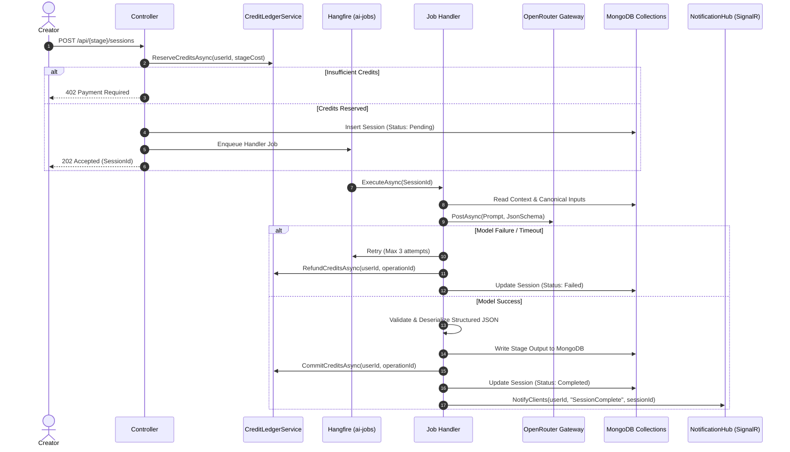
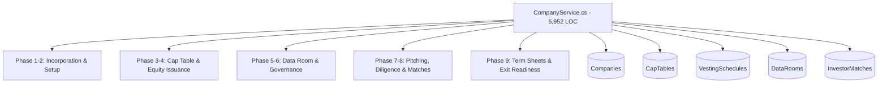

# MONDIAL BUSINESS CREATION (MBC) — ARCHITECTURE TOPOLOGY & DATA LINEAGE MAP

**Skill**: `modernize-map`  
**Date**: September 19, 2026  
**Auditor**: Antigravity Modernization Subagent (`legacy-analyst`)  
**Status**: COMPLETE — ALL 11 MERMAID TOPOLOGIES & INTERACTIVE VIEWER GENERATED  

---

## 1. Architecture Topology Summary

The Mondial Business Creation (MBC) platform is a fullstack ecosystem operating across distinct user personas: **Creator**, **Entrepreneur**, **Investor**, **Service Provider**, and **Platform Administrator**.

The active production architecture consists of:
1. **Frontend App**: Next.js 14 App Router under `src/` (TypeScript, TailwindCSS, Radix UI, `@tanstack/react-query`). Note: The orphaned `frontend/` directory is an obsolete prototype baseline.
2. **Core API Server**: ASP.NET Core (.NET 8) Web API under `backend/MondialEco.Backend/` exposing ~32 controllers and over 260 endpoints.
3. **Background Asynchronous Orchestration**: Hangfire backed by MongoDB (`hangfire_database`) with 22 dedicated task handlers (`backend/.../Jobs/Handlers/`).
4. **Primary Data Store**: MongoDB with 42+ active collections operated via `MongoDbContext` and official .NET MongoDB driver.
5. **Realtime Mesh**: SignalR Hub (`ChatHub.cs`) at `/hubs` coupled with Redis Pub/Sub backplane.
6. **External Integrations**: Sumsub SaaS (KYC WebSDK & webhooks), OpenRouter AI inference gateway, and local storage.

---

## 2. Domain Clusters

To prevent architectural unreadability, the system topology is divided into 10 cohesive domain clusters:

| Domain Cluster | Key Frontend Views | Primary Controllers | Key Services | Core Datastores |
| :--- | :--- | :--- | :--- | :--- |
| **Platform / Identity** | `src/app/auth`, `/settings` | `AuthController.cs`, `UsersController.cs` | `AuthService.cs`, `EmailService.cs` | `ApplicationUsers`, `Roles`, `RefreshTokens` |
| **Creator** | `src/app/creator` | `CreatorIdeasController.cs`, `BusinessPlanController.cs`, `Phase3Controllers` | `CreatorIdeaService.cs`, `AIProjectService.cs` | `CreatorIdeas`, `BusinessIdeas`, `AI Sessions` |
| **Entrepreneur** | `src/app/entrepreneur` | `CompaniesController.cs`, `DataRoomController.cs` | `CompanyService.cs` (5,952 LOC) | `Companies`, `CapTables`, `VestingSchedules` |
| **Investor** | `src/app/investor` | `InvestorsController.cs`, `InvestorMatchesController.cs` | `InvestorService.cs`, `DiligenceService.cs` | `Investors`, `InvestorMatches`, `DiligenceSessions` |
| **Service Provider** | `src/app/services` | `ProfessionalProfilesController.cs`, `ServiceListingsController.cs`, `WorkroomEngagementsController.cs` | `WorkroomService.cs`, `ProposalService.cs` | `ProfessionalProfiles`, `ServiceProviderProfiles`, `ServiceListings`, `WorkroomEngagements` |
| **Marketplace** | `src/app/marketplace` | `MarketplaceProjectsController.cs` (2,021 LOC) | *Direct DB Queries (Bypasses Services)* | Direct queries across `Companies`, `CreatorIdeas`, `Investments` |
| **Messenger** | `src/components/chat` | `ChatController.cs`, `ChatHub.cs` | `ResponseRateService.cs`, Redis PubSub | `Conversations`, `ChatMessages` |
| **Deals** | `src/app/deals` | `DealsController.cs` (8,376 LOC) | `EscrowService.cs`, `TransactionEngine` | `Deals`, `DealExecutions`, `Transactions`, `Holdings` |
| **Verification** | `src/app/kyc` | `IdentityController.cs`, `VarificationController.cs` | `IdentityVerificationService.cs`, `KycStorageService.cs` | `UniversalIdentityVerifications`, `Local Disk (uploads/kyc)` |
| **AI / Intelligence** | Background Hangfire | `AIController.cs`, 22 Hangfire Handlers | `OpenRouterClient.cs`, `PromptBuilder` | `Phase3Concepts`, `Phase3Kpis`, `BrandKits` |

---

## 3. Cross-Domain Dependencies

```mermaid
graph TD
    Creator[Creator Domain] -->|Transition Idea -> Company| Entrepreneur[Entrepreneur Domain]
    Entrepreneur -->|Propose Term Sheet / Pitch| Investor[Investor Domain]
    Entrepreneur -->|Create Deal / Issue Equity| Deals[Deals Domain (8.3k LOC)]
    Investor -->|Execute Investment| Deals
    Deals -->|Mutate CapTable & Dilution| Entrepreneur
    Deals -->|Issue Holdings| Investor
    Marketplace[Marketplace Domain] -.->|Direct Read Bypass| Entrepreneur
    Marketplace -.->|Direct Read Bypass| Creator
    Marketplace -.->|Direct Read Bypass| Investor
    ServiceProvider[Service Provider Domain] -->|Client Briefs & Contracts| Entrepreneur
    Messenger[Messenger Domain] -->|Realtime Chat between All Personas| Platform[Platform Core]
    Verification[Verification / KYC] -->|Gating Enforcement| Platform
```

---

## 4. Creator Persona Flow (End-to-End)

The full journey diagram is captured in [`analysis/mbc/CREATOR_FLOW.mmd`](file:///d:/mondial.eco/9-12-2026/mondial_monorepo_fullstack/analysis/mbc/CREATOR_FLOW.mmd).

1. **Authentication & Profile Setup**: User registers (`POST /api/auth/register`), enters onboarding, and initializes a Creator profile.
2. **Canonical Idea Core**: Founder fills in basic idea details (title, description, industry, target audience). `CreatorIdeasController` creates a record in `CreatorIdeas`.
3. **Idea Clarification (Stage 1)**: User triggers clarification (`POST /api/clarifier/sessions`). Hangfire dispatches `ClarifierHandler.cs`. AI probes edge cases and generates structured questions/answers.
4. **Market Study (Stage 2)**: User initiates market research (`POST /api/marketstudy/sessions`). Consumes canonical idea and clarifier context. Produces TAM, SAM, SOM calculations, target personas, and competitor matrices. Stored in `Phase3Concepts` and `CreatorIdeas.Phase3Data.MarketStudySessionId`.
5. **Business Model Canvas (Stage 3)**: User initiates business model generation (`POST /api/businessmodel/sessions`). Generates 9 canvas blocks, revenue model, cost structures. Stored in `CreatorIdeas.Phase3Data.BusinessModelSessionId`.
6. **Business Plan (Stage 4)**: Initiates executive business plan generation (`POST /api/businessplan/sessions`). Dispatches `BusinessPlanHandler.cs`.
7. **Financial Forecast (Stage 5)**: AI projects 3-year cash flows, P&L, break-even analysis based on business plan and model assumptions.
8. **Brand / Identity & IP Valuation**: Generates brand identity tokens (`BrandKits`), IP valuation estimates (`IpValuations`).
9. **Transition to Entrepreneur**: Founder transitions validated project to an incorporated entity via `CompanyService.CreateCompanyFromIdeaAsync`.

---

## 5. Creator Phase 3 Lineage & The Business Plan Context Gap

Full sequence and lineage diagram: [`analysis/mbc/CREATOR_PHASE3_LINEAGE.mmd`](file:///d:/mondial.eco/9-12-2026/mondial_monorepo_fullstack/analysis/mbc/CREATOR_PHASE3_LINEAGE.mmd).

### Critical Finding: The Business Plan Context Gap (CONFIRMED)

**Files Audited**:
- `backend/MondialEco.Backend/Controllers/BusinessPlanController.cs` (lines 119–130 and 169–176)
- `backend/MondialEco.Backend/Jobs/Handlers/BusinessPlanHandler.cs` (lines 78–125)

**Code Evidence**:
1. In `BusinessPlanController.cs` (lines 119–126), the controller strictly verifies that the user completed the prior stages:
   ```csharp
   if (string.IsNullOrEmpty(creatorIdea.Phase3Data?.MarketStudySessionId))
       return BadRequest("Market Study must be completed before generating a Business Plan.");
   if (string.IsNullOrEmpty(creatorIdea.Phase3Data?.BusinessModelSessionId))
       return BadRequest("Business Model must be completed before generating a Business Plan.");
   ```
2. In `BusinessPlanController.cs` (lines 169–176), the controller schedules the Hangfire background job:
   ```csharp
   BackgroundJob.Enqueue<BusinessPlanHandler>(h => h.ExecuteAsync(
       session.Id,
       clarifierSessionId,
       creditOperationId,
       businessIdeaId,
       CancellationToken.None));
   ```
3. In `BusinessPlanHandler.cs` (lines 80–115), the handler constructs the LLM context prompt:
   - It fetches the `clarifier` session (`_clarifierSessions.Find(...)`).
   - It fetches the `creatorIdea` (`_creatorIdeas.Find(...)`).
   - It injects into the prompt **ONLY**:
     - `CANONICAL IDEA CORE`: `creatorIdea.Project`
     - `CLARIFIER HISTORY`: `clarifier.Output`
     - Legacy `BusinessIdeas` text.
   - **It NEVER fetches or injects**:
     - `MarketStudySessionId` output (TAM / SAM / SOM, competitors, customer segments).
     - `BusinessModelSessionId` output (9 Canvas blocks, cost structures, revenue channels).
4. **Architectural Significance**:
   Although the frontend gate forces the founder to wait and pay credits for Market Study and Business Model stages, **none of those analytical outputs are passed into the Business Plan prompt**. The generated Business Plan hallucinates market size and business model afresh rather than synthesizing the founder's existing validated data.

---

## 6. AI Execution Topology

Sequence Diagram: [`analysis/mbc/AI_EXECUTION_FLOW.mmd`](file:///d:/mondial.eco/9-12-2026/mondial_monorepo_fullstack/analysis/mbc/AI_EXECUTION_FLOW.mmd).



**Key Execution Attributes**:
- **Credits**: Debited via reservation pattern; refunded on unrecoverable retry failure.
- **Retries**: Configured for Hangfire automatic exponential retry (3 attempts).
- **Delivery**: Asynchronous polling via `GET /api/{stage}/sessions/{id}` supplemented by SignalR notification broadcast.

---

## 7. Database Hotspots & Shared Collections

Lineage Diagram: [`analysis/mbc/MONGODB_LINEAGE.mmd`](file:///d:/mondial.eco/9-12-2026/mondial_monorepo_fullstack/analysis/mbc/MONGODB_LINEAGE.mmd).

The MongoDB database layer contains several critical multi-writer collections prone to race conditions and inconsistent state:

1. **`Companies` Collection**:
   - Written by: `CompanyService.cs`, `DealsController.cs`, `DataRoomController.cs`.
   - Contains: Company metadata, cap tables, shareholder registries, stage flags, pitch decks.
   - Hotspot Risk: `DealsController` performs inline atomic and non-atomic updates directly against cap tables during deal negotiation and closing, bypassing `CompanyService`.
2. **`CreatorIdeas` Collection**:
   - Written by: `CreatorIdeasController.cs`, `BusinessPlanController.cs`, `Phase3Controllers`, all AI Handlers.
   - Contains: Idea canonical core, phase 3 session IDs, founder custom edits.
3. **`Deals` & `DealExecutions` Collections**:
   - Exclusively mutated by `DealsController.cs` (8,376 LOC).
4. **`ApplicationUsers` Collection**:
   - Written by: `AuthController`, `UsersController`, `VarificationController` (legacy KYC), and `IdentityVerificationService` (Sumsub webhook).

---

## 8. Fat Controller Hotspot — `DealsController.cs` (8,376 LOC)

Decomposition Diagram: [`analysis/mbc/DEALS_TOPOLOGY.mmd`](file:///d:/mondial.eco/9-12-2026/mondial_monorepo_fullstack/analysis/mbc/DEALS_TOPOLOGY.mmd).

`DealsController.cs` contains **79 HTTP endpoints** spanning over 8,370 lines of code. It acts as controller, domain service, repository, and escrow ledger combined.

### Functional Clusters Identified:
1. **Deal Creation & Negotiation (Endpoints 1–18)**: Deal draft creation, term negotiations, inline commenting, clause-level accepts/rejects. Directly modifies `Deals.Terms`.
2. **Cap Table Dilution Math (Endpoints 19–28)**: Inlines cap table simulations, equity percentage math, dilution forecasts. Directly mutates `Companies.CapTable`.
3. **Legal Documents & Contracts (Endpoints 29–42)**: PDF generation, term sheet exports, addendum uploads, DocuSign-like signature coordinates.
4. **Buyout & Asset Transfer Lifecycle (Endpoints 43–58)**: Founder buyout workflows, intellectual property handover checks, physical/digital asset release verification.
5. **Escrow, Payment & Closing (Endpoints 59–79)**: Escrow receipt verification, payment releases, transaction records (`Transactions`), status transition to `Executed`, and portfolio holding creation.

---

## 9. God Service Hotspot — `CompanyService.cs` (5,952 LOC)

`CompanyService.cs` contains **121 public methods** and orchestrates the entire company lifecycle across all 9 phases of entrepreneurship:



**Coupling Observations**:
- Combines database queries, math calculators (dilution, vesting schedules), access control checks, and email dispatch into a single monolithic class.
- Called by `CompaniesController`, `DataRoomController`, `DealsController`, and `InvestorMatchesController`.

---

## 10. Marketplace Aggregation & Direct Database Bypass

Diagram: [`analysis/mbc/MARKETPLACE_FLOW.mmd`](file:///d:/mondial.eco/9-12-2026/mondial_monorepo_fullstack/analysis/mbc/MARKETPLACE_FLOW.mmd).

**Files Audited**:
- `backend/MondialEco.Backend/Controllers/MarketplaceProjectsController.cs` (2,021 LOC)

**Bypass Mechanism**:
- `MarketplaceProjectsController` bypasses all domain service abstractions (`CompanyService`, `CreatorIdeaService`, `InvestorService`).
- It directly injects `MongoDbContext` and queries:
  - `_context.Companies` (for entrepreneur venture cards)
  - `_context.CreatorIdeas` (for public creator pitch projects)
  - `_context.Investments` (for active investment rounds)
  - `_context.MarketplaceProjectAccessGrants` (for NDA/diligence gating)
  - `_context.ProjectInterests` (for user bookmarking/leads)
- **Business Logic in Controller**:
  - Complex projection logic formatting raw company records into marketplace cards.
  - Role-based redaction (hiding founder financials unless `AccessGrant` exists).
  - In-memory sorting, pagination, and multi-faceted filtering.

---

## 11. Dual KYC / Verification Flow

Diagram: [`analysis/mbc/IDENTITY_VERIFICATION_FLOW.mmd`](file:///d:/mondial.eco/9-12-2026/mondial_monorepo_fullstack/analysis/mbc/IDENTITY_VERIFICATION_FLOW.mmd).

The codebase maintains **two independent KYC architectures**:

| Dimension | Legacy / Internal System | Modern System |
| :--- | :--- | :--- |
| **Controller** | `VarificationController.cs` (`api/varification`) | `IdentityController.cs` (`api/identity`) |
| **Provider** | Local disk storage (`KycStorageService`) | Sumsub SaaS WebSDK + Webhooks |
| **Storage Location** | Local filesystem: `uploads/kyc` | MongoDB: `UniversalIdentityVerifications` |
| **User Model Field** | `ApplicationUser.Kyc.Status` | `UniversalIdentityVerifications.Status` |
| **Security Risk** | High: Unvalidated local file upload risk | Low: Tokenized SaaS workflow |

**State Convergence & Overlap**:
- When Sumsub webhook fires (`IdentityVerificationService.HandleWebhookAsync`), it updates `UniversalIdentityVerifications` AND forcibly synchronizes the legacy user field:
  ```csharp
  user.Kyc.Status = VerificationStatus.Verified;
  ```
- However, if a user uploads a document through `VarificationController`, only the legacy field is updated; `UniversalIdentityVerifications` remains empty.
- **Provider Persona KYC**: `ServiceProviderProfiles` maintains an independent `VerificationStatus` field, requiring separate provider accreditation.

---

## 12. Entrepreneur Persona Flow

Diagram: [`analysis/mbc/ENTREPRENEUR_FLOW.mmd`](file:///d:/mondial.eco/9-12-2026/mondial_monorepo_fullstack/analysis/mbc/ENTREPRENEUR_FLOW.mmd).

Traces company foundation, cap table management, data room uploads, matchmaking with investors, and term sheet generation. Heavily dependent on `CompanyService` and `DealsController`.

---

## 13. Investor Persona Flow

Diagram: [`analysis/mbc/INVESTOR_FLOW.mmd`](file:///d:/mondial.eco/9-12-2026/mondial_monorepo_fullstack/analysis/mbc/INVESTOR_FLOW.mmd).

Traces onboarding & accreditation, investment thesis definition, marketplace deal discovery, automated matchmaking (`InvestorMatchesController`), data room diligence requests, term sheet execution, and holding creation in `Holdings` / `Investments`.

---

## 14. Service Provider Persona Flow

Diagram: [`analysis/mbc/SERVICE_PROVIDER_FLOW.mmd`](file:///d:/mondial.eco/9-12-2026/mondial_monorepo_fullstack/analysis/mbc/SERVICE_PROVIDER_FLOW.mmd).

Traces profile creation (`ProfessionalProfilesController`), service catalog publishing (`ServiceListingsController`), client project brief proposals (`ClientBriefsController`), interactive workroom collaboration (`WorkroomEngagementsController`), legal contracting (`ContractsController`), and invoice milestone payout (`InvoicesController`).

---

## 15. Messenger & Realtime Flow

Diagram: [`analysis/mbc/MESSENGER_FLOW.mmd`](file:///d:/mondial.eco/9-12-2026/mondial_monorepo_fullstack/analysis/mbc/MESSENGER_FLOW.mmd).

Traces 1-on-1 and group chat interactions. `ChatController` handles HTTP message persistence in `ChatMessages` and `Conversations`, while `ChatHub` dispatches realtime WebSocket events over the Redis backplane. Integrates `IResponseRateService` to measure service provider responsiveness scores.

---

## 16. Authorization Enforcement Topology

Across all audited flows, authorization enforcement is divided into three tiers:

1. **API Controller Tier (`[Authorize]`, `[AuthorizeRoles]`)**: Enforces authenticated JWT tokens and role claims (e.g. `Creator`, `Entrepreneur`, `Investor`, `ServiceProvider`, `Admin`).
2. **Domain Service Tier (Ownership Validation)**: Enforces that `userId` in the JWT claim owns the project, company, or session being accessed.
3. **Vulnerabilities / Client-Side Hiding Hotspots**:
   - In `MarketplaceProjectsController.cs`, financial visibility checks rely on manual if-statements in the controller body.
   - Certain `DealsController.cs` endpoints accept raw entity IDs without validating tenancy against `Company.FounderId` or `Deal.ParticipantIds`.

---

## 17. High-Risk Coupling Points & Recommendations

### Top 5 Architectural Findings:
1. **Business Plan Context Gap (CONFIRMED)**: Prompt builder in `BusinessPlanHandler.cs` omits Market Study and Business Model Canvas outputs, causing generated Business Plans to ignore previously generated data.
2. **DealsController Monolith (8,376 LOC)**: Exceeds standard controller limits by an order of magnitude; tightly binds deal formation, cap table math, PDF signing, and escrow payout.
3. **CompanyService God Service (5,952 LOC)**: 121 public methods driving all entrepreneur stages; primary bottleneck for unit testing and domain isolation.
4. **Dual KYC Divergence**: Legacy local disk KYC (`VarificationController`) coexists with modern Sumsub SaaS (`IdentityController`), causing fragmented verification states.
5. **Marketplace Direct Database Bypass**: `MarketplaceProjectsController` bypasses services and queries `Companies`, `CreatorIdeas`, and `Investments` directly.

### Recommended Next Skills:
1. **`modernize-extract-rules` (Recommended Immediate Next Stage)**:
   - Extract business rules from `DealsController.cs` (negotiation, buyout, escrow release conditions).
   - Extract cap table dilution rules from `CompanyService.cs`.
   - Formalize Given/When/Then specifications for Creator Phase 3 AI pipelines.
2. **`modernize-harden` (Subsequent Stage)**:
   - Quarantine legacy file-upload vulnerabilities in `VarificationController.cs`.
   - Audit tenancy and authorization guards in `DealsController` and `MarketplaceProjectsController`.
