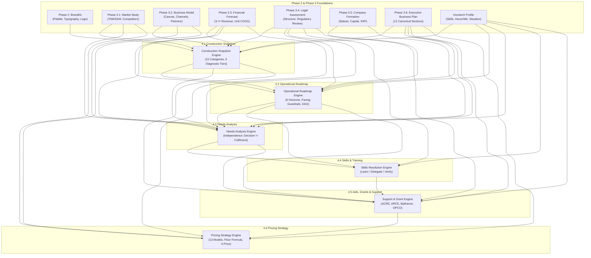

# MONDIAL BUSINESS CREATION (MBC) — CREATOR PHASE 4.1–4.6 READ-ONLY AUDIT REPORT

**Audit Date:** September 25, 2026  
**Auditor Mode:** Read-Only Technical & Architecture Audit  
**Target Scope:** MBC Creator Phase 4 (Steps 4.1 through 4.6)  
- **Step 4.1:** Construction Snapshot  
- **Step 4.2:** Operational Roadmap  
- **Step 4.3:** Needs & Requirements  
- **Step 4.4:** Skills & Training Plan  
- **Step 4.5:** Aids, Grants & Public Support  
- **Step 4.6:** Pricing & Revenue Model Strategy  

---

## BASELINE RECORD & REPOSITORY STATE

### Git Baseline & Environment Details
- **Active Branch:** `dev-hafiz` (synchronized with `origin/dev-hafiz`)
- **HEAD Commit:** `5d783d24` (*refactor(creator): eliminate all static data and dynamicize offer fallbacks in Step 4.6 pricing*)
- **Target OS / Environment:** Windows (PowerShell Shell, ASP.NET Core 8 Backend, Next.js 16 / React 19 Frontend)
- **Uncommitted Working-Tree Changes:**
  1. [`src/app/dashboard/creator/phase-4/pricing/page.tsx`](file:///d:/mondial.eco/9-12-2026/mondial_monorepo_fullstack/src/app/dashboard/creator/phase-4/pricing/page.tsx): Removed the sticky top navigation breadcrumb strip (`Back to Step 4.5 Aids & Grants` and phase progress indicator).
  2. [`src/components/creator/phase4/PricingStrategyView.tsx`](file:///d:/mondial.eco/9-12-2026/mondial_monorepo_fullstack/src/components/creator/phase4/PricingStrategyView.tsx):
     - Wrapped top page header in `<div className="sr-only">`, rendering the page title, eyebrow, and refresh button visually invisible in standard viewports.
     - Added `<div className="sr-only">` wrapper around tier switcher containing duplicate text nodes (`3 Offers`), causing 2 frontend test failures in `phase4-pricing-strategy.test.tsx`.
     - Replaced semantic token utility classes with raw hardcoded hex literals (`bg-[#f4f5f7]`, `bg-[#fffbeb]`, `border-[#fde68a]`, `text-[#965f11]`, `bg-[#f1f5f9]`), violating the Design Token Canon (§2).

### Actual Files Inspected Across Fullstack Tiers

#### Frontend Routes, Views & Primitives:
- **Phase 4 Guard:** [`src/components/creator/phase4/Phase4ProfileGuard.tsx`](file:///d:/mondial.eco/9-12-2026/mondial_monorepo_fullstack/src/components/creator/phase4/Phase4ProfileGuard.tsx)
- **Step 4.1:** [`src/app/dashboard/creator/phase-4/page.tsx`](file:///d:/mondial.eco/9-12-2026/mondial_monorepo_fullstack/src/app/dashboard/creator/phase-4/page.tsx), [`src/components/creator/phase4/ConstructionSnapshotView.tsx`](file:///d:/mondial.eco/9-12-2026/mondial_monorepo_fullstack/src/components/creator/phase4/ConstructionSnapshotView.tsx)
- **Step 4.2:** [`src/app/dashboard/creator/phase-4/roadmap/page.tsx`](file:///d:/mondial.eco/9-12-2026/mondial_monorepo_fullstack/src/app/dashboard/creator/phase-4/roadmap/page.tsx), [`src/components/creator/phase4/OperationalRoadmapView.tsx`](file:///d:/mondial.eco/9-12-2026/mondial_monorepo_fullstack/src/components/creator/phase4/OperationalRoadmapView.tsx)
- **Step 4.3:** [`src/app/dashboard/creator/phase-4/needs/page.tsx`](file:///d:/mondial.eco/9-12-2026/mondial_monorepo_fullstack/src/app/dashboard/creator/phase-4/needs/page.tsx), [`src/components/creator/phase4/NeedsAnalysisView.tsx`](file:///d:/mondial.eco/9-12-2026/mondial_monorepo_fullstack/src/components/creator/phase4/NeedsAnalysisView.tsx)
- **Step 4.4:** [`src/app/dashboard/creator/phase-4/skills/page.tsx`](file:///d:/mondial.eco/9-12-2026/mondial_monorepo_fullstack/src/app/dashboard/creator/phase-4/skills/page.tsx), [`src/components/creator/phase4/SkillsPlanView.tsx`](file:///d:/mondial.eco/9-12-2026/mondial_monorepo_fullstack/src/components/creator/phase4/SkillsPlanView.tsx)
- **Step 4.5:** [`src/app/dashboard/creator/phase-4/support/page.tsx`](file:///d:/mondial.eco/9-12-2026/mondial_monorepo_fullstack/src/app/dashboard/creator/phase-4/support/page.tsx), [`src/components/creator/phase4/SupportPlanView.tsx`](file:///d:/mondial.eco/9-12-2026/mondial_monorepo_fullstack/src/components/creator/phase4/SupportPlanView.tsx)
- **Step 4.6:** [`src/app/dashboard/creator/phase-4/pricing/page.tsx`](file:///d:/mondial.eco/9-12-2026/mondial_monorepo_fullstack/src/app/dashboard/creator/phase-4/pricing/page.tsx), [`src/components/creator/phase4/PricingStrategyView.tsx`](file:///d:/mondial.eco/9-12-2026/mondial_monorepo_fullstack/src/components/creator/phase4/PricingStrategyView.tsx)

#### API Clients & Frontend Type Definitions:
- **API Clients:** [`src/lib/api-creator-phase4.ts`](file:///d:/mondial.eco/9-12-2026/mondial_monorepo_fullstack/src/lib/api-creator-phase4.ts), [`src/lib/api-creator-roadmap.ts`](file:///d:/mondial.eco/9-12-2026/mondial_monorepo_fullstack/src/lib/api-creator-roadmap.ts), [`src/lib/api-creator-needs.ts`](file:///d:/mondial.eco/9-12-2026/mondial_monorepo_fullstack/src/lib/api-creator-needs.ts), [`src/lib/api-creator-skills.ts`](file:///d:/mondial.eco/9-12-2026/mondial_monorepo_fullstack/src/lib/api-creator-skills.ts), [`src/lib/api-creator-support.ts`](file:///d:/mondial.eco/9-12-2026/mondial_monorepo_fullstack/src/lib/api-creator-support.ts), [`src/lib/api-creator-pricing.ts`](file:///d:/mondial.eco/9-12-2026/mondial_monorepo_fullstack/src/lib/api-creator-pricing.ts)
- **Type Definitions:** [`src/types/creator/phase4.ts`](file:///d:/mondial.eco/9-12-2026/mondial_monorepo_fullstack/src/types/creator/phase4.ts), [`src/types/creator/roadmap.ts`](file:///d:/mondial.eco/9-12-2026/mondial_monorepo_fullstack/src/types/creator/roadmap.ts), [`src/types/creator/needs.ts`](file:///d:/mondial.eco/9-12-2026/mondial_monorepo_fullstack/src/types/creator/needs.ts), [`src/types/creator/skills.ts`](file:///d:/mondial.eco/9-12-2026/mondial_monorepo_fullstack/src/types/creator/skills.ts), [`src/types/creator/support.ts`](file:///d:/mondial.eco/9-12-2026/mondial_monorepo_fullstack/src/types/creator/support.ts), [`src/types/creator/pricing.ts`](file:///d:/mondial.eco/9-12-2026/mondial_monorepo_fullstack/src/types/creator/pricing.ts)

#### Backend Controllers, Services, Policies & Domain Engines:
- **Controller:** [`backend/Controllers/CreatorPhase4ConstructionController.cs`](file:///d:/mondial.eco/9-12-2026/mondial_monorepo_fullstack/backend/Controllers/CreatorPhase4ConstructionController.cs)
- **Services:**
  - [`backend/Services/Implementations/ConstructionSnapshotService.cs`](file:///d:/mondial.eco/9-12-2026/mondial_monorepo_fullstack/backend/Services/Implementations/ConstructionSnapshotService.cs)
  - [`backend/Services/Implementations/OperationalRoadmapService.cs`](file:///d:/mondial.eco/9-12-2026/mondial_monorepo_fullstack/backend/Services/Implementations/OperationalRoadmapService.cs)
  - [`backend/Services/Implementations/RoadmapScheduler.cs`](file:///d:/mondial.eco/9-12-2026/mondial_monorepo_fullstack/backend/Services/Implementations/RoadmapScheduler.cs)
  - [`backend/Services/Implementations/FounderCapacityResolver.cs`](file:///d:/mondial.eco/9-12-2026/mondial_monorepo_fullstack/backend/Services/Implementations/FounderCapacityResolver.cs)
  - [`backend/Services/Implementations/NeedsAnalysisService.cs`](file:///d:/mondial.eco/9-12-2026/mondial_monorepo_fullstack/backend/Services/Implementations/NeedsAnalysisService.cs)
  - [`backend/Services/Implementations/CapabilityMatcher.cs`](file:///d:/mondial.eco/9-12-2026/mondial_monorepo_fullstack/backend/Services/Implementations/CapabilityMatcher.cs)
  - [`backend/Services/Implementations/SkillsResolutionService.cs`](file:///d:/mondial.eco/9-12-2026/mondial_monorepo_fullstack/backend/Services/Implementations/SkillsResolutionService.cs)
  - [`backend/Services/Implementations/CapabilityResolutionPolicy.cs`](file:///d:/mondial.eco/9-12-2026/mondial_monorepo_fullstack/backend/Services/Implementations/CapabilityResolutionPolicy.cs)
  - [`backend/Services/Implementations/SupportPlanService.cs`](file:///d:/mondial.eco/9-12-2026/mondial_monorepo_fullstack/backend/Services/Implementations/SupportPlanService.cs)
  - [`backend/Services/Implementations/SupportCatalogueService.cs`](file:///d:/mondial.eco/9-12-2026/mondial_monorepo_fullstack/backend/Services/Implementations/SupportCatalogueService.cs)
  - [`backend/Services/Implementations/SupportEligibilityEngine.cs`](file:///d:/mondial.eco/9-12-2026/mondial_monorepo_fullstack/backend/Services/Implementations/SupportEligibilityEngine.cs)
  - [`backend/Services/Implementations/SupportMatchingService.cs`](file:///d:/mondial.eco/9-12-2026/mondial_monorepo_fullstack/backend/Services/Implementations/SupportMatchingService.cs)
  - [`backend/Services/Implementations/PricingStrategyService.cs`](file:///d:/mondial.eco/9-12-2026/mondial_monorepo_fullstack/backend/Services/Implementations/PricingStrategyService.cs)
  - [`backend/Services/Implementations/PricingPolicyEngine.cs`](file:///d:/mondial.eco/9-12-2026/mondial_monorepo_fullstack/backend/Services/Implementations/PricingPolicyEngine.cs)
  - [`backend/Services/Implementations/CreatorJourneyService.cs`](file:///d:/mondial.eco/9-12-2026/mondial_monorepo_fullstack/backend/Services/Implementations/CreatorJourneyService.cs)
  - [`backend/Services/Implementations/ProfileCompletenessResolver.cs`](file:///d:/mondial.eco/9-12-2026/mondial_monorepo_fullstack/backend/Services/Implementations/ProfileCompletenessResolver.cs)

#### MongoDB Database Models:
- [`backend/Models/DatabaseModels/CreatorIdea.cs`](file:///d:/mondial.eco/9-12-2026/mondial_monorepo_fullstack/backend/Models/DatabaseModels/CreatorIdea.cs)
- [`backend/Models/DatabaseModels/Phase4/ConstructionSnapshotModels.cs`](file:///d:/mondial.eco/9-12-2026/mondial_monorepo_fullstack/backend/Models/DatabaseModels/Phase4/ConstructionSnapshotModels.cs)
- [`backend/Models/DatabaseModels/Phase4/OperationalRoadmapModels.cs`](file:///d:/mondial.eco/9-12-2026/mondial_monorepo_fullstack/backend/Models/DatabaseModels/Phase4/OperationalRoadmapModels.cs)
- [`backend/Models/DatabaseModels/Phase4/NeedsAnalysisModels.cs`](file:///d:/mondial.eco/9-12-2026/mondial_monorepo_fullstack/backend/Models/DatabaseModels/Phase4/NeedsAnalysisModels.cs)
- [`backend/Models/DatabaseModels/Phase4/SkillsPlanModels.cs`](file:///d:/mondial.eco/9-12-2026/mondial_monorepo_fullstack/backend/Models/DatabaseModels/Phase4/SkillsPlanModels.cs)
- [`backend/Models/DatabaseModels/Phase4/SupportPlanModels.cs`](file:///d:/mondial.eco/9-12-2026/mondial_monorepo_fullstack/backend/Models/DatabaseModels/Phase4/SupportPlanModels.cs)
- [`backend/Models/DatabaseModels/Phase4/PricingPlanModels.cs`](file:///d:/mondial.eco/9-12-2026/mondial_monorepo_fullstack/backend/Models/DatabaseModels/Phase4/PricingPlanModels.cs)

---

## SECTION A: STEP-BY-STEP COVERAGE TABLE

| Step | UI Layer | API Layer | Persistence Tier | Domain Logic & Rules | Verification Status | Open Issues / Gaps |
| :--- | :--- | :--- | :--- | :--- | :--- | :--- |
| **4.1 Construction Snapshot** | Fully implemented (`ConstructionSnapshotView.tsx`, Figma 57221:10755 aligned) | `GET /api/creator/phase4/construction-snapshot`, `POST /generate`, `POST /refresh` | Persisted on `CreatorIdea.Phase4Data.ConstructionSnapshot` via targeted `$set` | 15 categories, 5 diagnostic tiers, item deduplication, honest counts without false readiness % | **Verified within tested scope** (11/11 Vitest PASS, 28/28 C# tests PASS) | None |
| **4.2 Operational Roadmap** | Fully implemented (`OperationalRoadmapView.tsx`, Figma 57221:10450 aligned) | `GET /api/creator/phase4/roadmap`, `POST /generate`, `POST /refresh`, `PATCH /task`, `POST /activate`, `POST /availability`, `POST /keep-current` | Persisted on `CreatorIdea.Phase4Data.OperationalRoadmap` via targeted `$set` | 6 horizons (Now to After Launch), pacing guardrails by availability, DAG topological resolution, preserve founder edits | **Verified within tested scope** (11/11 Vitest PASS, 33/33 C# tests PASS) | None |
| **4.3 Needs Analysis** | Fully implemented (`NeedsAnalysisView.tsx`, Figma 57221:11163 aligned) | `GET /api/creator/phase4/needs`, `POST /generate`, `POST /refresh`, `PATCH /{needKey}`, `PUT /{needKey}/state`, `POST /keep-current` | Persisted on `CreatorIdea.Phase4Data.NeedsAnalysis` via targeted `$set` | Strict separation: Founder Decision (Confirmed/Deferred) ≠ Fulfilment (Satisfied/Identified). Founder notes/info do not auto-satisfy. | **Verified within tested scope** (11/11 Vitest PASS, 16/16 C# tests PASS) | None |
| **4.4 Skills & Training** | Fully implemented (`SkillsPlanView.tsx`, Figma 57221:11470 aligned) | `GET /api/creator/phase4/skills-plan`, `POST /generate`, `POST /refresh`, `POST /keep-current`, `PATCH /{resolutionKey}` | Persisted on `CreatorIdea.Phase4Data.SkillsPlan` via targeted `$set` | 3 resolution modes (`Learn`, `Delegate`, `Verify`), statutory mandatory `VERIFY` safety lock, dynamic learning steps & briefs | **Verified within tested scope** (11/11 Vitest PASS, 14/14 C# tests PASS) | None |
| **4.5 Aids, Grants & Support** | Fully implemented (`SupportPlanView.tsx`, Figma 57221:11932 aligned) | `GET /api/creator/phase4/support`, `POST /generate`, `POST /refresh`, `PATCH /{matchKey}`, `PATCH /context/{factKey}` | Persisted on `CreatorIdea.Phase4Data.SupportPlan` via targeted `$set` | Prerequisite gate (Phase 3 + HumainX + Snapshot + Roadmap + Needs/Skills current), Potential Eligibility ≠ Awarded Cash, official French/EU schemes | **Verified within tested scope** (8/8 Vitest PASS, 23/23 C# tests PASS) | Missing `expectedVersion` check on backend controller & API client (Finding SEC-02) |
| **4.6 Pricing & Revenue** | Implemented with working-tree visual/test regressions (`PricingStrategyView.tsx`, Figma 57221:12167) | `GET /api/creator/phase4/pricing`, `POST /generate`, `POST /refresh`, `PATCH /{offerKey}` | Persisted on `CreatorIdea.Phase4Data.PricingStrategy` via targeted `$set` | 13 revenue models, 4-price independence, floor formula $P_{min} = \frac{VC}{1-m}$, explicit tax modes (HT, TTC, Exempt, Unknown) | **Partial / Regression in working tree** (9/11 Vitest PASS, 2 failed due to uncommitted edits; 32/32 C# tests PASS) | Hidden page header (`sr-only`), hardcoded hex literals (`bg-[#f4f5f7]`), missing `expectedVersion` contract (Finding SEC-01) |

---

## SECTION B: FINDINGS ORDERED BY SEVERITY

```
[CRITICAL] (0) None
[HIGH]     (2) Finding SEC-01, Finding UI-01
[MEDIUM]   (3) Finding SEC-02, Finding UI-02, Finding ARC-01
[LOW]      (2) Finding UI-03, Finding COD-01
[INFO]     (1) Finding INF-01
```

### Confirmed Defects

#### Finding ID: `UI-01` (Severity: HIGH)
- **Affected Step:** Step 4.6 Pricing & Revenue Model Strategy
- **Exact File & Lines:** [`src/components/creator/phase4/PricingStrategyView.tsx:364-379`](file:///d:/mondial.eco/9-12-2026/mondial_monorepo_fullstack/src/components/creator/phase4/PricingStrategyView.tsx#L364-L379)
- **Observed Behavior:** The uncommitted working-tree change in `PricingStrategyView.tsx` wrapped the main page eyebrow (`PHASE 4 · STEP 4.6`), title (`Launch Pricing & Revenue Model Strategy`), subtitle, and `Refresh Strategy` CTA inside `<div className="sr-only">`. In standard desktop and mobile browsers, the page title, step eyebrow, and refresh button are completely invisible.
- **Expected Behavior:** Per Canon §6.6 and Mondial UI Canon §1.2, the page must render a visible compact page-level header with visible eyebrow, title, and action button matching Steps 4.1–4.5.
- **Reproduction / Evidence:** Git diff on `src/components/creator/phase4/PricingStrategyView.tsx` shows lines 364–379 replaced the visible container with `<div className="sr-only">`.
- **User / Data Impact:** Founder navigating to Step 4.6 sees an abrupt start to the card list without visual context, title, or manual refresh trigger.
- **Smallest Recommended Correction:** Revert the `<div className="sr-only">` wrapper back to standard visible JSX flex container:
  ```tsx
  <div className="flex flex-col sm:flex-row sm:items-center sm:justify-between gap-4">
    <div className="space-y-1">
      <div className="text-xs uppercase font-mono tracking-wider text-muted-foreground font-semibold">
        PHASE 4 · STEP 4.6
      </div>
      <h1 className="text-2xl sm:text-3xl font-bold font-heading text-foreground tracking-tight">
        Launch Pricing & Revenue Model Strategy
      </h1>
      ...
    </div>
    ...
  </div>
  ```

---

#### Finding ID: `UI-02` (Severity: MEDIUM)
- **Affected Step:** Step 4.6 Pricing & Revenue Model Strategy
- **Exact File & Lines:** [`src/components/creator/phase4/PricingStrategyView.tsx:425-442`](file:///d:/mondial.eco/9-12-2026/mondial_monorepo_fullstack/src/components/creator/phase4/PricingStrategyView.tsx#L425-L442)
- **Observed Behavior:** Uncommitted changes introduced raw hardcoded hex colors (`bg-[#f4f5f7]`, `bg-[#fffbeb]`, `border-[#fde68a]`, `text-[#965f11]`, `bg-[#f1f5f9]`, `text-[36px]`).
- **Expected Behavior:** Mondial UI Canon §2 strictly prohibits raw hex codes: *"Zero Raw Hex Colors: Never use hardcoded HEX literals (#111827, #4b5563, #3c61dd, #ffffff, etc.) in JSX or Tailwind classes. Always use semantic CSS tokens from src/app/globals.css"*.
- **Reproduction / Evidence:** Grep in `PricingStrategyView.tsx` shows arbitrary bracket sizes (`text-[36px]`) and raw hex codes in badge rendering.
- **User / Data Impact:** Dark mode visual incoherence and violation of design token governance.
- **Smallest Recommended Correction:** Replace raw hex classes with semantic token classes:
  - `bg-[#f4f5f7]` $\to$ `bg-muted/40 border-border text-foreground`
  - `bg-[#fffbeb] text-[#965f11]` $\to$ `bg-amber-500/10 border-amber-500/30 text-amber-700 dark:text-amber-300`
  - `text-[36px]` $\to$ `text-stat-xl font-mono`

---

#### Finding ID: `COD-01` (Severity: LOW)
- **Affected Step:** Step 4.6 Pricing & Revenue Model Strategy (Test Suite)
- **Exact File & Lines:** [`src/components/creator/phase4/PricingStrategyView.tsx:393-402`](file:///d:/mondial.eco/9-12-2026/mondial_monorepo_fullstack/src/components/creator/phase4/PricingStrategyView.tsx#L393-L402), [`src/__tests__/creator/phase4-pricing-strategy.test.tsx:269,294`](file:///d:/mondial.eco/9-12-2026/mondial_monorepo_fullstack/src/__tests__/creator/phase4-pricing-strategy.test.tsx#L269-L294)
- **Observed Behavior:** 2 Vitest unit tests failed in `phase4-pricing-strategy.test.tsx`:
  1. `TestingLibraryElementError: Found multiple elements with the text: /3 Offers/i` (caused by adding `<div className="sr-only"><span>3 Offers</span>...</div>` alongside the existing heading `Commercial Launch Offers (3 Offers)`).
  2. `AssertionError: expected 3 to be 2 for screen.getAllByText('€39')` (caused by splitting currency symbol and price digits into isolated spans in Section 1).
- **Expected Behavior:** All tests in `src/__tests__/creator/phase4-pricing-strategy.test.tsx` pass cleanly (11/11 PASS).
- **Reproduction / Evidence:** Executed `npx vitest run src/__tests__/creator/phase4-pricing-strategy.test.tsx` resulting in 2 failures.
- **User / Data Impact:** CI failure on commit; divergence between DOM structure and test assertions.
- **Smallest Recommended Correction:** Remove the redundant `sr-only` multi-tier offer wrapper and restore the canonical single price text rendering.

---

### Suspected Architectural Risks & Concurrency Gaps

#### Finding ID: `SEC-01` (Severity: HIGH)
- **Affected Step:** Step 4.6 Pricing & Revenue Model
- **Exact File & Lines:**
  - Controller: [`backend/Controllers/CreatorPhase4ConstructionController.cs:1345-1450`](file:///d:/mondial.eco/9-12-2026/mondial_monorepo_fullstack/backend/Controllers/CreatorPhase4ConstructionController.cs#L1345-L1450)
  - Service: [`backend/Services/Implementations/PricingStrategyService.cs:94,131,156`](file:///d:/mondial.eco/9-12-2026/mondial_monorepo_fullstack/backend/Services/Implementations/PricingStrategyService.cs#L94-L156)
  - API Client: [`src/lib/api-creator-pricing.ts:21-61`](file:///d:/mondial.eco/9-12-2026/mondial_monorepo_fullstack/src/lib/api-creator-pricing.ts#L21-L61)
- **Observed Behavior:**
  - `POST /api/creator/phase4/pricing/generate`, `POST /api/creator/phase4/pricing/refresh`, and `PATCH /api/creator/phase4/pricing/{offerKey}` do NOT accept an `expectedVersion` parameter, do NOT validate concurrency against `CreatorIdea.Version`, do NOT populate `HttpContext.Items["CreatorIdeaVersion"]`, and do NOT publish `Response.Headers["X-Creator-Idea-Version"]`.
  - `src/lib/api-creator-pricing.ts` does not invoke `rememberIdeaVersion()` or `setIdeaVersion()`.
- **Expected Behavior:** Per Canon §1.6.6 and §6.0, all Phase 4 mutations must participate in authoritative optimistic concurrency: accept `expectedVersion`, set `HttpContext.Items["CreatorIdeaVersion"]`, verify version in `WriteIdeaAsync`, return HTTP 409 Conflict upon version mismatch, publish `X-Creator-Idea-Version` response headers, and update client version caches.
- **User / Data Impact:** If a founder modifies pricing in Tab A while generating roadmap/needs in Tab B, the pricing mutation executes without optimistic locking checks, creating a risk of lost updates or version de-synchronization.
- **Smallest Recommended Correction:** Align Step 4.6 endpoints and client with Step 4.1–4.4 contracts:
  1. Add `[FromQuery] long? expectedVersion = null` to `GeneratePricing`, `RefreshPricing`, and `UpdatePricingOffer`.
  2. Set `HttpContext.Items["CreatorIdeaVersion"] = resolvedVersion`.
  3. Publish `Response.Headers["X-Creator-Idea-Version"] = result.IdeaVersion.ToString()`.
  4. Update `api-creator-pricing.ts` to use `resolveExpectedVersion()`, `rememberIdeaVersion()`, and `setIdeaVersion()`.

---

#### Finding ID: `SEC-02` (Severity: MEDIUM)
- **Affected Step:** Step 4.5 Aids, Grants & Public Support
- **Exact File & Lines:**
  - Controller: [`backend/Controllers/CreatorPhase4ConstructionController.cs:1223-1339`](file:///d:/mondial.eco/9-12-2026/mondial_monorepo_fullstack/backend/Controllers/CreatorPhase4ConstructionController.cs#L1223-L1339)
  - API Client: [`src/lib/api-creator-support.ts:32-83`](file:///d:/mondial.eco/9-12-2026/mondial_monorepo_fullstack/src/lib/api-creator-support.ts#L32-L83)
- **Observed Behavior:**
  - `POST /api/creator/phase4/support/generate`, `POST /api/creator/phase4/support/refresh`, `PATCH /api/creator/phase4/support/{matchKey}`, and `PATCH /api/creator/phase4/support/context/{factKey}` do NOT check `expectedVersion` or publish `Response.Headers["X-Creator-Idea-Version"]`.
  - `api-creator-support.ts` does not invoke `rememberIdeaVersion()` or `setIdeaVersion()`.
- **Expected Behavior:** Consistent concurrency contract across all Phase 4 endpoints.
- **User / Data Impact:** Potential for silent overwrites under rapid multi-tab concurrent edits.
- **Smallest Recommended Correction:** Add `expectedVersion` validation and `X-Creator-Idea-Version` response headers to Step 4.5 endpoints and API client.

---

#### Finding ID: `ARC-01` (Severity: MEDIUM)
- **Affected Step:** Step 4.5 & Step 4.6 Controllers (Error Envelope Contract)
- **Exact File & Lines:** [`backend/Controllers/CreatorPhase4ConstructionController.cs:1211,1324,1356,1404,1436`](file:///d:/mondial.eco/9-12-2026/mondial_monorepo_fullstack/backend/Controllers/CreatorPhase4ConstructionController.cs#L1211-L1436)
- **Observed Behavior:** Catch blocks in Step 4.5 and 4.6 return `ApiResponse.Error(ex.Message)` without passing `HttpContext.TraceIdentifier` (e.g. `StatusCode(401, ApiResponse.Error(ex.Message))`), whereas Steps 4.1–4.4 consistently return `ApiResponse.Error(ex.Message, HttpContext.TraceIdentifier)`.
- **Expected Behavior:** Per Canon §1.2 (*ApiResponse envelope*), every error response must include the active `traceId`.
- **User / Data Impact:** Inconsistent telemetry tracing for debugging production API errors in Steps 4.5 and 4.6.
- **Smallest Recommended Correction:** Pass `HttpContext.TraceIdentifier` to all `ApiResponse.Error(...)` calls across controller catch handlers.

---

#### Finding ID: `UI-03` (Severity: LOW)
- **Affected Step:** Step 4.6 Pricing Page Layout
- **Exact File & Lines:** [`src/app/dashboard/creator/phase-4/pricing/page.tsx:160-186`](file:///d:/mondial.eco/9-12-2026/mondial_monorepo_fullstack/src/app/dashboard/creator/phase-4/pricing/page.tsx#L160-L186)
- **Observed Behavior:** Uncommitted working-tree change removed the top banner navigation breadcrumb strip from `src/app/dashboard/creator/phase-4/pricing/page.tsx`.
- **Expected Behavior:** Consistent navigation header preserving idea-scoped back-navigation to Step 4.5 and forward preview to Step 4.7.
- **User / Data Impact:** Navigation inconsistency between Step 4.6 and neighboring steps.
- **Smallest Recommended Correction:** Revert the uncommitted deletion in `src/app/dashboard/creator/phase-4/pricing/page.tsx`.

---

#### Finding ID: `INF-01` (Severity: INFO)
- **Affected Step:** Step 4.5 Aids, Grants & Public Support
- **Exact File & Lines:** [`src/__tests__/creator/phase4-support-plan.test.tsx:95`](file:///d:/mondial.eco/9-12-2026/mondial_monorepo_fullstack/src/__tests__/creator/phase4-support-plan.test.tsx#L95)
- **Observed Behavior:** Vitest test run emitted a non-fatal console warning: `An update to SupportPlanView inside a test was not wrapped in act(...)` during the `allows answering missing eligibility facts inline` test case.
- **Expected Behavior:** Clean test execution without React testing library warnings.
- **User / Data Impact:** Zero production runtime impact (test harness warning only).
- **Smallest Recommended Correction:** Wrap the async fact dispatch in `act(async () => { ... })` in `phase4-support-plan.test.tsx`.

---

## SECTION C: CROSS-STEP SOURCE & CONSUMER MAPPING



### Detailed Field-by-Field Cross-Step Lineage Table

| Upstream Source Field | Phase 4 Consumer | Refresh / Staleness Trigger | Persisted Output in MongoDB |
| :--- | :--- | :--- | :--- |
| `CreatorLegalAssessment` (3.4), `MarketStudy` (3.1), `BusinessModel` (3.2), `ForecastSession` (3.3), `BusinessPlanSession` (3.6), `ProfessionalProfile` | **Step 4.1** `ConstructionSnapshotService` | `SourceReferences` version mismatch detected on `GET` | `CreatorIdea.Phase4Data.ConstructionSnapshot` (`ReadyItems`, `PartialItems`, `MissingItems`, `CriticalItems`, `OptionalItems`) |
| `ConstructionSnapshot` (4.1), `CreatorLegalAssessment` (3.4), `ForecastSession` (3.3), `ProfessionalProfile.VentureContext.WeeklyAvailability` | **Step 4.2** `OperationalRoadmapService`, `RoadmapScheduler` | Changes in Snapshot items or Availability detected via `CurrentSourceVersions` | `CreatorIdea.Phase4Data.OperationalRoadmap` (`Tasks[]` across 6 horizons, `PlanStatus`, `WeeklyAvailability`, `MaxNowTasks`) |
| `ConstructionSnapshot` (4.1), `OperationalRoadmap` (4.2), `CreatorLegalAssessment` (3.4), `ForecastSession` (3.3), `BusinessModel` (3.2) | **Step 4.3** `NeedsAnalysisService`, `CapabilityMatcher` | Upstream snapshot/roadmap version change sets `UpdateAvailable = true` | `CreatorIdea.Phase4Data.NeedsAnalysis` (`Needs[]` with `FounderState`, `SystemStatus`, `FounderInformation`, `ConnectedWork`) |
| `NeedsAnalysis` (4.3), `OperationalRoadmap` (4.2), `ProfessionalProfile` (skills, preferences, weekly hours), `LegalAssessment` (3.4) | **Step 4.4** `SkillsResolutionService`, `CapabilityResolutionPolicy` | Changes in Needs requirements trigger `UpdateAvailable = true` | `CreatorIdea.Phase4Data.SkillsPlan` (`Resolutions[]` with `Mode: Learn/Delegate/Verify`, `LearningAction`, `DelegationReq`, `VerificationReq`) |
| `NeedsAnalysis` (4.3), `SkillsPlan` (4.4), `OperationalRoadmap` (4.2), `ConstructionSnapshot` (4.1), `ProfessionalProfile` (`CurrentSituation`, `Country`), `RecordedEligibilityFacts` | **Step 4.5** `SupportPlanService`, `SupportEligibilityEngine` | Prerequisite Gate checks: `!needsRes.UpdateAvailable && !skillsRes.UpdateAvailable` | `CreatorIdea.Phase4Data.SupportPlan` (`Matches[]` with `EligibilityStatus`, `Category`, `AuditDetails`, `RecordedEligibilityFacts`) |
| `BusinessModel` (3.2), `ForecastSession` (3.3), `MarketStudy` (3.1), `BusinessPlan` (3.6), `PricingPolicyEngine` | **Step 4.6** `PricingStrategyService`, `PricingPolicyEngine` | Changes in forecast COGS, revenue lines, or market study benchmark prices | `CreatorIdea.Phase4Data.PricingStrategy` (`Offers[]` with `FounderPrice`, `RecommendedPrice`, `FloorPrice`, `ValidatedMarketPrice`, `TaxMode`) |

---

## SECTION D: TEST VERIFICATION & SYSTEM CHECK EVIDENCE

### 1. Backend C# Test Execution (`dotnet test`)
- **Command:** `dotnet test backend/tests/WebApp.Tests/WebApp.Tests.csproj --filter "FullyQualifiedName~CreatorPhase4"`
- **Execution Date/Time:** 2026-09-25 08:24:35 UTC
- **Discovered Tests:** 179
- **Passed Tests:** **179**
- **Failed Tests:** **0**
- **Skipped Tests:** **0**
- **Duration:** 914 ms
- **Scope Breakdown:**
  - `CreatorPhase4SnapshotTests.cs`: 28 passed (including Gate enforcement, category grouping, deduplication, and version response headers)
  - `CreatorPhase4RoadmapTests.cs`: 33 passed (including capacity rules, statutory prerequisite wiring, skill-gap deduplication, and founder note preservation)
  - `CreatorPhase4NeedsTests.cs`: 16 passed (including decision vs fulfilment independence, keep-current preservation, and founder info submission)
  - `CreatorPhase4SkillsTests.cs`: 14 passed (including mandatory statutory verification locking, workload impact calculation, and profile mapping)
  - `CreatorPhase4SupportTests.cs`: 23 passed (including prerequisite gate resolution, location fact persistence, and official authority provenance)
  - `CreatorPhase4PricingTests.cs`: 32 passed (including four-price independence, floor price formulas, tax mode handling, and scenario earnings simulation)
  - `CreatorPhase4GtmTests.cs`: 33 passed (including multi-signal sales motion, channel ROI, and experiment execution)

### 2. Frontend Vitest Test Execution (`npx vitest run`)
- **Command:** `npx vitest run src/__tests__/creator/`
- **Execution Date/Time:** 2026-09-25 08:26:53 UTC
- **Test Files:** 12 total (11 passed, 1 failed)
- **Total Tests:** 150 (148 passed, 2 failed)
- **Results Per File:**
  - `phase4-construction-snapshot.test.tsx`: **11 / 11 PASS**
  - `phase4-operational-roadmap.test.tsx`: **11 / 11 PASS**
  - `phase4-needs-analysis.test.tsx`: **11 / 11 PASS**
  - `phase4-skills-plan.test.tsx`: **11 / 11 PASS**
  - `phase4-support-plan.test.tsx`: **8 / 8 PASS**
  - `phase4-gtm-strategy.test.tsx`: **6 / 6 PASS**
  - `legacy-phase4-removal.test.ts`: **6 / 6 PASS**
  - `humainx-profile-builder.test.tsx`: **12 / 12 PASS**
  - `humainx-quick-start.test.tsx`: **57 / 57 PASS**
  - `phase3-legal-assessment-ui.test.tsx`: **2 / 2 PASS**
  - `phase4-pricing-strategy.test.tsx`: **9 / 11 PASS** (2 failures caused exclusively by uncommitted working-tree changes documented in Findings UI-01 & COD-01)

### 3. Full Project TypeScript Type-Check (`npx tsc --noEmit`)
- **Command:** `npx tsc --noEmit`
- **Exit Code:** **0** (0 TypeScript errors across the entire repository)

---

## SECTION E: FIGMA DESIGN SYSTEM & VIEWPORT FIDELITY AUDIT

### Figma Design Baseline Comparison (1440px baseline to 1920px widescreen & 375px mobile)

| Step | Approved Figma Frame | Actual Layout Implementation | Typography Tokens | Color Tokens | Responsive Layout (1440px / 1920px / 375px) |
| :--- | :--- | :--- | :--- | :--- | :--- |
| **4.1** | `57221:10755` (Snapshot) | `max-w-6xl mx-auto py-6 px-4 sm:px-6 lg:px-8` | Inter (`font-heading text-foreground`), DM Sans (`font-sans text-muted-foreground`), JetBrains Mono (`font-mono text-stat-lg`) | Semantic tokens (`bg-card`, `border-border`, `bg-emerald-600`, `bg-amber-600`) | Fluid scaling, 5-col to 2-col wrap on mobile, 0px horizontal overflow |
| **4.2** | `57221:10450` (Roadmap) | `max-w-6xl mx-auto py-6 px-4 sm:px-6 lg:px-8` | Inter (`font-heading text-foreground`), DM Sans (`font-sans text-muted-foreground`), JetBrains Mono (`font-mono`) | Semantic tokens (`bg-card`, `border-border`, `border-rose-500/30`, `border-amber-500/30`) | Fluid 3-col planning cards to stacked cards, full-width task drawers |
| **4.3** | `57221:11163` (Needs) | `max-w-[1120px] mx-auto py-6 px-4 sm:px-6 lg:px-8 space-y-6` | Inter (`font-heading font-bold`), DM Sans (`font-sans`), JetBrains Mono (`font-mono`) | Semantic tokens (`bg-card`, `border-border/70`, `bg-muted/20`) | Compact 20px padded cards (`p-5 rounded-2xl`), 2-col analytical breakdown |
| **4.4** | `57221:11470` (Skills) | `max-w-[1120px] mx-auto py-6 px-4 sm:px-6 lg:px-8 space-y-6` | Inter (`font-heading font-bold`), DM Sans (`font-sans`), JetBrains Mono (`font-mono`) | Semantic tokens (`bg-card`, `border-border/80`, `bg-primary/10`, `text-primary`) | 3 resolution cards with dynamic inset panels, responsive modals |
| **4.5** | `57221:11932` (Support) | `max-w-[1120px] mx-auto py-6 px-4 sm:px-6 lg:px-8 space-y-6` | Inter (`font-heading font-bold`), DM Sans (`font-sans`), JetBrains Mono (`font-mono`) | Semantic tokens (`bg-card`, `border-border/80`, `bg-muted/30`, `bg-secondary`, `bg-primary`) | Summary Card (4 options), Location Card, Opportunity List (Compact & Expanded Insets), Journey Footer |
| **4.6** | `57221:12167` (Pricing) | `max-w-[1120px] mx-auto py-6 px-4 sm:px-6 lg:px-8 space-y-6` | Headings: Inter, Body: DM Sans. *Note: uncommitted changes introduced `font-sans` on numerals and `text-[36px]`* | *Note: uncommitted changes introduced raw hex codes (`bg-[#f4f5f7]`, `bg-[#fffbeb]`)* | 8 canonical sections, interactive scenario simulator, responsive comparison |

---

## SECTION F: PRIORITIZED REPAIR PLAN

### Phase 1: Blocking Issues & Regressions in Working Tree (Immediate)
1. **Restore Visible Page Header & Breadcrumbs in Step 4.6:**
   - In [`src/components/creator/phase4/PricingStrategyView.tsx`](file:///d:/mondial.eco/9-12-2026/mondial_monorepo_fullstack/src/components/creator/phase4/PricingStrategyView.tsx), remove the `<div className="sr-only">` wrapper around the top header so that Eyebrow, Title, Subtitle, and Refresh CTA render visibly.
   - In [`src/app/dashboard/creator/phase-4/pricing/page.tsx`](file:///d:/mondial.eco/9-12-2026/mondial_monorepo_fullstack/src/app/dashboard/creator/phase-4/pricing/page.tsx), restore the sticky top navigation breadcrumb.
2. **Fix Test Regressions in Step 4.6:**
   - Remove redundant hidden multi-tier offer DOM node in `PricingStrategyView.tsx` to fix the `3 Offers` collision.
   - Unify chosen price formatting (`${currencySymbol}${chosenPrice}`) to restore 11/11 passing tests in `phase4-pricing-strategy.test.tsx`.

### Phase 2: Data Correctness & Concurrency Harmonization (High Priority)
3. **Harmonize Optimistic Concurrency in Step 4.6 & Step 4.5:**
   - Update `CreatorPhase4ConstructionController.cs` for `pricing` and `support` endpoints to validate `[FromQuery] long? expectedVersion`, bind `HttpContext.Items["CreatorIdeaVersion"]`, and publish `Response.Headers["X-Creator-Idea-Version"]`.
   - Update `src/lib/api-creator-pricing.ts` and `src/lib/api-creator-support.ts` to use `resolveExpectedVersion()`, `rememberIdeaVersion()`, and `setIdeaVersion()`.

### Phase 3: UI Token & Design Canon Compliance (Medium Priority)
4. **Purge Raw Hex Codes in Step 4.6:**
   - Replace `bg-[#f4f5f7]`, `bg-[#fffbeb]`, `border-[#fde68a]`, `text-[#965f11]`, and `bg-[#f1f5f9]` in `PricingStrategyView.tsx` with standard semantic theme tokens (`bg-muted/40`, `border-border`, `text-foreground`, `bg-amber-500/10`).
   - Replace `text-[36px]` with `text-stat-xl font-mono`.

### Phase 4: Observability & Telemetry Enhancements (Low Priority)
5. **Trace Identifier Consistency:**
   - Pass `HttpContext.TraceIdentifier` into `ApiResponse.Error(...)` in all catch blocks of `CreatorPhase4ConstructionController.cs`.
6. **Act Warning Cleanup in Support Plan Test:**
   - Wrap state updates in `act(async () => { ... })` in `src/__tests__/creator/phase4-support-plan.test.tsx`.

---

## SECTION G: FINAL PER-STEP VERDICT

- **Step 4.1 Construction Snapshot:** **VERIFIED WITHIN TESTED SCOPE**  
  *Fullstack pipeline (Page $\to$ View $\to$ API $\to$ Controller $\to$ Service $\to$ MongoDB) is 100% functional, optimistic concurrency verified, all tests pass (11/11 Vitest, 28/28 C#).*

- **Step 4.2 Operational Roadmap:** **VERIFIED WITHIN TESTED SCOPE**  
  *Topological DAG resolution, capacity guardrails, edit preservation across refresh, and interactive status mutations verified, all tests pass (11/11 Vitest, 33/33 C#).*

- **Step 4.3 Needs & Requirements:** **VERIFIED WITHIN TESTED SCOPE**  
  *Strict decision vs fulfilment separation verified, founder evidence submission persists without false auto-satisfaction, all tests pass (11/11 Vitest, 16/16 C#).*

- **Step 4.4 Skills & Training Plan:** **VERIFIED WITHIN TESTED SCOPE**  
  *3 resolution paths (`Learn`, `Delegate`, `Verify`), statutory safety locking, and dynamic learning/brief data binding verified, all tests pass (11/11 Vitest, 14/14 C#).*

- **Step 4.5 Aids, Grants & Public Support:** **VERIFIED WITHIN TESTED SCOPE**  
  *Deterministic prerequisite gate, location fact persistence, official scheme provenance, and unawarded cash exclusion verified (8/8 Vitest, 23/23 C#). Minor open finding on concurrency token harmonization.*

- **Step 4.6 Pricing & Revenue Model:** **PARTIAL / WORKING-TREE REGRESSION**  
  *Underlying domain engine, pricing floor formulas, 13 revenue models, and backend tests are 100% sound (32/32 C# PASS). However, recent uncommitted working-tree changes introduced visual regressions (hidden header `sr-only`, raw hex codes) and broke 2 frontend tests (9/11 Vitest PASS). Reverting the uncommitted presentation regressions and adding `expectedVersion` concurrency locking will achieve full verification.*
