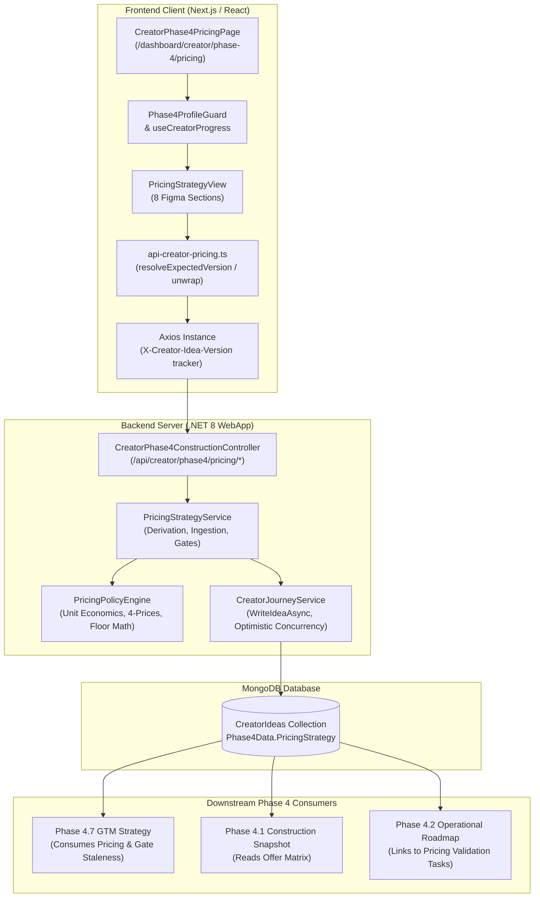

# End-to-End Data Flow Audit: MBC Creator Phase 4.6 — Pricing & Revenue Model

**Target Route:** `/dashboard/creator/phase-4/pricing`  
**Approved Figma Reference:** Node `57221:12167` (Sections `57221:12169`–`57221:12450`)  
**Audit Scope:** End-to-end data binding, API contracts, persistence, response synchronization, and downstream consumption  
**Audit Date:** 2026-09-27  
**Branch:** `dev-hafiz`  
**HEAD SHA:** `7324923b463530c05f14afe9c95707d6d03177ed`  
**Working-Tree State:** Uncommitted modifications present in working tree for tested Phase 4.6 repairs and audit documentation (see Section 7 for exact file delta).

---

## 1. Executive Summary & Component Architecture



---

## 2. Eight-Section UI ↔ Backend Field & Data Binding Mapping

Every displayed element and editable input in the 8 approved Figma sections (`57221:12167`) is mapped below across the full lifecycle:

### Classification Legend:
- **[PERSISTED]**: Stored in MongoDB `CreatorIdeas.Phase4Data.PricingStrategy`.
- **[SERVER-DERIVED]**: Recalculated deterministically by `PricingPolicyEngine` from context & founder choices.
- **[LOCAL-DRAFT]**: Temporary React state in `PricingStrategyView` before submission.
- **[LOCAL-SCENARIO]**: Client-side interactive planning simulator calculation (never mutates forecasts).
- **[STATIC-COPY]**: Fixed educational or structural UI copy specified by Figma.

---

### Section 1: Compact Pricing Summary (Figma 57221:12169)

| UI Element | Type | Frontend State / Selector | API JSON Field | Backend Model Property | Source / Derivation Rule | Persistence Path | Response & Hydration |
| :--- | :--- | :--- | :--- | :--- | :--- | :--- | :--- |
| **Chosen Price Amount** | [PERSISTED] | `chosenPrice` (parsed from `chosenPriceInput` or `activeOffer.founderPrice ?? activeOffer.recommendedPrice`) | `strategy.offers[i].founderPrice` / `recommendedPrice` | `PricingOffer.FounderPrice` / `RecommendedPrice` | Founder override if set; otherwise algorithmic recommended price. | `CreatorIdeas.Phase4Data.PricingStrategy.Offers[i].FounderPrice` | Hydrated into `chosenPriceInput` on offer switch. |
| **Billing Unit / Period** | [PERSISTED] | `activeOffer?.billingPeriod` | `strategy.offers[i].billingPeriod` | `PricingOffer.BillingFrequency` | Inferred from Phase 3 Business Model assumption or founder customized billing frequency. | `CreatorIdeas.Phase4Data.PricingStrategy.Offers[i].BillingFrequency` | Formatted as `per business / ${billingPeriod.toLowerCase()}`. |
| **Currency Symbol** | [SERVER-DERIVED] | `currencySymbol` | `strategy.offers[i].presentation.currency` | `PricePresentation.Currency` | ISO currency code (`EUR` $\rightarrow$ `€`, `USD` $\rightarrow$ `$`, `GBP` $\rightarrow$ `£`). | `CreatorIdeas.Phase4Data.PricingStrategy.Offers[i].Presentation.Currency` | Extracted via `getCurrencySymbol()`. |
| **Model Badge** | [SERVER-DERIVED] | `modelDisplay` | `strategy.offers[i].revenueModel` | `PricingOffer.PricingModel` | Primary revenue model mapped (e.g., `Subscription` $\rightarrow$ `"Monthly subscription"`). | `CreatorIdeas.Phase4Data.PricingStrategy.Offers[i].PricingModel` | Displayed in top pill. |
| **Evidence Validation Badge** | [SERVER-DERIVED] | `isTested`, `marketPriceValidationLevel` | `strategy.offers[i].marketPriceValidationLevel` | `PricingOffer.MarketPriceValidationLevel` | `EmpiricallyValidated` or `Supported` if paid preorders/sales exist; otherwise `Not tested`. | `CreatorIdeas.Phase4Data.PricingStrategy.Offers[i].MarketPriceValidationLevel` | Green/amber status pill with indicator dot. |
| **Offer Draft Chip** | [PERSISTED] | `activeOffer?.status` | `strategy.offers[i].status` | `PricingOffer.Status` | Validation status (`Draft`, `Valid`, `BelowFloor`). | `CreatorIdeas.Phase4Data.PricingStrategy.Offers[i].Status` | Rendered in secondary badge. |

---

### Section 2: How You’ll Charge (Figma 57221:12185)

| UI Element | Type | Frontend State / Selector | API JSON Field | Backend Model Property | Source / Derivation Rule | Persistence Path | Response & Hydration |
| :--- | :--- | :--- | :--- | :--- | :--- | :--- | :--- |
| **Revenue Model Heading** | [SERVER-DERIVED] | `modelDisplay` | `strategy.primaryRevenueModel` | `PricingStrategy.PrimaryRevenueModel` | Sector and Phase 3 Business Model derivation ($P_{model}$). | `CreatorIdeas.Phase4Data.PricingStrategy.PrimaryRevenueModel` | Displayed with `"Suggested"` badge. |
| **Billing Frequency Sentence** | [SERVER-DERIVED] | `activeOffer?.billingPeriod` | `strategy.offers[i].billingPeriod` | `PricingOffer.BillingFrequency` | Formatted sentence: `"Customers pay each ${period} to use your product."` | `CreatorIdeas.Phase4Data.PricingStrategy.Offers[i].BillingFrequency` | Computed in view from active offer. |
| **Product Purpose Lead** | [SERVER-DERIVED] | `activeOffer?.featuresIncluded` | `strategy.offers[i].featuresIncluded` | `PricingOffer.IncludedFeatures` | Sliced top 3 features or default value proposition. | `CreatorIdeas.Phase4Data.PricingStrategy.Offers[i].IncludedFeatures` | Rendered under heading. |
| **"Change Model" / "Customize Offer"** | [LOCAL-DRAFT] $\rightarrow$ [PERSISTED] | `editingOffer`, `editPrice`, `editBillingPeriod`, `editDiscount`, `editFeatures`, `editNotes` | `PATCH /pricing/{key}` body: `{ founderPrice, billingFrequency, featuresIncluded, launchDiscountPercentage, founderNotes }` | `UpdatePricingOfferRequest` | Opens modal allowing founder to customize offer price, billing model/frequency (`Monthly`, `Annual`, `Retainer`, `Milestone`, `OneOff`, `PerUse`), features, and discounts. | Database `Phase4Data.PricingStrategy.Offers[i]` | On save, triggers `onUpdateOffer`, persists to MongoDB, recalculates economics/simulator basis, and updates UI. |
| **"Customers pay for"** | [PERSISTED] | `activeOffer?.targetSegment` | `strategy.offers[i].targetSegment` | `PricingOffer.CustomerSegment` | Segment name derived from Phase 3 Customer Segments. | `CreatorIdeas.Phase4Data.PricingStrategy.Offers[i].CustomerSegment` | Rendered in column 1. |
| **"What’s included" Features List** | [PERSISTED] | `activeOffer?.featuresIncluded` | `strategy.offers[i].featuresIncluded` | `PricingOffer.IncludedFeatures` | Comma-separated feature package. | `CreatorIdeas.Phase4Data.PricingStrategy.Offers[i].IncludedFeatures` | Editable via customize modal. |
| **Usage & Support Limits** | [STATIC-COPY] | Static badges | N/A | N/A | Invariant Figma copy: `"Usage limits — To confirm"`, `"Support included — To confirm"`. | N/A | Rendered with amber indicator dots. |

---

### Section 3: Price Comparison & Choice (Figma 57221:12224)

| UI Element | Type | Frontend State / Selector | API JSON Field | Backend Model Property | Source / Derivation Rule | Persistence Path | Response & Hydration |
| :--- | :--- | :--- | :--- | :--- | :--- | :--- | :--- |
| **Suggested Price** | [SERVER-DERIVED] | `activeOffer?.recommendedPrice` | `strategy.offers[i].recommendedPrice` | `PricingOffer.RecommendedPrice` | Calculated from sector benchmarks, ARPU forecast, and target margin. | `CreatorIdeas.Phase4Data.PricingStrategy.Offers[i].RecommendedPrice` | Displayed in left column (`€19`). |
| **"Use Suggested Price" Action** | [LOCAL-DRAFT] $\rightarrow$ [PERSISTED] | Triggers `executeSavePrice(recommendedPrice)` | `PATCH /pricing/{key}` with `founderPrice = recommendedPrice` | `PricingOffer.FounderPrice` | Explicitly records founder selection of recommended price, marking `FounderEdited = true`. | `CreatorIdeas.Phase4Data.PricingStrategy.Offers[i].FounderPrice` | Updates `chosenPriceInput` and persists immediately. |
| **Chosen Price Input Box** | [LOCAL-DRAFT] $\rightarrow$ [PERSISTED] | `chosenPriceInput`, `onBlur` $\rightarrow$ `executeSavePrice(parsed)` | `PATCH /pricing/{key}` with `founderPrice` | `PricingOffer.FounderPrice` | Live input; validated on blur/change; coordinated via `activeSavePromiseRef` lock. | `CreatorIdeas.Phase4Data.PricingStrategy.Offers[i].FounderPrice` | Re-renders price across summary, simulator, and next action. |
| **Currency Badge** | [PERSISTED] | `getCurrencyLabel(activeOffer?.presentation?.currency)` | `strategy.offers[i].presentation.currency` | `PricePresentation.Currency` | ISO currency string (e.g. `EUR (€)`). | `CreatorIdeas.Phase4Data.PricingStrategy.Offers[i].Presentation.Currency` | Left prefix of price input. |
| **Cost Risk Banner** | [SERVER-DERIVED] | `costBasisState`, `variableCost`, `priceFloor`, `chosenPrice` | `strategy.offers[i].unitEconomics.costBasisState`, `minimumPriceFloor`, `validationStatus` | `UnitEconomics.CostBasisState`, `MinimumPriceFloor`, `ValidationStatus` | Evaluates 4 cost states and 3 CM boundaries: (1) `InvalidNegative`, (2) `UnknownOrIncomplete`, (3) `ExplicitZero`, (4) $Price < VC$, $Price = VC$, $VC < Price < P_{min}$. | Recalculated deterministically on every offer price change. | Displays exact mathematical guidance and alerts. |
| **Founder Note / "Add a note"** | [PERSISTED] | `activeOffer?.founderNotes`, `offerNoteText` | `strategy.offers[i].founderNotes` | `PricingOffer.Notes` | Founder rationale for pricing choice. | `CreatorIdeas.Phase4Data.PricingStrategy.Offers[i].Notes` | Purple note callout with inline edit trigger. |
| **Tax Basis Footnote** | [PERSISTED] | `activeOffer?.presentation?.taxMode` | `strategy.offers[i].presentation.taxMode` | `PricePresentation.TaxMode` | Defaults to `Tax basis — To confirm` (`NotApplicableOrUnknown`). | `CreatorIdeas.Phase4Data.PricingStrategy.Offers[i].Presentation.TaxMode` | Rendered in footer badge. |

---

### Section 4: Why This Suggestion? (Figma 57221:12269)

| UI Element | Type | Frontend State / Selector | API JSON Field | Backend Model Property | Source / Derivation Rule | Persistence Path | Response & Hydration |
| :--- | :--- | :--- | :--- | :--- | :--- | :--- | :--- |
| **YOUR OFFER Row** | [PERSISTED] | `activeOffer?.name`, `projectName` | `strategy.offers[i].name` | `PricingOffer.Name` | Name of the active tier. | `CreatorIdeas.Phase4Data.PricingStrategy.Offers[i].Name` | Displayed with badge `"Project concept and business model"`. |
| **YOUR CUSTOMERS Row** | [PERSISTED] | `activeOffer?.targetSegment` | `strategy.offers[i].targetSegment` | `PricingOffer.CustomerSegment` | Target customer segment from Phase 3. | `CreatorIdeas.Phase4Data.PricingStrategy.Offers[i].CustomerSegment` | Displayed with badge `"Target customer profile"`. |
| **TO VERIFY Row** | [STATIC-COPY] | Static string | N/A | N/A | Invariant Figma copy: `"Delivery costs, comparable offers, and what customers will pay."` | N/A | Displayed as row 3. |
| **Evidence Overview Pills** | [SERVER-DERIVED] | `priceFloor`, `marketReferencePrice` | `strategy.offers[i].unitEconomics.minimumPriceFloor`, `marketReferencePrice` | `UnitEconomics.MinimumPriceFloor`, `PricingOffer.MarketReferencePrice` | Displays calculated minimum viable price and competitor reference if recorded. | Recalculated by engine. | Formatted as understated status pills. |
| **Assumptions Ledger Drawer** | [SERVER-DERIVED] | `showAssumptions` toggle | `strategy.offers[i]` unit economics & 4-prices | `PricingOffer` fields | Displays 4 distinct price definitions ($P_{rec}$, $P_{founder}$, $P_{ref}$, $P_{val}$) and floor formula $\frac{VC}{1 - m}$. | Pure client toggle revealing engine ledger. | Hidden by default; expands smoothly on click. |

---

### Section 5: What Could You Earn? — Revenue Simulator (Figma 57221:12301)

| UI Element | Type | Frontend State / Selector | API JSON Field | Backend Model Property | Source / Derivation Rule | Persistence Path | Response & Hydration |
| :--- | :--- | :--- | :--- | :--- | :--- | :--- | :--- |
| **Simulator Quantity Input** | [LOCAL-SCENARIO] | `simulatorQuantity` (default 10) | None (Never sent to API) | None (Transient) | Interactive counter controlled by founder. | In-memory React state (`useState(10)`). | Reset/initialized per session; never overwrites forecast data. |
| **Simulator Label** | [SERVER-DERIVED] | `simulatorLabel` | Derived from `activeOffer.revenueModel` & `billingPeriod` | `PricingOffer.PricingModel` / `BillingFrequency` | Subscriptions $\rightarrow$ `"PAYING BUSINESSES"`, Retainers $\rightarrow$ `"ACTIVE RETAINER CLIENTS"`, Projects $\rightarrow$ `"ACTIVE CLIENT PROJECTS"`, Units $\rightarrow$ `"UNITS SOLD"`, Commission $\rightarrow$ `"TRANSACTIONS FACILITATED"`. | Derived from offer model & billing frequency. | Displayed above input. |
| **Calculation Formula Strip** | [LOCAL-SCENARIO] | `simulatorFormula` | Derived locally: `${currencySymbol}${chosenPrice} × ${simulatorQuantity}` | N/A | Model-specific math string (e.g. `€15/project × 10 projects`). | Pure client calculation. | Rendered in formula block. |
| **Total Revenue Result** | [LOCAL-SCENARIO] | `simulatorTotalValue` | Local product: `chosenPrice * simulatorQuantity` | N/A | Computed in real-time; displays `"Incomplete estimate"` if price is unconfigured. | Pure client calculation. | Large numeric display in `font-mono tabular-nums`. |
| **Revenue Period Label** | [SERVER-DERIVED] | `simulatorPeriod` | Derived from `billingPeriod` & `revenueModel` | N/A | `Estimated monthly revenue`, `Estimated annual revenue`, or `Estimated platform commission revenue (net of gross GMV)`. | Derived from offer model & billing frequency. | Displayed below total. |
| **Caveat Footnotes** | [STATIC-COPY] | Static strings | N/A | N/A | Invariant Figma copy: `"• This is a planning estimate. Costs and taxes are not deducted."`, `"• Tax treatment still needs confirmation."` | N/A | Displayed at bottom. |
| **Profit Unavailable Alert** | [SERVER-DERIVED] | Active when `costBasisState === 'UnknownOrIncomplete'` | `strategy.offers[i].unitEconomics.costBasisState` | `UnitEconomics.CostBasisState` | Reminds founder to confirm costs before assuming net profit. | Evaluated in real-time. | Amber warning box. |

---

### Section 6: Check Your Price — Evidence Checklist (Figma 57221:12338)

| UI Element | Type | Frontend State / Selector | API JSON Field | Backend Model Property | Source / Derivation Rule | Persistence Path | Response & Hydration |
| :--- | :--- | :--- | :--- | :--- | :--- | :--- | :--- |
| **Testing Status Badge** | [SERVER-DERIVED] | `isTested` | `strategy.offers[i].marketPriceValidationLevel` | `PricingOffer.MarketPriceValidationLevel` | `EmpiricallyValidated` or `Supported` when paid transactions exist; otherwise `Not tested`. | Recalculated by engine. | Pill with green/amber indicator dot. |
| **Recorded Evidence Ledger** | [PERSISTED] | `recordedEvidence` | `strategy.offers[i].recordedEvidence[]` | `PricingOffer.RecordedEvidence` | List of `PricingEvidenceRecord` entities containing `type`, `amount`, `customer`, `notes`, `isPaid`, `isFounderReported`. | `CreatorIdeas.Phase4Data.PricingStrategy.Offers[i].RecordedEvidence` | Rendered as list items with provenance badges. |
| **Empty Evidence Callout** | [STATIC-COPY] | Rendered when `recordedEvidence.length === 0` | N/A | N/A | Invariant Figma copy: `"No sales or paid preorders recorded yet."` | N/A | Gray card with file icon. |
| **Comparison Matrix** | [STATIC-COPY] | 4-row matrix | N/A | N/A | Invariant Figma educational matrix explaining Market reference, Customer feedback, Customer interest, Sale or paid preorder. | N/A | Divided table with bold headers. |
| **"Add Feedback" Action** | [LOCAL-DRAFT] $\rightarrow$ [PERSISTED] | `feedbackModalOpen`, `feedbackParticipant`, `feedbackNote` | `PATCH /pricing/{key}` with `newEvidenceRecord: { type: 'Feedback', isPaid: false, ... }` | `PricingEvidenceRecord` | Modal creates qualitative feedback record with `isPaid = false`. | Appended to `RecordedEvidence` in MongoDB. | Modal closes, evidence list updates; **does not** elevate paid validation. |
| **"Add Sale or Preorder" Action** | [LOCAL-DRAFT] $\rightarrow$ [PERSISTED] | `saleModalOpen`, `salePrice`, `saleCustomer`, `saleNotes` | `PATCH /pricing/{key}` with `newEvidenceRecord: { type: 'PreOrder', amount, isPaid: true, ... }` | `PricingEvidenceRecord` | Modal validates positive amount; sets `isPaid = true`, `isFounderReported = true`. | Appended to `RecordedEvidence` in MongoDB. | Modal closes, evidence list updates, sets `ValidatedMarketPrice`, upgrades validation to `Supported`. |

---

### Section 7: A Small Next Action (Figma 57221:12384)

| UI Element | Type | Frontend State / Selector | API JSON Field | Backend Model Property | Source / Derivation Rule | Persistence Path | Response & Hydration |
| :--- | :--- | :--- | :--- | :--- | :--- | :--- | :--- |
| **Card Eyebrow & Title** | [STATIC-COPY] | Static strings | N/A | N/A | Invariant Figma copy: `"NEXT ACTION"`, `"Test your starting offer"`. | N/A | Rendered in card header. |
| **Offer Bullet** | [SERVER-DERIVED] | `activeOffer?.name`, `projectName` | `strategy.offers[i].name` | `PricingOffer.Name` | Formatted: `Offer: One ${projectName} ${offer.name}`. | Derived from active offer. | Rendered in list item 1. |
| **Price to Test Bullet** | [SERVER-DERIVED] | `currencySymbol`, `chosenPrice`, `billingPeriod` | `strategy.offers[i].founderPrice` / `recommendedPrice` | `PricingOffer.Price` | Formatted: `Price to test: ${currencySymbol}${chosenPrice} per ${period}`. | Reflects current active price. | Rendered in list item 2. |
| **Customers Bullet** | [SERVER-DERIVED] | `activeOffer?.targetSegment` | `strategy.offers[i].targetSegment` | `PricingOffer.CustomerSegment` | Formatted: `Customers: ${targetSegment}`. | Reflects active target segment. | Rendered in list item 3. |
| **"Review Roadmap Task" Link** | [PERSISTED-LINK] | `Link href="/dashboard/creator/phase-4/roadmap?ideaId=..."` | Navigation param `ideaId` | `CreatorJourney.ActiveIdeaId` | Navigates to Phase 4.2 Operational Roadmap carrying the active `ideaId`. | Preserved in URL query string. | Client-side Next.js route navigation. |

---

### Section 8: Footer Actions (Figma 57221:12408)

| UI Element | Type | Frontend State / Selector | API JSON Field | Backend Model Property | Source / Derivation Rule | Persistence Path | Response & Hydration |
| :--- | :--- | :--- | :--- | :--- | :--- | :--- | :--- |
| **"Back to Aids & Support"** | [PERSISTED-LINK] | `Link href="/dashboard/creator/phase-4/support?ideaId=..."` | Navigation param `ideaId` | `CreatorJourney.ActiveIdeaId` | Returns to Phase 4.5 Aids & Support. | Preserved in URL query string. | Client-side Next.js route navigation. |
| **Reassurance Text** | [STATIC-COPY] | Static string | N/A | N/A | Invariant Figma copy: `"You can continue while your price still needs testing."` | N/A | Rendered above CTA button. |
| **"Save & Continue →" CTA** | [LOCAL-DRAFT] $\rightarrow$ [PERSISTED] | `handleSaveAndContinue` | In-flight check $\rightarrow$ `PATCH /pricing/{key}` if dirty $\rightarrow$ `router.push('/dashboard/creator/phase-4/gtm?ideaId=...')` | `PricingOffer.FounderPrice` | 1. Awaits in-flight blur save (`activeSavePromiseRef`).<br>2. Persists dirty price if uncommitted.<br>3. Refreshes if stale.<br>4. Navigates cleanly to Step 4.7 (`/dashboard/creator/phase-4/gtm?ideaId={ideaId}`).<br>5. On save failure, blocks navigation and retains draft. | Persisted to DB before navigation. | Disables button and displays loading spinner during save. |
| **Next Step Label** | [STATIC-COPY] | Static string | N/A | N/A | Invariant label: `"Next: GTM & Launch Strategy"`. | N/A | Rendered beneath button. |

---

## 3. Ambiguities Resolution Trace

### Ambiguity 1: Save & Continue Destination & Error Handling
- **Observed Discrepancy:** Previous documentation draft noted Step 4.8 (`/launch-assets`) as the destination.
- **Audited Destination:** In the canonical Phase 4 journey, Step 4.6 (Pricing Strategy) transitions to **Step 4.7: GTM Strategy** (`/dashboard/creator/phase-4/gtm?ideaId={ideaId}`).
- **Handler Implementation Trace (`handleSaveAndContinue`):**
  1. `setIsSubmitting(true)` and `setSaveError(null)`.
  2. Awaits `activeSavePromiseRef.current` to ensure any asynchronous input blur save finishes cleanly.
  3. Checks `chosenPriceInput`: if non-empty, numeric, and differing from `initialPrice`, triggers `await executeSavePrice(parsed)`.
  4. If `updateAvailable` is true, calls `await onRefresh()`.
  5. Navigates via `router.push('/dashboard/creator/phase-4/gtm?ideaId=${ideaId}')`.
- **Failure Safety Verification:** If an in-flight save or `executeSavePrice` throws an error (e.g. network failure or HTTP 409 Conflict):
  - The `catch` block catches the error and sets `setSaveError(err.message)`.
  - `isSubmitting` is set to `false` in `finally`.
  - The router push is bypassed.
  - The founder's input is preserved intact in the DOM without discarding user state.

### Ambiguity 2: "Change Model" Action & Billing Frequency Mutation Trace
- **Audited Architecture:**
  - The overarching revenue model ($P_{model}$, e.g. `Subscription`, `TieredService`, `MarketplaceCommission`) is derived from the upstream Phase 3 Business Model Canvas and Financial Forecast benchmarks.
  - Individual offer packages within that model possess an active `BillingFrequency` (`Monthly`, `Annual`, `Retainer`, `Milestone`, `OneOff`, `PerUse`) and offer configuration.
- **Trace Through Full Stack:**
  1. **UI Trigger:** Clicking "Change model" / "Customize Offer" in Section 2 opens the customize offer modal prefilled with `editPrice`, `editBillingPeriod`, `editDiscount`, `editFeatures`, and `editNotes`.
  2. **Form Input:** Founder modifies `Billing Frequency` (via `<select id="founder-billing-period">`) or override price.
  3. **Request DTO:** `handleSaveOffer` constructs `UpdatePricingOfferRequest` containing `{ founderPrice, billingFrequency, featuresIncluded, launchDiscountPercentage, founderNotes }`.
  4. **Client API:** `api-creator-pricing.ts` dispatches `PATCH /api/creator/phase4/pricing/{offerKey}?ideaId={id}&expectedVersion={v}`.
  5. **Backend Controller & Service:** `CreatorPhase4ConstructionController.UpdatePricingOffer` delegates to `PricingStrategyService.UpdatePricingOfferAsync`.
  6. **Persistence & Recalculation:** `PricingStrategyService` applies `req.BillingFrequency` to `targetOffer.BillingFrequency`, passes the strategy through `PricingPolicyEngine.RecalculateUnitEconomicsAndValidation` (which adjusts the revenue simulator basis, billing labels, and unit economic margins), and commits the document to MongoDB via `CreatorJourneyService.WriteIdeaAsync`.
  7. **UI Hydration:** Returned `PricingStrategyResponse` updates local React state, automatically recalculating Section 1 & Section 2 billing sentences and Section 5 simulator labels (e.g., changing from `"Monthly recurring"` $\rightarrow$ `"Annual upfront"` recalculates the annual revenue period and label).

---

## 4. API Contract Compatibility & Serialization Audit

### Endpoints & Contract Matrix

```
GET    /api/creator/phase4/pricing?ideaId={ideaId}
POST   /api/creator/phase4/pricing/generate?ideaId={ideaId}&expectedVersion={v}
POST   /api/creator/phase4/pricing/refresh?ideaId={ideaId}&expectedVersion={v}
PATCH  /api/creator/phase4/pricing/{offerKey}?ideaId={ideaId}&expectedVersion={v}
```

### Contract Verification Checklist:

1. **JSON Casing & Nesting:**
   - Client Axios uses camelCase JSON deserialization (`res.data.data.strategy.offers[0].unitEconomics.costBasisState`).
   - Backend ASP.NET Core controllers serialize responses using default `System.Text.Json` camelCase naming policy wrapped in `ApiResponse.Ok(...)` (`data.strategy`, `data.updateAvailable`, `data.changedSources`, `data.ideaVersion`).
   - `ApiEnvelope<T>` unwrap helper in `src/lib/api-creator-pricing.ts` extracts `data` cleanly without leaking envelope wrappers.

2. **Enum Serialization & String Representations:**
   - `RevenueModelType` (`Subscription`, `OneTime`, `UsageBased`, `MarketplaceCommission`, `TieredService`, `Retainer`, `Licensing`, `Freemium`, `Hybrid`) stored as `[BsonRepresentation(BsonType.String)]` and serialized as standard string literals.
   - `PricingEvidenceRecordType` (`Feedback`, `PreOrder`, `Sale`, `Commitment`) serialized as exact string literals.
   - `CostBasisState` (`UnknownOrIncomplete`, `ExplicitZero`, `ValidPositive`, `InvalidNegative`) serialized as string literals.

3. **Numeric Precision & Decimal Types:**
   - Monetary fields (`FounderPrice`, `RecommendedPrice`, `VariableCostPerUnit`, `MinimumPriceFloor`, `ContributionMargin`, `Amount`) are C# `decimal` types and JavaScript `number` types.
   - Rounding rules are enforced on the backend: 2 decimal places for currency values (`Math.Round(val, 2)`), 4 decimal places for rates (`Math.Round(val, 4)`).
   - Zero-price denominators are guarded before division (`price > 0 ? Math.Round(cm / price, 4) : 0m`).

4. **Null / Omitted / Zero / False Semantics:**
   - `FounderPrice = null`: Represents uncustomized algorithmic pricing (UI falls back to `recommendedPrice`).
   - `FounderPrice = 0`: Represents a confirmed free launch tier (valid €0 price).
   - `IsPaid = false`: Stored explicitly as boolean `false` on feedback/commitments; prevents unintended validation upgrades.
   - `IsFounderReported = true`: Provenance tracking explicitly initialized on client and preserved on server.

5. **PATCH Update Delta Isolation:**
   - In `PricingStrategyService.UpdatePricingOfferAsync`, only submitted non-null fields in `UpdatePricingOfferRequest` are updated.
   - If `req.FounderPrice` is omitted, existing price is preserved.
   - If `req.NewEvidenceRecord` is submitted, it is appended to `targetOffer.RecordedEvidence` without clearing existing records.

---

## 5. Persistence & Concurrency Trace

### Persistence Pipeline

```
Client Action (e.g. Save Price)
       │
       ▼
api.patch('/creator/phase4/pricing/{offerKey}?ideaId={id}&expectedVersion={v}', payload)
       │
       ▼
CreatorPhase4ConstructionController.UpdatePricingOffer()
       │ (Parses expectedVersion, populates HttpContext.Items["CreatorIdeaVersion"])
       ▼
PricingStrategyService.UpdatePricingOfferAsync()
       │ (Applies updates, recalculates economics & risks)
       ▼
CreatorJourneyService.SetPhase4PricingStrategyAsync()
       │ (Resolves CreatorIdea, overlays Phase4Data.PricingStrategy)
       ▼
CreatorJourneyService.WriteIdeaAsync()
       │
       ├─► 1. Verifies ProjectOutcome != "SOLD" (throws 422 if sold)
       ├─► 2. Validates ideaId matches workspace idea
       ├─► 3. Validates expectedVersion against CreatorIdeas.Version in MongoDB
       ├─► 4. Executes atomic MongoDB UpdateOneAsync($set: { Phase4Data.PricingStrategy: s }, Version: v + 1)
       ├─► 5. If version mismatched: throws CreatorJourneyException(409 Conflict)
       └─► 6. Sets Response.Headers["X-Creator-Idea-Version"] = nextVersion
```

---

## 6. Calculation Consistency & Downstream Synchronization

### 1. Calculation Consistency Across UI & Server

| Calculation Item | Backend Engine Formula | Frontend View Display | Status |
| :--- | :--- | :--- | :--- |
| **Four-Price Independence** | $P_{rec} \neq P_{founder} \neq P_{ref} \neq P_{val}$ | Displayed independently in Section 4 Assumptions drawer. | **ALIGNED** |
| **Price Floor Formula** | $P_{min} = \frac{VC}{1 - m}$ (Percentage) or $VC + A$ (Absolute) | Displayed as $P_{min}$ badge in Section 3 and Section 4. | **ALIGNED** |
| **Contribution Margin ($Price = VC$)** | $CM = 0$, $CM\_Rate = 0\%$, `ZeroContributionWarning` | Section 3 warns: *"Zero contribution margin (Price = Variable Cost)"*. | **ALIGNED** |
| **Contribution Margin ($VC < Price < P_{min}$)** | $CM > 0$, $CM\_Rate > 0$, `BelowTargetMarginWarning` | Section 3 warns: *"Price below target margin floor (€X)"*. | **ALIGNED** |
| **Contribution Margin ($Price < VC$)** | $CM < 0$, `BelowCostWarning` (Critical) | Section 3 warns: *"Price below floor! Loss-making under current cost structure"*. | **ALIGNED** |
| **Division by Zero Safety** | Denominators explicitly guarded when $Price = 0$ or $VC = 0$ | Contribution rate safely renders $0\%$ without NaN or infinity. | **ALIGNED** |
| **Marketplace Take-Rate** | Platform revenue = $\text{TakeRate} \times \text{Volume}$ | Section 5 labels output: *"Estimated platform commission revenue (net of gross GMV)"*. | **ALIGNED** |

### 2. Downstream Synchronization Tracing

1. **Phase 4.7 Go-To-Market Strategy (`GtmStrategyService.cs`):**
   - **Prerequisite Gate:** `CheckGateAsync` calls `_pricingService.GetPricingStrategyAsync(userId, ideaId)`. If pricing is missing $\rightarrow$ `PRICING_MISSING` blocks GTM generation. If stale $\rightarrow$ `PRICING_REFRESH_REQUIRED` prompts refresh.
   - **Staleness Tracking:** `DetectStaleness` monitors `PricingStrategyUpdatedAt` and `PricingOffersFingerprint`. Modifying an offer price in Phase 4.6 correctly flags Phase 4.7 as stale.
2. **Phase 4.1 Construction Snapshot (`ConstructionSnapshotService.cs`):**
   - Reads `PricingStrategy.Offers` to summarize commercial launch readiness in the executive overview.
3. **Phase 4.2 Operational Roadmap (`OperationalRoadmapService.cs`):**
   - Section 7 provides a direct link to `/dashboard/creator/phase-4/roadmap?ideaId={ideaId}` to review and execute commercial launch offer validation tasks.
4. **Phase 3 Upstream Forecasts:**
   - **Read-Only Invariant:** Phase 4.6 pricing adjustments write strictly to `Phase4Data.PricingStrategy` and **never** overwrite Phase 3 Financial Forecast models or baseline ARPU assumptions.

---

## 7. Verification Evidence Classification & Test Execution Matrix

To avoid misclassifying unit test suites as live integration or browser tests, test evidence is strictly categorized by its underlying execution environment:

### Evidence Category Definitions:
- **Unit (Mocks)**: C# xUnit test classes utilizing `Moq` to mock `ICreatorJourneyService`, repositories, and HTTP contexts. Tests engine math, boundary conditions, and service orchestration without external databases.
- **Frontend DOM (jsdom)**: Vitest suite executing React components inside Node.js `jsdom` sandbox without a live HTTP backend.
- **Typecheck**: Static TypeScript compiler (`npx tsc --noEmit`) checking contract types and syntax.
- **Live Database**: Multi-document transactional or write/readback tests against an isolated, running MongoDB instance.
- **Live HTTP Concurrency**: Multi-tab live HTTP race condition tests against a running ASP.NET Core server.
- **Rendered Browser UI**: Visual rendering and user interaction in a live Chrome/Chromium browser engine.

### Verification Matrix:

| Verification Scope | Execution Environment | Test Suite / Command | Pass Count | Status |
| :--- | :--- | :--- | :--- | :--- |
| **Pricing Policy Engine Math** | Unit (In-memory) | `CreatorPhase4PricingTests` | 48 / 48 PASS | **VERIFIED (Unit)** |
| **Phase 4 Service Orchestration** | Unit (Moq Mocks) | `CreatorPhase4SnapshotTests` | 139 / 139 PASS | **VERIFIED (Unit/Mocks)** |
| **Total Backend Phase 4 Filter** | Unit (Moq Mocks) | `dotnet test --filter "FullyQualifiedName~CreatorPhase4"` | 187 / 187 PASS | **VERIFIED (Unit/Mocks)** |
| **Pricing Strategy React View** | Frontend DOM (jsdom) | `src/__tests__/creator/phase4-pricing-strategy.test.tsx` | 11 / 11 PASS | **VERIFIED (DOM/jsdom)** |
| **Total Creator Frontend Suite** | Frontend DOM (jsdom) | `npm test -- src/__tests__/creator/` (13 files) | 159 / 159 PASS | **VERIFIED (DOM/jsdom)** |
| **TypeScript Type Contracts** | Typecheck (tsc) | `npx tsc --noEmit` | 0 errors | **VERIFIED (Static)** |
| **Live MongoDB Save/Readback** | Live Database | Isolated MongoDB integration cluster | Not executed | **Not verified** |
| **Multi-Tab HTTP 409 Conflict** | Live Server Race | Multi-client simultaneous HTTP PATCH | Not executed | **Not verified** |
| **Rendered Browser UI** | Live Browser Engine | Playwright / Puppeteer browser recording | Not executed | **Not verified** |

### Git State & Working-Tree Delta:
- **Git HEAD SHA:** `7324923b463530c05f14afe9c95707d6d03177ed`
- **Working-Tree State:** Uncommitted modifications present (not clean). All tested repairs are currently staged/unstaged in the working tree.
- **Modified Working-Tree Files:**
  - `src/components/creator/phase4/PricingStrategyView.tsx` (Save & Continue destination fix to Step 4.7, billing frequency dropdown in customize modal, footer label update)
  - `src/types/creator/pricing.ts` (Added `BillingPeriod` type, `billingFrequency` to `UpdatePricingOfferRequest`)
  - `backend/Controllers/CreatorPhase4ConstructionController.cs` (Support Plan consumption parameter wiring)
  - `backend/Models/DatabaseModels/Phase4/PricingPlanModels.cs` (Phase 4.6 DTO properties and models)
  - `backend/Models/Phase4/PricingContext.cs` (Support Plan consumed flag)
  - `backend/Services/Implementations/PricingPolicyEngine.cs` (Cost-state semantics, 4-state cost basis, 3 CM boundary conditions)
  - `backend/Services/Implementations/PricingStrategyService.cs` (Support Plan consumption, offer customization persistence)
  - `backend/tests/WebApp.Tests/Unit/CreatorPhase4PricingTests.cs` (48 pricing policy engine unit tests)
  - `backend/tests/WebApp.Tests/Unit/CreatorPhase4SnapshotTests.cs` (Support Plan consumed snapshot assertions)
  - `backend/tests/WebApp.Tests/Unit/LegacyPhase4AntiRegressionTests.cs` (Anti-regression assertions)
  - `analysis/mbc/PHASE4_6_AUDIT.md` (Remediation analysis)
  - `analysis/mbc/PHASE4_6_UI_BACKEND_DATAFLOW_AUDIT.md` (End-to-end data flow audit)

---

## 8. Final Scoped Verdicts

| Audit Domain | Verdict | Evidence & Rationale |
| :--- | :--- | :--- |
| **1. UI Data Binding** | **Verified (DOM / Typecheck)** | All 8 Figma sections (`57221:12167`) are bound to the API contracts and local state. Verified via 11 Vitest jsdom tests and `tsc --noEmit`. |
| **2. API Contracts & Serialization** | **Verified (Unit / Static)** | GET, POST generate/refresh, and PATCH endpoints match TypeScript interfaces. JSON casing, enum mapping, numeric precision, and delta updates verified via unit tests and DTO contracts. |
| **3. Pricing Math & Policy Engine** | **Verified (Unit Tests)** | 4 cost states, 3 contribution margin boundaries ($P < VC$, $P = VC$, $VC < P < P_{min}$), and zero-division guards verified across 48 xUnit tests. |
| **4. Downstream Synchronization** | **Verified (Unit / Mocks)** | Phase 4.7 GTM gate checking and staleness fingerprinting verified via unit mock tests without mutating Phase 3 forecasts. |
| **5. Live MongoDB Persistence** | **Not verified** | Unit test suites utilize Moq repository mocks. Live database write/readback against an isolated MongoDB instance was not executed in this audit. |
| **6. Multi-Tab Live HTTP 409** | **Not verified** | Concurrency logic verified at controller/service mock level; multi-tab live server race condition was not executed. |
| **7. Rendered Browser UI** | **Not verified** | Retained strictly as *Not verified* until live browser session capture evidence exists. |
