# MBC Creator Journey — Data Flow & Cross-Step Dependency Map

**Audit Date**: 2026-09-20  
**Audit Scope**: Cross-step and cross-phase data pipelines across all 6 phases at HEAD  
**Status**: CONFIRMED at HEAD  

---

## 1. Cross-Step Dependency & Fallback Matrix

| Upstream Source Step | Downstream Consumer Step | Data Consumed | Canonical Upstream Used? | Fallback / Default Constant at HEAD | File & Symbol Evidence |
| :--- | :--- | :--- | :--- | :--- | :--- |
| **Phase 2 Clarifier** (`/phase-2/clarifier`) | **Phase 2 Idea Summary** (`/phase-2/idea-summary`) | Problem statement, target customer, solution overview | **YES** (Canonical) | Empty string `""` | `idea-summary/page.tsx:32-45` reading `journey.Phase2.ClarifierAnswers` |
| **Phase 2 Idea Summary** | **Phase 2 Concept Name** (`/phase-2/concept-name`) | Concept description & industry tags | **YES** (Canonical) | Generic prompt `"innovative startup"` if missing | `concept-name/page.tsx:88-112`, `CreatorPhase2Controller.cs:142` |
| **Phase 2 Concept Name** | **Phase 2 Brand Studio** (`/phase-2/brand-studio`) | Approved concept name | **YES** (Canonical) | `"My Brand"` | `brand-studio/page.tsx:64` |
| **Phase 2 Complete** | **Phase 2 Summary Card** (`/phase-2/complete`) | Value proposition, brand traits, color palette | **NO** (Bypassed) | **Hardcoded Fabricated Defaults**: • Tagline: `"The invoicing tool that does the awkward follow-up for you."` • Problem: `"Chasing late payments costs time..."` • Traits: `["Direct", "Calm", "Practical", "Modern", "Trustworthy"]` • Colors: `#2563EB`, `#0F172A` | `complete/page.tsx:200-280` |
| **Phase 3.1 Market Study** | **Phase 3.3 Forecast** (`/phase-3/forecast`) | TAM (Total Addressable Market) | **YES** (when available) | **Hardcoded Defaults**: • TAM fallback: **$1,000,000** • ARPU fallback: **$49 / month** • OPEX fallback: **$8,000 / month** • Growth Rate fallback: **12% / month** • Churn Rate fallback: **5% / month** | `forecast/page.tsx:115-121` |
| **Phase 3.1 Market Study** | **Phase 3.6 Business Plan** (`/phase-3/business-plan`) | TAM, SAM, SOM, CAGR, Competitors | **YES** (Canonical) | Skips section generation or uses placeholder bullets if Market Study absent | `CreatorPhase3AiService.cs:492-515` |
| **Phase 3.2 Business Model** | **Phase 3.6 Business Plan** | Revenue streams, Cost structure, Value proposition | **YES** (Canonical) | Defaults to standard SaaS subscription model structure | `CreatorPhase3AiService.cs:518-535` |
| **Phase 3.3 Forecast** | **Phase 3.6 Business Plan** | 3-year revenue projection, Burn rate, Runway | **YES** (Canonical) | Returns 0 for projections if forecast artifact missing | `CreatorPhase3AiService.cs:540-562` |
| **Phase 3.4 Legal & Compliance** | **Phase 3.6 Business Plan** | Statutory risks, compliance checklist | **YES** (Canonical) | Generic French corporate law boilerplates | `CreatorPhase3AiService.cs:565-580` |
| **Phase 3.5 Formation Generator** | **Phase 3.6 Business Plan** | Recommended structure (SAS / SAS-U / SARL) & governance | **YES** (Canonical) | Defaults to `"SAS"` if formation recommendation absent | `CreatorPhase3AiService.cs:582-595` |
| **Phase 3 All Steps (3.1 - 3.6)** | **Phase 3.7 Investor Readiness** (`/phase-3/complete`) | Scores across 5 dimensions | **YES** (Canonical) | 0 points for uncompleted modules | `CreatorPhase3Controller.cs:674-720` |
| **Phase 3.2 Business Model** | **Phase 4.1 Pricing** (`/offer-pricing`) | Pricing model & target segments | **PARTIAL** | Reads sector from Idea; if not found, defaults to `"B2B SaaS"` benchmark profile | `CreatorPhase4Controller.cs:88-112`, `Phase4BenchmarkData.cs:12-25` |
| **Phase 4.1 Pricing & 4.2 Resource** | **Phase 5.1 IP Valuation** (`/crossroads`) | Projected ARR, gross margin, team costs | **YES** (Canonical) | Valuation multiple defaults to 3.5x ARR if financial data missing | `CreatorPhase5Controller.cs:85-120` |
| **Phase 4.2 Resource Budget** | **Phase 6 Level-Up** (`/investors`) | Headcount and budget requirements | **YES** (Canonical) | Seed capital allocation initialized to 0 | `CreatorPhase6Controller.cs:245` |

---

## 2. End-to-End Journey Data Flow Pipeline

```mermaid
flowchart TD
    subgraph P1["Phase 1: Identity & Onboarding"]
        A1[User Registration] --> A2[Sumsub ID Verification]
        A2 --> A3[(Users.Onboarding)]
    end

    subgraph P2["Phase 2: Ideation & Brand Kit"]
        A3 --> B1[Clarifier Chat]
        B1 --> B2[(CreatorJourneys.Phase2.ClarifierAnswers)]
        B2 --> B3[Idea Summary]
        B3 --> B4[Concept Naming]
        B4 --> B5[(CreatorIdeas.Name)]
        B5 --> B6[Brand Studio]
        B6 --> B7[(CreatorIdeas.Branding)]
        B7 --> B8[Brand Kit Hub]
    end

    subgraph P3["Phase 3: Business Masterplan"]
        B8 --> C1[Step 3.1: Market Study AI]
        C1 --> C1_DB[(CreatorArtifacts: market_study)]
        C1_DB --> C2[Step 3.2: Business Model AI]
        C2 --> C2_DB[(CreatorArtifacts: business_model)]
        C1_DB -. TAM Seed .-> C3[Step 3.3: Forecast Engine]
        C3 --> C3_DB[(CreatorArtifacts: forecast)]
        C3_DB --> C4[Step 3.4: Legal Compliance Engine]
        C4 --> C4_DB[(CreatorArtifacts: legal_compliance)]
        C4_DB --> C5[Step 3.5: Formation Engine]
        C5 --> C5_DB[(CreatorArtifacts: formation_generator)]
        
        C1_DB --> C6[Step 3.6: 12-Section Business Plan AI]
        C2_DB --> C6
        C3_DB --> C6
        C4_DB --> C6
        C5_DB --> C6
        C6 --> C6_DB[(CreatorArtifacts: business_plan)]
        
        C6_DB --> C7[Step 3.7: Investor Readiness Scorecard]
        C7 --> C7_DB[(CreatorJourneys.Phase3.MasterplanComplete)]
    end

    subgraph P4["Phase 4: Offer, Pricing & GTM"]
        C7_DB --> D1[Step 4.1: Services & Pricing]
        D1 --> D1_DB[(CreatorJourneys.Phase4.Pricing)]
        D1_DB --> D2[Step 4.2: Resource Calculator]
        D2 --> D2_DB[(CreatorJourneys.Phase4.ResourcePlan)]
        D2_DB --> D3[Step 4.3: Web & GTM Setup]
        D3 --> D3_DB[(CreatorJourneys.Phase4.GtmSetup)]
    end

    subgraph P5["Phase 5: Crossroads"]
        D3_DB --> E_FORK{Crossroads Decision}
        E_FORK -->|Path A: Sell / License| E1[IP Valuation]
        E1 --> E2[Marketplace Listing]
        E2 --> E3[(MarketplaceListings)]
        E_FORK -->|Path B: Build & Seed| E4[Company Formation Filing]
        E4 --> E5[SP Marketplace Matches]
        E5 --> E6[(CreatorJourneys.Phase5.CompanyFormation)]
    end

    subgraph P6["Phase 6: Investor Readiness & Level-Up"]
        E6 --> F1[Investor Matching Hub]
        F1 --> F2[Level-Up Transition Atomic TX]
        F2 --> F3[(EntrepreneurProfiles)]
        F2 --> F4[(Companies)]
        F2 --> F5[(CapitalAllocation)]
        F2 --> F6[(Phase4CapTables)]
    end
```

---

## 3. Concrete Hardcoded Fallbacks Discovered at HEAD

1. **Market Size Fallback**:
   - Location: `src/app/dashboard/creator/phase-3/forecast/page.tsx:115`
   - Code: `tam: marketStudy?.tam ?? 1000000`
   - Value: **$1,000,000**
2. **Financial Forecast Assumptions**:
   - Location: `src/app/dashboard/creator/phase-3/forecast/page.tsx:116-121`
   - Code:
     - `arpu: 49` (**$49/mo**)
     - `monthlyOpex: 8000` (**$8,000/mo**)
     - `growthRate: 0.12` (**12%/mo**)
     - `churnRate: 0.05` (**5%/mo**)
3. **Phase 2 Complete Hardcoded Card Values**:
   - Location: `src/app/dashboard/creator/phase-2/complete/page.tsx:210-265`
   - Tagline: `"The invoicing tool that does the awkward follow-up for you."`
   - Problem: `"Chasing late payments costs time, damages client relationships, and kills cash flow."`
   - Solution: `"Automated, tone-adaptive payment reminders that preserve relationships while accelerating cash collection."`
   - Brand Personality Traits: `["Direct", "Calm", "Practical", "Modern", "Trustworthy"]`
   - Brand Colors: Primary `#2563EB`, Secondary `#0F172A`, Accent `#F8FAFC`
4. **Phase 4 Industry Benchmark Profile**:
   - Location: `backend/Controllers/CreatorPhase4Controller.cs:95`
   - Code: `var profile = Phase4BenchmarkData.GetProfile(idea?.Sector ?? "B2B SaaS");`
   - Fallback: `"B2B SaaS"`
5. **Phase 5 IP Valuation Multiple**:
   - Location: `backend/Controllers/CreatorPhase5Controller.cs:105`
   - Code: `var multiple = benchmark?.ValuationMultiple ?? 3.5;`
   - Value: **3.5x ARR**
