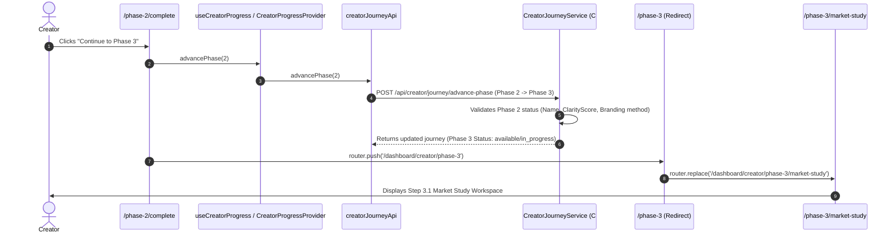

# Actual Creator Page Flow — Phase 2 & Phase 3

**Audit Date:** 2026-09-19  
**Monorepo:** Mondial Monorepo Fullstack (`mondial_monorepo_fullstack`)  
**Scope:** Strict Findings-Only Audit of Creator Phase 2 (Project Identity & Branding) and Phase 3 (Business Plan Intelligence)

---

## 1. Phase 2: Current Implemented Flow

```mermaid
flowchart TD
    subgraph Phase 2 Entry & Clarification
        P2_Root["/dashboard/creator/phase-2<br/>(Immediate Redirect)"] -->|Sets already_have_idea| P2_Clarifier["/dashboard/creator/phase-2/clarifier<br/>(AI Chat: 6 Questions & Live Clarity)"]
        P2_Clarifier -->|finalizeClarifier()| P2_Summary["/dashboard/creator/phase-2/idea-summary<br/>(Clarity Ring & Synthesis Card)"]
    end

    subgraph Project Naming & Concept
        P2_Summary -->|"Continue (Step 8)"| P2_Name["/dashboard/creator/phase-2/concept-name<br/>(AI Suggestions or Custom Name + Tagline + Category)"]
        P2_Summary -.->|"Refine Answers"| P2_Clarifier
    end

    subgraph Brand Identity Studio
        P2_Name -->|"Continue (Step 9)"| P2_Branding["/dashboard/creator/phase-2/branding<br/>(Gateway Selection Screen)"]
        P2_Branding -->|"Open Brand Studio"| P2_Studio["/dashboard/creator/phase-2/brand-studio<br/>(BrandStudioShell · 7-Step Modal Studio)"]
        P2_Branding -->|"Skip for now"| P2_Complete["/dashboard/creator/phase-2/complete<br/>(Phase 2 Completion Showcase)"]

        subgraph BrandStudioShell Workflow
            P2_Studio --> S1["1. StrategyReviewModal"]
            S1 --> S2["2. DirectionBoardModal (3 Styles)"]
            S2 --> S3["3. LogoTypeChooserModal (Monogram/Wordmark/Abstract)"]
            S3 --> S4["4. LogoCreationModal (AI Generation Engine)"]
            S4 --> S5["5. VariationSetModal (4 Treatments)"]
            S5 --> S6["6. ColorSystemModal (6 Curated Palettes)"]
            S6 --> S7["7. TypographySystemModal (Curated Pairings)"]
            S7 -->|Finalize & Save Brand| P2_Kit["/dashboard/creator/phase-2/brand-kit<br/>(BrandKitHubView · Asset Hub & Export)"]
        end
    end

    subgraph Phase 2 Exit & Legacy Remnants
        P2_Kit -->|"Continue to Phase 2 Completion"| P2_Complete
        P2_Branding -.->|"Book a Human Designer (Bypassed)"| P2_Hire["/dashboard/creator/phase-2/hire-designer<br/>(M50 Designer Marketplace · Dead / Unlinked in primary flow)"]
        P2_Branding -.->|"Legacy Prototype (Bypassed)"| P2_LogoTool["/dashboard/creator/phase-2/logo-tool<br/>(Standalone Logo Creation · Dead Route)"]
        P2_Complete -->|"Continue to Phase 3<br/>(advancePhase(2))"| P3_Root["/dashboard/creator/phase-3<br/>(Immediate Redirect)"]
    end

    classDef active fill:#2563eb,stroke:#1d4ed8,stroke-width:2px,color:#fff;
    classDef dead fill:#ef4444,stroke:#b91c1c,stroke-width:1px,color:#fff;
    classDef bypass fill:#f59e0b,stroke:#d97706,stroke-width:1px,color:#fff;

    class P2_Clarifier,P2_Summary,P2_Name,P2_Branding,P2_Studio,P2_Kit,P2_Complete active;
    class P2_Hire,P2_LogoTool dead;
    class P3_Root bypass;
```

---

## 2. Phase 2 to Phase 3 Transition



---

## 3. Phase 3: Current Implemented Flow

```mermaid
flowchart TD
    subgraph Phase 3 Root Redirect
        P3_Entry["/dashboard/creator/phase-3<br/>(Immediate Replace)"] --> P3_1
    end

    subgraph Step 3.1 — Market Study
        P3_1["/dashboard/creator/phase-3/market-study<br/>(Step 3.1 · Market Study & TAM/SAM/SOM Engine)"]
        P3_1 -->|completeStep 3, 1| P3_2["/dashboard/creator/phase-3/business-model<br/>(Step 3.2 · 9-Block Osterwalder Canvas)"]
    end

    subgraph Step 3.2 — Business Model
        P3_2 -->|completeStep 3, 2| P3_3["/dashboard/creator/phase-3/business-plan<br/>(Step 3.3 · Continuous-Scroll 12-Section Master Plan)"]
    end

    subgraph Step 3.3 — Business Plan
        P3_3 -->|completeStep 3, 3| P3_4["/dashboard/creator/phase-3/forecast<br/>(Step 3.4 · 36-Month Financial Projections & Break-even)"]
    end

    subgraph Step 3.4 — Financial Forecast
        P3_4 -->|completeStep 3, 4| P3_5["/dashboard/creator/phase-3/compliance<br/>(Step 3.5 · France-First Legal & Regulatory Intelligence)"]
    end

    subgraph Step 3.5 — Legal & Compliance Intelligence
        P3_5 -->|completeStep 3, 5| P3_6["/dashboard/creator/phase-3/formation<br/>(Step 3.6 · Company Formation & Team Skills Gap)"]
    end

    subgraph Step 3.6 — Company Formation & Team
        P3_6 -->|completeStep 3, 6| P3_7["/dashboard/creator/phase-3/complete<br/>(Step 3.7 · Investor Readiness Audit & Phase 4 Gateway)"]
    end

    subgraph Phase 4 Exit
        P3_7 -->|"Proceed to Phase 4: Commercial Setup<br/>(advancePhase(3))"| P4_Entry["/dashboard/creator/offer-pricing<br/>(Phase 4 Commercial Setup)"]
    end

    classDef step active fill:#0284c7,stroke:#0369a1,stroke-width:2px,color:#fff;
    class P3_1,P3_2,P3_3,P3_4,P3_5,P3_6,P3_7 step;
```

---

## 4. Back-Navigation & Return Trajectories

```mermaid
flowchart LR
    P3_7["Step 3.7: Complete"] -->|"Back to Company Formation"| P3_6["Step 3.6: Formation"]
    P3_6 -->|"Back to Legal & Compliance"| P3_5["Step 3.5: Compliance"]
    P3_5 -->|"Back to Financial Forecast"| P3_4["Step 3.4: Forecast"]
    P3_4 -->|"Back to Business Plan"| P3_3["Step 3.3: Business Plan"]
    P3_3 -->|"Back to Business Model"| P3_2["Step 3.2: Business Model"]
    P3_2 -->|"Back to Market Study"| P3_1["Step 3.1: Market Study"]
    P3_1 -->|"Back to Dashboard"| Dash["/dashboard/creator"]
```


