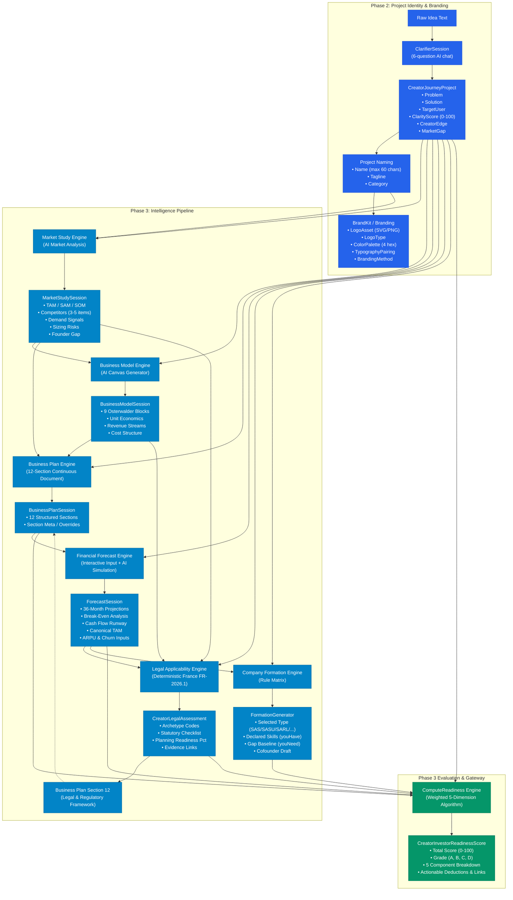

# Data Flow & Model Lineage Map — Creator Phase 2 & Phase 3

**Audit Date:** 2026-09-19  
**Monorepo:** `mondial_monorepo_fullstack`  
**Backend Data Source:** MongoDB collections (`CreatorJourneys`, `CreatorIdeas`, `ClarifierSessions`, `MarketStudySessions`, `BusinessModelSessions`, `BusinessPlanSessions`, `ForecastSessions`, `CreatorLegalAssessments`)

---

## 1. High-Level Data Flow Pipeline



---

## 2. Exact C# Class & MongoDB Model Reference

### 2.1 `CreatorJourneyProject` (Stored inside `CreatorIdea` / `CreatorJourney`)
```csharp
public class CreatorJourneyProject
{
    public string Name { get; set; }
    public string Tagline { get; set; }
    public string Concept { get; set; }
    public string Problem { get; set; }
    public string Solution { get; set; }
    public string TargetUser { get; set; }
    public string Category { get; set; }
    public string CreatorEdge { get; set; }
    public string MarketGap { get; set; }
    public int ClarityScore { get; set; }               // 0 to 100
    public CreatorBranding Branding { get; set; }
}

public class CreatorBranding
{
    public string BrandingMethod { get; set; }           // "ai_tool" | "m50_designer" | "skipped"
    public string LogoType { get; set; }                 // "monogram" | "wordmark" | "abstract"
    public string LogoAsset { get; set; }                // SVG/data URL string
    public List<string> ColorPalette { get; set; }       // 4 Hex strings
    public string PaletteName { get; set; }
    public string TypographyPairing { get; set; }
}
```

### 2.2 `MarketStudySession`
- **Collection:** `MarketStudySessions`
- **Output Schema:**
  ```typescript
  interface MarketStudyOutput {
    tamSamSom: {
      tam: { amount: number; description: string };
      sam: { amount: number; description: string };
      som: { amount: number; description: string };
    };
    competitorAnalysis: Array<{
      name: string;
      tier: 'Direct' | 'Indirect' | 'Alternative';
      strengths: string[];
      weaknesses: string[];
      pricingModel: string;
    }>;
    demandSignals: Array<{ signal: string; sourceOrProxy: string; confidence: 'High' | 'Medium' | 'Low' }>;
    sizingRisks: Array<{ risk: string; severity: 'High' | 'Medium' | 'Low'; mitigation: string }>;
    founderGap: { summary: string; missingCompetencies: string[] };
  }
  ```

### 2.3 `BusinessModelSession`
- **Collection:** `BusinessModelSessions`
- **Output Schema:**
  ```typescript
  interface BusinessModelOutput {
    canvas: {
      customerSegments: string[];
      valuePropositions: string[];
      channels: string[];
      customerRelationships: string[];
      revenueStreams: string[];
      keyResources: string[];
      keyActivities: string[];
      keyPartners: string[];
      costStructure: string[];
    };
    unitEconomics: {
      estimatedCac: number;
      estimatedLtv: number;
      paybackPeriodMonths: number;
      grossMarginPct: number;
    };
    pricingTiers: Array<{ name: string; price: number; billingFrequency: string; features: string[] }>;
  }
  ```

### 2.4 `BusinessPlanSession`
- **Collection:** `BusinessPlanSessions`
- **12 Continuous Sections:**
  1. `executiveSummary` (owned editable)
  2. `problemSolution` (synced from Phase 2 Clarifier)
  3. `marketAnalysis` (owned editable)
  4. `revenueModel` (owned editable)
  5. `competitorAnalysis` (owned editable)
  6. `goToMarket` (owned editable)
  7. `financials` (synced live from Step 3.4 ForecastSession)
  8. `team` (synced live from Step 3.6 FormationGenerator)
  9. `fundingRequirements` (bound to Phase 5 seed round)
  10. `operationsPlan` (owned full plan)
  11. `risks` (owned full plan)
  12. `legalFramework` (synced live from Step 3.5 LegalRegulatoryFramework)

### 2.5 `ForecastSession`
- **Collection:** `ForecastSessions`
- **Inputs:** `arpu`, `opex`, `monthlyGrowthPct`, `tam` (Canonical TAM), `monthlyChurnPct`
- **Output Schema:**
  - `revenueForecast.monthly[36]`
  - `costForecast.monthly[36]` (fixed costs, variable costs)
  - `cashFlowProjection.monthly[36]` (net cash flow, ending balance)
  - `breakEvenAnalysis` (`isAchievedWithinHorizon`, `breakEvenMonth`, `breakEvenRevenue`)
  - `risks` (financial category, likelihood, mitigation)

### 2.6 `CreatorLegalAssessment`
- **Collection:** `CreatorLegalAssessments`
- **Deterministic French Rules:** FR-2026.1 statutory rule set
- **Fields:**
  - `DetectedArchetypes`: Array of detected French business archetypes
  - `Items`: Extended statutory checklist items (stage, requirement, authority citation, status)
  - `PlanningReadinessPct`: Weighted score (0–100%)
  - `EvidenceLinks`: Evidence documents attached from Idea Vault

### 2.7 `FormationGenerator`
- **Stored in:** `Phase3Data.FormationGenerator`
- **Fields:**
  - `RecommendedType`: SAS, SASU, SARL, EURL, MICRO, or EI
  - `SelectedType`: Creator's confirmed legal structure
  - `Options`: Full metadata comparison for each legal structure
  - `YouHave`: Array of declared skills (Tech, Finance, Legal, etc.)
  - `YouNeed`: Derived skill gaps paired with specialist profiles
  - `CofounderDraft`: Target cofounder role, equity range, location preference

### 2.8 `CreatorInvestorReadinessScore`
- **Computed By:** `CreatorPhase3Controller.ComputeReadiness(journey, forecast)`
- **Max Score:** 100 points across 5 dimensions:
  1. `ConceptClarity` (Max 20 pts): `(ClarityScore / 100.0) * 20`
  2. `MarketEvidence` (Max 20 pts): TAM Tier (+8), Business Plan present (+6), TargetUser defined (+6)
  3. `FinancialModel` (Max 25 pts): Forecast present (+10), BreakEven <= 24 mo (+8), LTV/CAC >= 3.0 (+7)
  4. `LegalReadiness` (Max 15 pts): `(PlanningReadinessPct / 100.0) * 15`
  5. `TeamCredibility` (Max 20 pts): CreatorEdge defined (+14), SP engaged or Co-founder mapped (+6)
