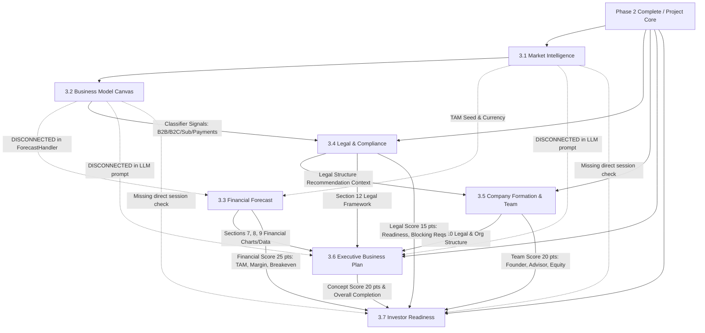

# MONDIAL BUSINESS CREATION (MBC)
## CREATOR PHASE 3 — DATA FLOW & ARTIFACT LINEAGE AUDIT

### 1. Code-Derived End-to-End Dependency Graph

---

### 2. Module-by-Module Inflow/Outflow Lineage

#### 3.1 Market Intelligence
- **Inputs**: Phase 2 `IdeaRecord.Project` (Title, Description, Category, Target Audience, Problem Statement).
- **Outputs**:
  - `MarketDefinition`
  - `TargetMarket` & `Segments` (Demographics, Psychographics, Pain Points)
  - `DemandSignals`
  - `Competitors` (List with Positioning, Strengths, Weaknesses)
  - `TAM`, `SAM`, `SOM` (Distinct numeric amounts, currency, percentage, methodology narrative)
  - `MarketGaps` & `Trends`
- **Persistence**: Stored in `MarketStudySessions` MongoDB collection; linked via `CreatorIdea.Phase3.MarketStudySessionId`.

#### 3.2 Business Model Canvas
- **Inputs**: Phase 2 Project context + Step 3.1 Target Segments & Value proposition context.
- **Outputs**:
  - 9 Canvas Blocks:
    1. `CustomerSegments`
    2. `ValuePropositions`
    3. `Channels`
    4. `CustomerRelationships`
    5. `RevenueStreams`
    6. `KeyResources`
    7. `KeyActivities`
    8. `KeyPartners`
    9. `CostStructure`
  - Commercial metrics: Pricing tiers, primary revenue model, estimated CAC/LTV indicators.
- **Persistence**: Stored in `BusinessModelSessions` collection; linked via `CreatorIdea.Phase3.BusinessModelSessionId`.

#### 3.3 Financial Forecast
- **Inputs**:
  - `Inputs.Tam` (Seeded from Step 3.1 TAM if fresh; preserves custom overrides if modified).
  - Business Model (Intended inputs: pricing, revenue model, cost structure).
  - **FINDING (P3-AUDIT-003)**: `ForecastHandler.cs` does not read `BusinessModelSession`. It relies solely on `creatorIdea.Project` and manual input parameters.
- **Outputs**:
  - 36-Month P&L, Monthly Cash Flow, Balance Sheet summary.
  - Break-even month, Runway, Gross & Net Margins, Unit Economics (CAC, LTV, Payback).
- **Persistence**: Stored in `ForecastSessions` collection; linked via `CreatorIdea.Phase3.ForecastSessionId`.

#### 3.4 Legal & Compliance
- **Inputs**:
  - Business Profile Classifier signals derived from Project & Business Model:
    `HasB2B`, `HasB2C`, `HasSaaS`, `HasMarketplace`, `HasSubscription`, `HasWebsite`, `HasOnlinePayments`, `HasPersonalData`, `HasAnalytics`, `HasEmployees`, `HasContractors`, `HasPhysicalPremises`, `HasRegulatedActivity`.
- **Outputs**:
  - Applicable legal requirements from `FranceRules.json` (18 rules).
  - Roadmap stages: Before Company Creation, Company Creation, Before Launch, Before First Sale, Ongoing.
  - Legal Readiness Score (0–100), Blocking requirements list.
  - Evidence Vault bindings (`CreatorIdeaDocuments`).
- **Persistence**: Stored in `CreatorPhase3` subdocument (`LegalAssessment`, `RulesVersion`, `EvidenceLinks`).

#### 3.5 Company Formation & Team
- **Inputs**:
  - Supported structures: `SAS`, `SAS-U`, `SARL`.
  - Intended signals: Founder count, liability preferences, fundraising plan, revenue profile.
  - **FINDING (P3-AUDIT-002)**: Evaluates Phase 4 `TeamRequirements` and Phase 5 `SeedFunding`, which are null in Phase 3.
- **Outputs**:
  - Structure recommendation (with rationale and governance rules).
  - Team audit: "You Have" vs "You Need", Skill gaps, Founder equity split.
- **Persistence**: Stored in `CreatorPhase3.FormationData`.

#### 3.6 Executive Business Plan
- **Inputs**: Slices across all prior steps:
  - Canonical 12 sections:
    1. Executive Summary
    2. Problem & Market Need
    3. Solution & Value Proposition
    4. Market Analysis (from 3.1)
    5. Business Model (from 3.2)
    6. Marketing & Sales Strategy
    7. Operations Plan
    8. Management & Organization (from 3.5)
    9. Financial Plan (from 3.3)
    10. Funding Requirements & Use of Funds
    11. Risk Analysis & Mitigation
    12. Legal & Regulatory Framework (from 3.4)
  - **FINDING (P3-AUDIT-004)**: Initial LLM prompt does not inject 3.1/3.2/3.3 artifacts; Sections 7, 8, 9, 12 are client-stitched.
- **Outputs**: Full interactive 12-section business plan with manual edit preservation.
- **Persistence**: Stored in `BusinessPlanSessions` collection; linked via `CreatorIdea.Phase3.BusinessPlanSessionId`.

#### 3.7 Investor Readiness
- **Inputs & Weight Distribution**:
  - Concept & Clarity: 20 pts (Phase 2 + Business Plan completion).
  - Market: 20 pts (Forecast TAM + Competitor analysis).
  - Financials: 25 pts (TAM > 1M, Margin > 20%, Breakeven <= 36 months).
  - Legal: 15 pts (Legal Readiness score, no blocking requirements).
  - Team: 20 pts (Solo/multi-founder profile, skills identified).
  - **TOTAL**: 100 pts.
- **Outputs**: Overall Readiness Score (0–100), Category breakdown, Remediation action list.
- **Persistence**: Computed on demand; cached in `CreatorPhase3.ReadinessAssessment`.

---

### 3. Stale & Invalidation Cascades

| Trigger Event | Impacted Downstream Step | Staleness Behavior | Code Status |
| :--- | :--- | :--- | :--- |
| **Market TAM updated (3.1)** | Step 3.3 (Forecast) | Review recommended / TAM sync badge offered | **PASS** (Seeded on fresh; badge displayed if mismatch) |
| **Market Segments updated (3.1)** | Step 3.2 (Business Model) | Manual review recommended; does not overwrite saved canvas | **PASS** |
| **Business Model pricing/costs updated (3.2)** | Step 3.3 (Forecast) | **DEFECT**: Forecast has no stale listener or prompt link | **FAIL** (Disconnected) |
| **Business Model signals updated (3.2)** | Step 3.4 (Legal) | Legal Change Detector flags material profile change | **PASS** (`LegalChangeDetector` compares profile hash) |
| **Legal Assessment updated/refreshed (3.4)** | Step 3.6 (Section 12) | Section 12 dynamic builder reflects new rules/readiness | **PASS** (`GetBusinessPlanSection12` re-evaluates dynamically) |
| **Legal Assessment updated/refreshed (3.4)** | Step 3.7 (Readiness) | Legal readiness score reflects immediately | **PASS** |
| **Forecast or Legal updated** | Step 3.6 (Plan Sections 9 & 12) | Real-time hydration via API | **PASS** |
| **Any upstream artifact updated** | Step 3.7 (Investor Readiness) | Readiness recomputes on page load / fetch | **PASS** |
