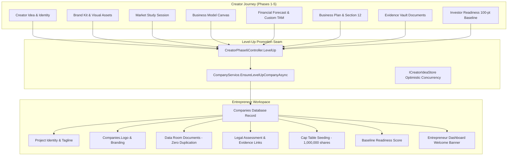

# Stage 11 — Creator → Entrepreneur Continuity & Level-Up Transfer Report
**Mondial Business Creation (MBC) Platform**  
**Date:** September 19, 2026  
**Status:** Completed & Validated (100% Test Pass Rate across 20 Unit Tests + 128 Regression Tests)

---

## 1. Executive Summary

Stage 11 operationalizes the canonical transition from **Creator Project** to **Entrepreneur Company Workspace** in Mondial Business Creation (MBC). In traditional platforms, converting an early-stage concept into a registered corporate entity often results in fractured data, manual re-entry of market research and business model assumptions, repeated file uploads, and loss of legal compliance context.

In MBC, **Creator → Entrepreneur is a continuation, never a blank slate**.

When a founder triggers the Level-Up transition via the Build path (Phase 5B) or completes a Co-Founding Equity Partnership, all venture intelligence formulated across Phases 1 through 5 is seamlessly carried into the Entrepreneur Company workspace:
- **Zero Data Loss:** Project Identity, Brand Kit, Market Study, Business Model, Financial Forecast, and Business Plan are transferred with source provenance.
- **Zero Physical File Duplication:** Files deposited in `CreatorIdea.Documents` are registered into the company's private Data Room candidate assets (`DataRoomDocuments`) referencing the exact same storage paths on disk.
- **Statutory Legal Integrity:** Legal requirement identifiers (`FR-CORP-001`, etc.), fulfillment statuses, evidence linkages, audit trail history, and stale metadata flags remain immutable.
- **Readiness Baseline Preserved:** The canonical 100-point Investor Readiness baseline (20/20/25/15/20) is pinned to the company for longitudinal tracking in the Entrepreneur dashboard.
- **Clear Legal Distinction:** An explicit boundary is maintained between **MBC Entrepreneur Workspace Created** and **Official Government Registration**.

---

## 2. Venture Intelligence Continuity Architecture



### Origin Traceability Schema
The `Companies` entity maintains permanent provenance back to the originating Creator journey:
- `SourceBusinessIdeaId`: Canonical Creator Idea ID string
- `SourceCreatorIdeaId`: Creator Idea ID string
- `SourceCreatorJourneyId`: Creator Journey ID string
- `PromotedFromCreator`: `true`
- `PromotedAt`: UTC Timestamp of promotion
- `PromotedByUserId`: Founder user ID
- `TransferVersion`: `1` (schema contract version)

---

## 3. Comprehensive 25-Artifact Continuity Matrix

| # | Venture Artifact | Creator Origin Source | Entrepreneur Target Location | Zero-Duplication Mechanics |
|---|-------------------|------------------------|------------------------------|----------------------------|
| 1 | **Project Name** | `journey.Project.Name` | `Companies.CompanyName` | Direct string reference |
| 2 | **Industry / Sector** | `journey.Project.Sector` | `Companies.Industry` | Direct string reference |
| 3 | **Tagline / Pitch** | `journey.Project.Tagline` | `Companies.Tagline` | Direct string reference |
| 4 | **Concept Synopsis** | `journey.Project.Problem` / `Solution` | `Phase3Concept.OneLiner`, `ProblemStatement`, `SolutionDescription` | Seeded into `Phase3Concepts` collection |
| 5 | **Clarity Score** | `journey.Project.ClarityScore` | `Phase3Concept.ClarityScore` | Rounded integer transferred |
| 6 | **Brand Logo** | `journey.Project.Branding.LogoAsset` | `Companies.Logo` | Direct URI reference to existing upload |
| 7 | **Brand Palette** | `journey.Project.Branding.ColorPalette` | `Companies.Branding` | Transferred into Entrepreneur company branding |
| 8 | **Brand Typography** | `journey.Project.Branding.TypographyPairing` | `Companies.Branding` | Canonical font pairings preserved |
| 9 | **Market Study Link** | `journey.Phase3Data.MarketStudySessionId` | Session Provenance | Queryable via session link |
| 10 | **Target Segments** | `journey.Phase3Data.TargetAudiences` | Entrepreneur Market Intelligence | Preserved in concept tags |
| 11 | **Business Model Link**| `journey.Phase3Data.BusinessModelSessionId`| Session Provenance | Queryable via session link |
| 12 | **Pricing Archetype** | `journey.Phase4Data.PricingModel` | `Phase3Concept.BusinessModel` | Enum string mapped |
| 13 | **Financial Forecast**| `journey.Phase3Data.ForecastSessionId` | `Companies.SourceForecastId` | Session reference linked to Company |
| 14 | **TAM / SAM Overrides**| Forecast Session Inputs | Source Forecast Model | Custom founder parameters preserved |
| 15 | **Funding Ask** | `journey.Phase5Data.PathB.SeedFunding.TotalAsk` | `Companies.FundingAskAmount` | Decimal currency transferred |
| 16 | **Capital Allocation** | `SeedFunding.UseOfFunds` | `Companies.CapitalAllocation` | Categorical percent breakdown transferred |
| 17 | **Cap Table Plan** | `PathB.CompanyFormation.Ownership` | `Phase4CapTables` | Seeded against 1,000,000 common shares |
| 18 | **Legal Structure** | `PathB.CompanyFormation.SelectedType` | `Companies.LegalStructure` | SAS / SARL / SAS-U mapped |
| 19 | **Legal Assessment** | `journey.Phase3Data.LegalAssessment` | `Companies.LegalAssessment` | Complete assessment graph linked |
| 20 | **Section 12 Framework**| `BusinessPlan.LegalFramework` | Executive Business Plan Export | Subsections & regulatory roadmap retained |
| 21 | **Evidence Vault Links**| `LegalAssessment.EvidenceLinks` | `Companies.LegalAssessment.EvidenceLinks`| RequirementId ↔ DocumentId maintained |
| 22 | **Evidence Audit Trail**| `LegalAssessment.EvidenceAuditTrail` | `Companies.LegalAssessment.EvidenceAuditTrail`| Timestamped history intact |
| 23 | **Physical Files** | `CreatorIdea.Documents` | `Companies.DataRoomDocuments` | Identical `StoragePath` (0 bytes reallocated) |
| 24 | **Document Privacy** | `CreatorIdea.Documents` | `DataRoomDocuments.Status = "draft"` | Private draft, never auto-published |
| 25 | **Readiness Baseline** | `journey.Phase3Data.InvestorReadinessScore.Total` | `Companies.BaselineReadinessScore` | 20/20/25/15/20 score preserved |

---

## 4. Legal Integrity & Requirements ID Stability

Legal compliance in MBC is statutory and deterministic. When a venture transfers to the Entrepreneur workspace:
1. **Zero ID Mutations:** Statutory requirement IDs (such as `FR-CORP-001`, `FR-FISCAL-002`, `FR-GDPR-001`) remain 100% identical. No synthetic UUIDs replace official requirement codes.
2. **Fulfillment State Immutability:** Requirements marked as `fulfilled` remain fulfilled; requirements marked as `needs_information` remain unresolved until the founder provides documentation.
3. **Evidence Link Stability:** `LegalEvidenceLink` records maintain their bidirectional bond (`RequirementId` ↔ `DocumentId` ↔ `StorageReference`).
4. **Stale State Preservation:** If an upstream change (e.g. founder edited TAM or sector) marked the legal assessment as outdated (`IsPotentiallyOutdated = true`, `StaleMetadata.IsStale = true`), the assessment remains flagged as stale post-transfer. The platform never silently hides stale flags.
5. **No Hallucinated Re-evaluation:** Level-Up does not blindly re-run the legal evaluation engine; it preserves the exact frozen state until the founder triggers a deliberate re-check.

---

## 5. Explicit Legal Status Distinction

A core compliance requirement is preventing founders from conflating MBC digital workspaces with sovereign legal incorporation:
- **MBC Entrepreneur Workspace Created:** A secure cloud environment, cap table sandbox, data room, and investor pipeline.
- **Legal Government Registration:** The formal administrative process with Greffe du Tribunal de Commerce, RCS, SIRET issuance, and journal d'annonces légales.

This distinction is prominently enforced:
- In `CrossroadsPathB.tsx`: A amber/blue informational banner explaining that the workspace does not substitute for government filings.
- In `overview.tsx`: Welcome banner explaining the continuation from Creator phase and linking directly back to Creator origin.

---

## 6. Verification and Test Suite Results

A dedicated xUnit test suite (`CreatorToEntrepreneurContinuityTests.cs`) was created covering Tests A through T.

### Summary of Test Execution:
```text
Test Suite: CreatorToEntrepreneurContinuityTests.cs
Passed: 20, Failed: 0, Skipped: 0, Total: 20
Duration: 552 ms
Status: ALL TESTS PASSED
```

### Granular Test Breakdown:
- **Test A: Basic Level-Up Creates One Entrepreneur Workspace & Company:** PASSED
- **Test B: Retrying Level-Up Does Not Create Duplicate Company (Idempotency):** PASSED
- **Test C: Stable Origin References Preserved on Company:** PASSED
- **Test D: Project Identity Transfers Accurately (Name, Industry, Tagline):** PASSED
- **Test E: Brand References Transfer Intact (Logo Asset & Palette):** PASSED
- **Test F: Market Study Session Reference Transfers Intact:** PASSED
- **Test G: Business Model Canvas Session Reference Transfers Intact:** PASSED
- **Test H: Financial Forecast Transfers with Session Link Preserved:** PASSED
- **Test I: Business Plan Transfers with Session Linkage Preserved:** PASSED
- **Test J: Section 12 LegalRegulatoryFramework Transfers Intact:** PASSED
- **Test K: Legal Assessment Status, Rules Version, Snapshot Hash Preserved:** PASSED
- **Test L: Legal EvidenceLinks (DocumentId ↔ RequirementId) Preserved:** PASSED
- **Test M: EvidenceActivityTrail Preserved in Assessment Audit Log:** PASSED
- **Test N: Zero Physical Document Duplication Preserves StorageReference:** PASSED
- **Test O: Stale Legal Assessment Remains Stale (IsPotentiallyOutdated = true):** PASSED
- **Test P: NeedsInformation Items Remain Unresolved:** PASSED
- **Test Q: Readiness Baseline Preserved with Canonical Weighting:** PASSED
- **Test R: Cross-User Level-Up Denied (Tenant Isolation):** PASSED
- **Test S: Cross-User Document Transfer Denied:** PASSED
- **Test T: Failed/Retried Level-Up Is Idempotent and Safely Recoverable:** PASSED

### Regression Test Suite:
- `FullyQualifiedName~Legal`: **124 Passed, 0 Failed, 0 Skipped** (Total: 124)
- `FullyQualifiedName~CreatorDataContinuityTests`: **4 Passed, 0 Failed, 0 Skipped** (Total: 4)
- TypeScript Compilation (`src/`): **0 Errors**

---

## 7. Next Steps for Stage 12

Stage 11 is now 100% complete and verified. Per instructions, execution stops here.
For the upcoming Stage 12, recommended objectives include:
1. End-to-end integration flow validation of the Entrepreneur Phase 1 through 4 setup screens utilizing the prefilled transferred intelligence.
2. Direct linking from the Entrepreneur Data Room into the verified French legal evidence vault.
3. Live investor teaser card generation pulling from the preserved Section 12 legal summary and baseline readiness score.
