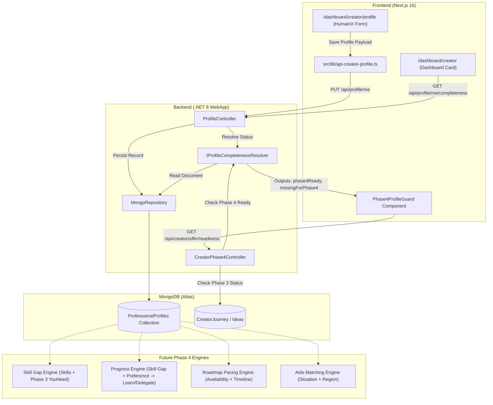

# HumainX Data Flow & Architectural Topology

**Mondial ECO** — Creator Track / HumainX Engine  
**Document**: Data Flow Specification  

---

## 1. End-to-End Data Pipeline



---

## 2. Model Persistence Structure

### `ProfessionalProfiles` Document

```json
{
  "_id": "60d5ecb8b392d72f10b8e1a1",
  "userId": "3fa85f64-5717-4562-b3fc-2c963f66afa6",
  "skills": [
    {
      "name": "Full-Stack Development",
      "level": "Expert",
      "source": "SelfDeclared",
      "verification": null
    },
    {
      "name": "UI/UX Prototyping",
      "level": "Comfortable",
      "source": "SelfDeclared",
      "verification": null
    },
    {
      "name": "Legacy C#",
      "level": null,
      "source": "LegacyMigration",
      "verification": null
    }
  ],
  "experiences": [
    {
      "id": "exp_01",
      "jobTitle": "Lead Developer",
      "companyName": "TechVenture Studio",
      "experienceType": "Job",
      "skillsUsed": ["TypeScript", "Next.js", "Docker"],
      "startDate": "2023-01",
      "endDate": null,
      "isCurrent": true,
      "description": "Building early-stage MVP products."
    }
  ],
  "education": [
    {
      "id": "edu_01",
      "institution": "University of Tech",
      "degree": "Master",
      "fieldOfStudy": "Software Engineering",
      "startYear": 2019,
      "endYear": 2021
    }
  ],
  "languages": [
    {
      "id": "lang_01",
      "language": "French",
      "proficiency": "Native"
    }
  ],
  "ventureContext": {
    "currentSituation": "EmployedFullTime",
    "weeklyAvailability": "10to20Hours",
    "region": "Ile-de-France",
    "previousEntrepreneurialExperience": "FirstTimeFounder",
    "learningPreference": "HandsOn",
    "delegationPreference": "DelegateWherePossible"
  },
  "updatedAt": "2026-09-21T00:30:00Z"
}
```

---

## 3. Completeness vs. Readiness Matrix

| Criterion | Affects Completion (0–100%)? | Required for Phase 4 Ready? | Machine Key if Missing |
|---|---|---|---|
| **Skills (≥ 1 declared)** | Yes (12.5%) | **YES** | `"Skills"` |
| **Current Situation** | Yes (12.5%) | **YES** | `"CurrentSituation"` |
| **Weekly Availability** | Yes (12.5%) | **YES** | `"WeeklyAvailability"` |
| **Region** | Yes (12.5%) | **YES** | `"Region"` |
| **Progress Preference (Learning OR Delegation)** | Yes (12.5%) | **YES** | `"ProgressPreference"` |
| **Experiences (≥ 1)** | Yes (12.5%) | No (Optional) | - |
| **Education (≥ 1)** | Yes (12.5%) | No (Optional) | - |
| **Languages (≥ 1)** | Yes (12.5%) | No (Optional) | - |

**Example State Scenarios:**
- A student founder with **no formal job/internship** and **no university degree**, but who declared skills, availability, and progress preference:
  - **Completion**: 63%
  - **Phase 4 Ready**: **TRUE** (Unblocked!)
- A seasoned executive who entered 10 years of experiences and degrees, but **skipped their weekly availability**:
  - **Completion**: 88%
  - **Phase 4 Ready**: **FALSE** (Blocked until availability is declared so roadmap pacing can be computed).

---

## 4. Downstream Phase 4 Engine Data Binding

When Phase 4 execution begins, the HumainX profile data powers 5 distinct automation systems:

1. **Skill Gap Engine**:
   - Compares founder's declared `Skills` with the requirements mined during Phase 3 ("You Need" list).
   - Identifies uncovered skills without human assumptions.
2. **Personalized Action Engine**:
   - Uses `LearningPreference` vs `DelegationPreference` to recommend:
     - *Self-Taught*: Guided modules, tutorials, documentation.
     - *Delegation*: Service Provider marketplace matchmaking, RFQ generation.
     - *Hybrid*: AI co-pilot + external review.
3. **Roadmap Pacing Engine**:
   - Integrates `WeeklyAvailability` (e.g. 5–10 hrs vs Full-time) to generate realistic milestone dates and sprint schedules.
4. **Local Support & Grants Engine**:
   - Matches `CurrentSituation` and `Region` against French/European entrepreneurial aid programs (e.g. ACRE, ARCE, Bpifrance, French Tech grants).
