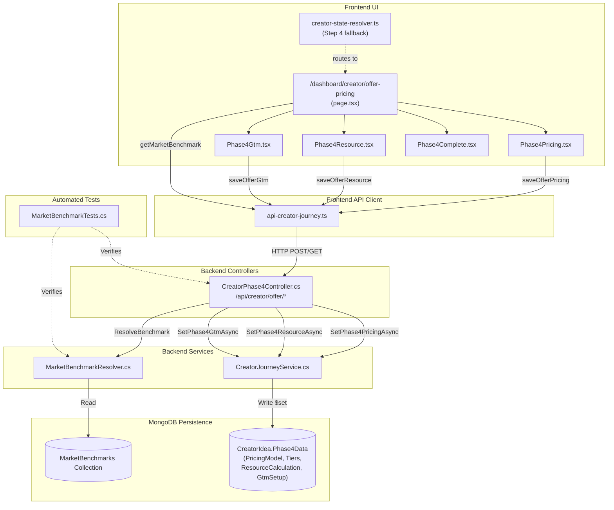
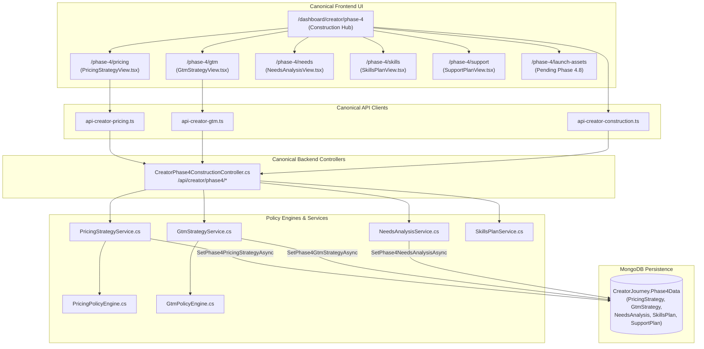
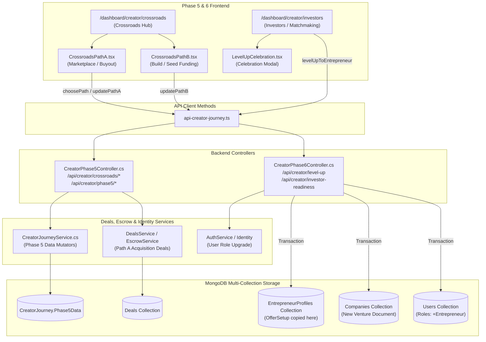

# MONDIAL BUSINESS CREATION (MBC)
## Legacy Architecture Dependency Graph & Call Lineage

**Audit Date:** September 21, 2026  
**Mode:** STRICT READ-ONLY AUDIT  
**Scope:** Full call graphs, service layers, API clients, UI components, routes, tests, and data persistence for Creator Phase 4, Phase 5, and Phase 6.

---

### 1. Architectural Topology Overview

The codebase exhibits two parallel tracks for Creator Construction:
1. **Legacy Track (Phase 4 Old):** A 4-step wizard (`offer-pricing`) that persists unconstrained form inputs directly to `CreatorIdea.Phase4Data` via `CreatorPhase4Controller`.
2. **Canonical Track (Phase 4.1–4.9 Construction Engine):** A deterministic, policy-driven orchestration suite (`/dashboard/creator/phase-4/*`) persisting validated strategy models to `CreatorJourney.Phase4Data` via `CreatorPhase4ConstructionController`, `PricingStrategyService`, `GtmStrategyService`, `NeedsAnalysisService`, etc.

In contrast, **Phase 5 (Crossroads)** and **Phase 6 (Smart Matchmaking & Level Up)** are single-generation architectures: the existing `CreatorPhase5Controller` and `CreatorPhase6Controller` represent the active, canonical implementations of their respective domain phases.

---

### 2. End-to-End Call Flow Diagrams

#### Diagram A: Legacy Phase 4 (Offer & Pricing)

---

#### Diagram B: Canonical Phase 4 Construction Engine (Coexisting Track)

---

#### Diagram C: Phase 5 (Crossroads) and Phase 6 (Level Up) Call Graph

---

### 3. Detailed Component Interdependency Matrix

| Source Component | Target Component | Relationship Type | Coupling Level | Deletion Impact |
|---|---|---|---|---|
| `creator-state-resolver.ts` | `/dashboard/creator/offer-pricing` | Route redirection | Loose | If modified to point to `/dashboard/creator/phase-4`, eliminates traffic to legacy wizard |
| `offer-pricing/page.tsx` | `Phase4Pricing.tsx` | Direct child component | Tight | Can be deprecated together with parent page |
| `offer-pricing/page.tsx` | `Phase4Resource.tsx` | Direct child component | Tight | Can be deprecated together with parent page |
| `offer-pricing/page.tsx` | `Phase4Gtm.tsx` | Direct child component | Tight | Can be deprecated together with parent page |
| `offer-pricing/page.tsx` | `Phase4Complete.tsx` | Direct child component | Tight | Can be deprecated together with parent page |
| `Phase4Pricing.tsx` | `api-creator-journey.ts (saveOfferPricing)` | API invocation | Medium | None if parent page is retired |
| `Phase4Resource.tsx` | `api-creator-journey.ts (saveOfferResource)` | API invocation | Medium | None if parent page is retired |
| `Phase4Gtm.tsx` | `api-creator-journey.ts (saveOfferGtm)` | API invocation | Medium | None if parent page is retired |
| `api-creator-journey.ts` | `CreatorPhase4Controller.cs` | HTTP REST (`/api/creator/offer/*`) | Medium | Endpoints can be marked obsolete once frontend caller is rerouted |
| `CreatorPhase4Controller.cs` | `MarketBenchmarkResolver.cs` | Dependency Injection | Loose | `MarketBenchmarkResolver` is ALSO used by `MarketStudyHandler.cs` (Phase 3.1); resolver MUST NOT be deleted |
| `CreatorPhase4Controller.cs` | `CreatorJourneyService.cs` | Dependency Injection | Medium | Methods (`SetPhase4PricingAsync`, etc.) write to `CreatorIdea.Phase4Data` |
| `MarketBenchmarkTests.cs` | `CreatorPhase4Controller.cs` | Test invocation | High | Test will fail if `CreatorPhase4Controller` is deleted before test refactoring |
| `CreatorPhase5Controller.cs` | `DealsService` & `EscrowService` | Domain integration | Tight | Must NOT be deleted; active transactional marketplace logic |
| `CreatorPhase6Controller.cs` | `EntrepreneurProfileRecord` | Database copy | Critical | Writes `journey.Phase4Data` into `existingProfile.OfferSetup` |

---

### 4. Cross-System Architectural Observations

1. **Reusability of `MarketBenchmarkResolver`:**
   `MarketBenchmarkResolver` provides statistical reference data (min/median/max budgets, durations, and pricing benchmarks based on industry sectors). While `CreatorPhase4Controller` consumes it for legacy benchmark views, `MarketStudyHandler` in Phase 3.1 also relies on it. It is therefore a **reusable domain utility**, not dead code.

2. **Phase 5 & 6 Are Production-Ready Canonical Modules:**
   Unlike Phase 4 (which underwent a comprehensive 9-phase redesign into `Phase4Construction`), Phase 5 (Crossroads) and Phase 6 (Level Up) are already structured around their permanent business capabilities:
   - Phase 5 manages high-value real-world workflows: IP valuation, marketplace publishing with NDA gating, and company formation.
   - Phase 6 manages the transition invariant: keeping user identity and company records continuous while adding the Entrepreneur role.
