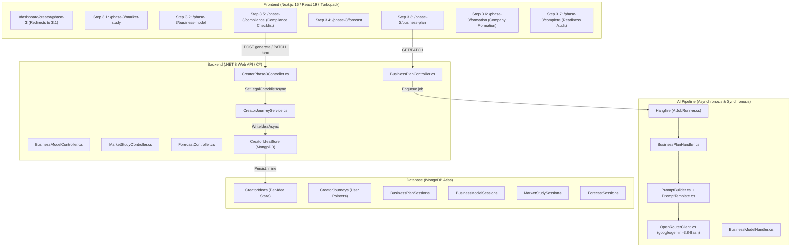

# Mondial Business Creation (MBC) — Current State Architecture
## Creator Phase 3: Legal & Compliance Intelligence Audit

**Audit Date:** September 19, 2026  
**Status:** AS-IS Code Architecture (Strictly Verified Against Production Codebase)

---

## 1. High-Level System Topology (CURRENT)



---

## 2. Creator Phase 3 Sequence & Execution Chain (CURRENT)

In the current production codebase, Phase 3 consists of **seven strictly sequenced steps**:

```text
Step 3.1: Market Study (/dashboard/creator/phase-3/market-study)
   ↓ (marketStudySessionId required)
Step 3.2: Business Model (/dashboard/creator/phase-3/business-model)
   ↓ (hasMarketStudy && hasBusinessModel required for fresh creators)
Step 3.3: Business Plan (/dashboard/creator/phase-3/business-plan)
   ↓
Step 3.4: Financial Forecast (/dashboard/creator/phase-3/forecast)
   ↓
Step 3.5: Legal & Compliance Checklist (/dashboard/creator/phase-3/compliance)
   ↓ (Advisory; does not gate completion)
Step 3.6: Company Formation & Team (/dashboard/creator/phase-3/formation)
   ↓
Step 3.7: Phase 3 Complete & Investor Readiness (/dashboard/creator/phase-3/complete)
```

---

## 3. Current Implementation of Step 3.5 (Compliance)

### Frontend Surface
- **File:** `src/app/dashboard/creator/phase-3/compliance/page.tsx`
- **Component Architecture:**
  - Wraps in `Phase3SetupShell` (`stepEyebrow="Step 3.5"`, `title="Legal & Compliance Checklist"`).
  - Renders top progress bar with percentage (`completedCount / totalCount * 100`).
  - Displays banner: *"Self-Attested Readiness Scorecard"*.
  - Displays notice: *"N mandatory items are remaining. You can proceed now and return anytime prior to company incorporation."*
  - Groups items into 4 static domain cards:
    1. Corporate Governance & Structure (`company-type`, `bank-account`, `shareholder-agreement`, `esop-pool`)
    2. Intellectual Property & Brand Protection (`ip-protection`, `trademark`)
    3. Data Privacy & Consumer Protection (`gdpr`, `tos-privacy`, `rgpd-article30`, `dpa`)
    4. Industry Regulatory & Risk Mitigation (`pci-dss`, `fin-reg`, `employment-contracts`, `liability-insurance`)
  - Each item renders a checkbox cycling through `pending -> done -> pending` via `PATCH /api/creator/legal-checklist/item/{itemId}`.
  - Continue CTA routes directly to `/dashboard/creator/phase-3/formation` via `completeStep(3, 5)`.

### Backend Controller
- **File:** `backend/Controllers/CreatorPhase3Controller.cs` (lines 161–237)
- **Endpoints:**
  1. `POST /api/creator/ai/legal-checklist/generate`
     - **Heuristic:** Inspects `CreatorJourneyProject.Sector == "FinTech"` or keyword match in `Solution`.
     - **Output:** Builds 6 universal items (`company-type`, `ip-protection`, `bank-account`, `trademark`, `gdpr`, `tos-privacy`). If FinTech, adds `pci-dss`, `fin-reg`. Fills remainder up to 12 items from an optional pool.
     - **Database Persistence:** Persists directly into `CreatorIdea.Phase3Data.LegalChecklist`.
     - **NO AI Call:** Despite the route `/ai/legal-checklist/generate`, zero AI execution occurs.
  2. `PATCH /api/creator/legal-checklist/item/{itemId}`
     - Updates item status (`done` vs `pending`).
     - Recalculates `CompletedCount` and saves to MongoDB.

---

## 4. Current Phase 3 Status Derivation Engine

- **File:** `backend/Services/Implementations/CreatorJourneyService.cs` (`ComputePhaseStatusAsync`, lines 293–346)
- **Derivation Logic:**
  ```csharp
  bool hasMarketStudy = marketStudySession != null && AiSessionSuccess.IsComplete(...);
  bool hasBusinessModel = businessModelSession != null && AiSessionSuccess.IsComplete(...);
  bool hasPlan = planSession != null && AiSessionSuccess.IsComplete(...);
  bool hasForecast = forecastSession != null && AiSessionSuccess.IsComplete(...);
  bool hasFormation = p3.FormationGenerator != null;
  bool legalPresent = p3.LegalChecklist != null;

  if (!p2Done) s.Phase3.Status = "locked";
  else if (hasMarketStudy && hasBusinessModel && hasPlan && hasForecast && hasFormation) s.Phase3.Status = "completed";
  else if (hasPlan && hasForecast && hasFormation) s.Phase3.Status = "completed"; // legacy bypass
  else if (anyP3) s.Phase3.Status = "in_progress";
  else s.Phase3.Status = "available";
  ```
- **Key Observation:** The legal checklist is strictly **advisory** in the Phase 3 gate. It does not block completion if absent or incomplete, but its existence marks Phase 3 as `in_progress`.

---

## 5. Current Readiness Scoring Engine

- **File:** `backend/Controllers/CreatorPhase3Controller.cs` (`ComputeReadiness`, lines 668–718)
- **5 Dimensions (Total 100 Points):**
  1. Concept Clarity: Max 20 pts (derived from `p.ClarityScore`)
  2. Market Evidence: Max 20 pts (TAM +8, competitor analysis +6, target user +6)
  3. Financial Model: Max 25 pts (forecast +10, break-even <= 24 mos +8, LTV/CAC >= 3.0 +7)
  4. **Legal Readiness: Max 15 pts** (computed as `CompletedCount / TotalCount * 15`)
  5. Team Credibility: Max 20 pts (founder edge +14, SP engaged +6)
- **Deductions:**
  - If `CompletedCount < TotalCount`, generates deduction: `"{remaining} legal & compliance checklist items remain unverified"` (Points lost: `15 - legalReadiness`).
  - Remediation Route: `/dashboard/creator/phase-3/compliance`.

---

## 6. Current Creator-to-Entrepreneur Conversion (Level Up)

- **File:** `backend/Controllers/CreatorPhase6Controller.cs` (`LevelUpAsync`, lines 500–640)
- **Current Data Transfer:**
  - Creates/updates `Companies` record (`OwnerId = userId`, `SourceBusinessIdeaId = ideaId`).
  - Sets `Company.LegalStructure` from `SelectedType` or default `"SAS"`.
  - Sets `Company.CompanyName`, `Industry`, `Tagline`.
  - Prefills `Phase3Concept` (`OneLiner`, `ProblemStatement`, `SolutionDescription`, `BusinessModel`, `SectorTags`).
  - Prefills `Phase4CapTable` and `CapitalAllocation`.
- **CURRENT ARCHITECTURAL VOID:**
  - `CreatorIdea.Phase3Data.LegalChecklist` is **NOT transferred**.
  - `CreatorIdea.Documents` are **NOT transferred**.
  - No records are inserted into `Companies.Documents`, `Companies.Legal`, or `Companies.DataRoomDocuments`.
  - The Entrepreneur starts Phase 2 (`/dashboard/entrepreneur/phase-2`) with zero knowledge of the legal diligence performed in Creator Phase 3.
