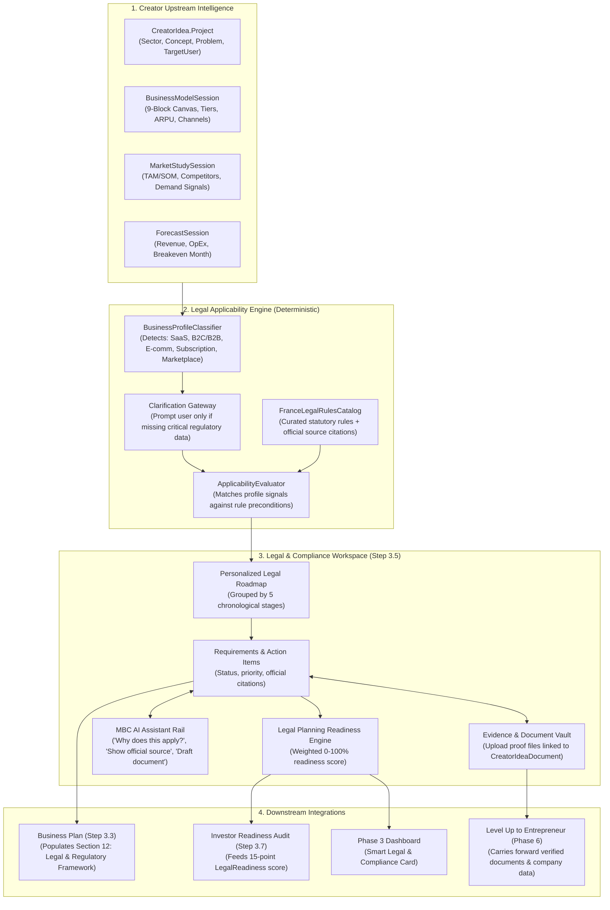

# Mondial Business Creation (MBC) — Proposed Target Architecture
## Creator Phase 3: Legal & Compliance Intelligence

**Audit Date:** September 19, 2026  
**Status:** PROPOSED Target Architecture (Grounded in Existing MBC Infrastructure)

---

## 1. Architectural Principles

1. **Deterministic Law, AI Explanation:**
   The legal requirements and official citations are 100% deterministic, curated from official French authorities. AI is NEVER permitted to invent statutes or determine whether a law applies. AI is restricted strictly to plain-language contextual explanation, risk synthesis, and drafting.
2. **Reuse Existing Monorepo Stack:**
   Zero new microservices. Built natively into ASP.NET Core 8 WebAPI (`backend/`), MongoDB Atlas, Hangfire background jobs, Next.js 16 / React 19 (`src/`), and the single OpenRouter provider (`google/gemini-3.8-flash`).
3. **Multi-Idea and Tenant Isolation:**
   All assessments, checklist states, and evidence files are strictly anchored to `CreatorIdea._id` and scoped to `OwnerUserId`.
4. **France-First, EU-Extensible:**
   Clean jurisdiction abstraction (`JurisdictionCode = "FR"` for launch), designed to cleanly scale to `"BE"`, `"DE"`, and `"ES"` without rewriting data schemas or UI layouts.
5. **Continuous Document & Entrepreneur Continuity:**
   Step 3.5 findings feed directly into the Executive Business Plan (as Section 12: Legal & Regulatory Framework) and carry forward into the Entrepreneur Company profile upon Level Up.

---

## 2. End-to-End Conceptual Flow (PROPOSED)



---

## 3. Detailed Component Architecture

### A. Business Profile Classifier & Applicability Engine
- **Service Interface:** `ILegalApplicabilityEngine` (registered as scoped service in ASP.NET Core).
- **Inputs:** `CreatorIdea.Project`, `BusinessModelSession.Versions.Last().Content`, `ForecastSession.Versions.Last().Content`.
- **Classification Logic:**
  - `IsSaaS`: Identified if `Sector` contains SaaS/Tech OR `BusinessModel.canvas.revenueStreams` includes recurring/subscription AND `channels` includes web/cloud.
  - `IsB2C`: Identified if `Project.TargetUser` or `BusinessModel.canvas.customerSegments` targets consumers/individuals.
  - `IsB2B`: Identified if targeting enterprises, SMEs, or professionals.
  - `IsEcommerce`: Identified if selling physical goods online (`channels` contains web/shipping, `revenueStreams` contains product sales).
  - `IsMarketplace`: Identified if matching buyers and sellers (`keyActivities` contains matching/intermediation, `revenueStreams` contains commissions/take-rates).
  - `HasOnlinePayments`: Identified if `keyPartners` includes Stripe/Adyen/PayPal or `revenueTiers` has digital checkout.
  - `CollectsPersonalData`: Automatically `true` for any web app, SaaS, or user account system.
  - `HasEmployeesExpected`: Inferred if `Forecast.OpEx` indicates payroll or `Formation.YouNeed` has non-founder roles.

### B. France Legal Rules Catalogue (`FranceLegalRulesCatalog`)
A curated, versioned registry of verified French regulatory and legal requirements:

```json
{
  "rulesVersion": "FR-2026.1",
  "jurisdiction": "FR",
  "rules": [
    {
      "ruleId": "fr-inpi-guichet-unique",
      "title": "Formalités d'Immatriculation (Guichet Unique INPI)",
      "category": "corporate",
      "stage": "company_creation",
      "priority": "critical",
      "applicabilityCondition": "always",
      "description": "Obligation légale d'immatriculation de l'entreprise via le guichet unique de l'INPI pour l'obtention du numéro SIREN/SIRET et de l'extrait Kbis.",
      "whyItApplies": "Toute création d'activité commerciale ou de société en France doit obligatoirement passer par le guichet unique INPI (loi Pacte).",
      "officialSource": {
        "authority": "INPI / Guichet Unique",
        "label": "Formalités d'entreprises (Article L123-33 du Code de commerce)",
        "url": "https://formalites.entreprises.gouv.fr/",
        "lastVerified": "2026-06-01"
      },
      "requiresEvidence": true,
      "evidenceDocType": "kbis_extract",
      "evidenceLabel": "Extrait Kbis ou récépissé de dépôt de dossier de création"
    },
    {
      "ruleId": "fr-cnil-rgpd-compliance",
      "title": "Conformité RGPD & Registre des Traitements (CNIL)",
      "category": "data_privacy",
      "stage": "before_website_launch",
      "priority": "critical",
      "applicabilityCondition": "collectsPersonalData == true",
      "description": "Mise en place de la politique de confidentialité, du recueil de consentement (cookies/traceurs) et tenue du registre d'activités de traitement (Article 30 du RGPD).",
      "whyItApplies": "Votre solution collecte des comptes utilisateurs, des emails ou traite des données nominatives de résidents européens.",
      "officialSource": {
        "authority": "CNIL",
        "label": "Règlement Général sur la Protection des Données (RGPD)",
        "url": "https://www.cnil.fr/fr/rgpd-par-ou-commencer",
        "lastVerified": "2026-05-15"
      },
      "requiresEvidence": true,
      "evidenceDocType": "gdpr_register",
      "evidenceLabel": "Lien vers la Politique de Confidentialité ou Registre Article 30"
    },
    {
      "ruleId": "fr-cgv-b2c-retraction",
      "title": "Conditions Générales de Vente (CGV) & Droit de Rétractation",
      "category": "consumer_protection",
      "stage": "before_first_sale",
      "priority": "critical",
      "applicabilityCondition": "isB2C == true && (isSaaS == true || isEcommerce == true)",
      "description": "Rédaction obligatoire des CGV B2C précisant le prix TTC, les modalités de paiement, la garantie légale de conformité et le délai légal de rétractation de 14 jours (Code de la consommation).",
      "whyItApplies": "Vous commercialisez des abonnements ou des produits directement à des consommateurs particuliers en France.",
      "officialSource": {
        "authority": "DGCCRF / Service-Public.fr",
        "label": "Code de la consommation (Articles L221-18 et suivants)",
        "url": "https://www.service-public.fr/professionnels-entreprises/vosdroits/F31228",
        "lastVerified": "2026-04-20"
      },
      "requiresEvidence": true,
      "evidenceDocType": "cgv_document",
      "evidenceLabel": "Document ou URL des CGV publiées"
    },
    {
      "ruleId": "fr-statuts-capital-depot",
      "title": "Dépôt des Fonds & Rédaction des Statuts",
      "category": "corporate",
      "stage": "before_company_creation",
      "priority": "critical",
      "applicabilityCondition": "always",
      "description": "Dépôt du capital social auprès d'une banque ou d'un notaire avec obtention de l'attestation de blocage des fonds, préalable indispensable à la signature des statuts.",
      "whyItApplies": "Requis pour toutes les formes sociétaires françaises (SAS, SARL, SASU).",
      "officialSource": {
        "authority": "Service-Public.fr",
        "label": "Dépôt du capital social d'une société commerciale",
        "url": "https://www.service-public.fr/professionnels-entreprises/vosdroits/F31440",
        "lastVerified": "2026-05-10"
      },
      "requiresEvidence": true,
      "evidenceDocType": "capital_deposit_cert",
      "evidenceLabel": "Attestation de dépôt des fonds de la banque"
    }
  ]
}
```

---

## 4. UI/UX Workspace Architecture (Step 3.5)

```text
+---------------------------------------------------------------------------------------------------------------+
| PHASE 3 SETUP SHELL: Step 3.5 • Legal & Compliance Intelligence                                               |
| [🇫🇷 France Rules Applied] [Planning Readiness: 68%] [Detected: SaaS • B2C • Subscription • Online Payment]  |
+---------------------------------------------------------------------------------------------------------------+
| LEFT PANE: STAGES             | CENTER PANE: REQUIREMENTS & EVIDENCE CANVAS      | RIGHT PANE: MBC AI RAIL    |
| (Chronological Execution)     |                                                  | (Contextual Legal Agent)   |
|                               | Selected Stage: 1. Before Company Creation       |                            |
| [●] 1. Before Company Creation| ------------------------------------------------ | Context:                   |
|     (3 items • 2 done)        | [✓] Dépôt des Fonds & Capital Social             | Dépôt des Fonds            |
|                               |     Official: Service-Public.fr [Link]           |                            |
| [ ] 2. Company Creation       |     Why: Required for SAS formation              | Quick Actions:             |
|     (2 items • 0 done)        |     Evidence: [certificat_depot.pdf]             | [Why does this apply?]     |
|                               |                                                  | [Show official source]     |
| [ ] 3. Before Website Launch  | [!] Rédaction des Statuts Constitutifs           | [What should I do next?]   |
|     (3 items • 1 done)        |     Official: Code de commerce                   | [Draft standard template]  |
|                               |     Action Required • Priority: Critical         |                            |
| [ ] 4. Before First Sale      |     [+ Attach Statuts Draft PDF] [Find Lawyer →] | "In France, share capital  |
|     (2 items • 0 done)        |                                                  | must be deposited into an  |
|                               | ------------------------------------------------ | escrow account before..."  |
| [ ] 5. Ongoing Compliance     | [Continue to Step 3.6: Formation →]              |                            |
|     (2 items • 1 done)        | (Non-blocking guidance)                          | [Ask a question...]        |
+---------------------------------------------------------------------------------------------------------------+
```

---

## 5. Data Model Schemas (PROPOSED)

### 1. Extended `CreatorLegalChecklist` & Item Record
```csharp
public class CreatorLegalChecklist
{
    public string Jurisdiction { get; set; } = "FR";
    public string RulesVersion { get; set; } = "FR-2026.1";
    public DateTime EvaluatedAt { get; set; } = DateTime.UtcNow;
    public string BusinessSnapshotHash { get; set; } = string.Empty;
    public bool IsPotentiallyOutdated { get; set; } = false;
    public List<string> DetectedArchetypes { get; set; } = new(); // ["SaaS", "B2C", "Subscription", "OnlinePayment"]
    public double PlanningReadinessPct { get; set; }
    public List<CreatorLegalChecklistItem> Items { get; set; } = new();
    public int CompletedCount { get; set; }
    public int TotalCount { get; set; }
}

public class CreatorLegalChecklistItem
{
    public string Id { get; set; } = string.Empty; // e.g. "fr-statuts-capital-depot"
    public string Title { get; set; } = string.Empty;
    public string Category { get; set; } = string.Empty; // corporate | ip | data_privacy | consumer_protection | labor
    public string Stage { get; set; } = string.Empty; // before_creation | at_creation | before_launch | before_sale | ongoing
    public string Priority { get; set; } = "standard"; // critical | recommended | optional
    public string Status { get; set; } = "pending"; // pending | in_progress | evidence_uploaded | done | not_applicable
    public string WhyItApplies { get; set; } = string.Empty;
    public OfficialSourceReference OfficialSource { get; set; } = new();
    public bool RequiresEvidence { get; set; }
    public string? EvidenceDocumentId { get; set; }
    public string? EvidenceFileName { get; set; }
    public bool ShowFindSp { get; set; }
    public string? SpSpecialty { get; set; }
    public DateTime? CompletedAt { get; set; }
}

public class OfficialSourceReference
{
    public string Authority { get; set; } = string.Empty; // e.g. "INPI", "CNIL", "Service-Public.fr"
    public string Label { get; set; } = string.Empty;
    public string Url { get; set; } = string.Empty;
    public string? ArticleReference { get; set; }
}
```

### 2. Evidence Storage in `CreatorIdea.Documents`
Reuses `CreatorIdeaDocument` with extended `DocumentType`:
- `legal_evidence`
- `kbis_extract`
- `statuts_draft`
- `capital_deposit_cert`
- `proof_of_address`
- `gdpr_policy`

---

## 6. Business Plan Document Integration (Step 3.3)

In `BusinessPlanOutputDto`, add Section 12 (or Section 05 in regulatory order):
```csharp
public class BusinessPlanOutputDto
{
    // Existing 7 sections...
    public LegalRegulatoryFrameworkDto LegalFramework { get; set; } = new();
}

public class LegalRegulatoryFrameworkDto
{
    public string Summary { get; set; } = string.Empty;
    public string Jurisdiction { get; set; } = "France";
    public string ProposedLegalStructure { get; set; } = "SAS";
    public List<string> PrimaryRegulations { get; set; } = new(); // e.g. ["RGPD / CNIL", "Code de la consommation", "Droit des sociétés"]
    public List<LegalRoadmapStageDto> Stages { get; set; } = new();
    public string IntellectualPropertyStrategy { get; set; } = string.Empty;
    public string ComplianceGovernanceNote { get; set; } = string.Empty;
}
```
In the frontend continuous document (`/dashboard/creator/phase-3/business-plan`), this displays as a dedicated, executive-formatted section that synchronizes automatically with Step 3.5 findings.

---

## 7. Creator-to-Entrepreneur Level-Up Continuity

When `CreatorPhase6Controller.LevelUpAsync` is triggered:
1. **Transfer Verified Documents:** Any `CreatorIdeaDocument` linked as legal evidence is cloned or mapped directly into `Companies.Documents` (`DocType = "kbis"`, `"bank_deposit"`, `"statuts"`, `"tax_cert"`).
2. **Transfer to Data Room:** Uploaded contracts and IP assignments are added to `Companies.DataRoomDocuments` with default status `verified`.
3. **Set Legal Info:** `Companies.LegalStructure` is confirmed from the formation step; `Companies.Legal.Country` is set to `"France"`.
4. **Result:** The entrepreneur opens `/dashboard/entrepreneur/phase-2` and discovers that their legal incorporation documents and compliance status are **already pre-filled and verified**, eliminating duplicate administrative friction.
