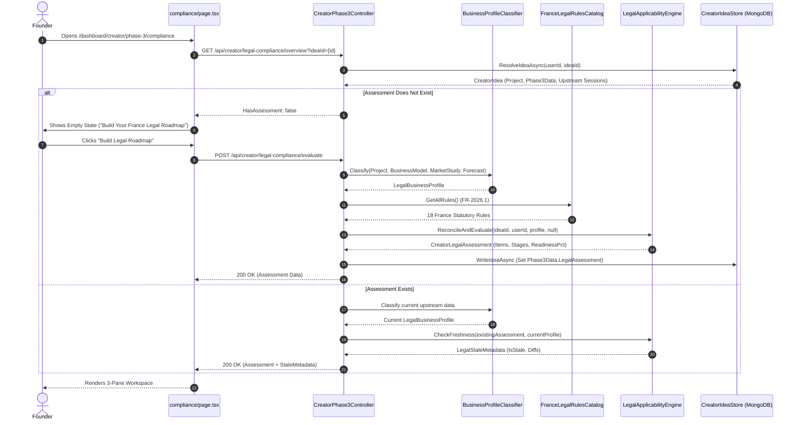

# MONDIAL BUSINESS CREATION (MBC)
# CREATOR PHASE 3, STEP 3.4 · LEGAL & COMPLIANCE INTELLIGENCE
## SYSTEM, LEGAL, DATA, UI & ARCHITECTURE AUDIT REPORT

**Audit Mode:** STRICT READ-ONLY AUDIT (Zero Production Code Mutations, Zero MongoDB Writes, Zero Document Regeneration)  
**Target Path:** `/dashboard/creator/phase-3/compliance`  
**Target Jurisdiction:** 🇫🇷 France (France-First Canonical Baseline)  
**Date:** September 22, 2026  
**Auditor:** DeepMind Antigravity Advanced Agentic Coding System  
**Workspace:** `mondial_monorepo_fullstack`  

---

## 1. Executive Summary

A comprehensive, strict read-only audit of **Creator Phase 3, Step 3.4 (Legal & Compliance Intelligence)** was executed across the fullstack repository. The audit evaluated frontend components (`src/app/dashboard/creator/phase-3/compliance/page.tsx`, `src/components/creator/legal/*`), backend controllers (`CreatorPhase3Controller.cs`, `CreatorIdeaDocumentsController.cs`), service layers (`CreatorJourneyService.cs`, `LegalApplicabilityEngine.cs`, `BusinessProfileClassifier.cs`, `FranceLegalRulesCatalog.cs`, `LegalChangeDetector.cs`), statutory rules data (`backend/Resources/LegalRules/FranceRules.json`), persistence schemas (`CreatorIdea.cs`, `CreatorJourney.cs`, `CreatorIdeaDocument.cs`), and automated test suites.

### Core Audit Findings
1. **True Deterministic Core (No LLM Legal Hallucination):** Step 3.4 relies on a 100% deterministic C# legal engine (`LegalApplicabilityEngine.cs`) and an 18-rule catalog (`FranceRules.json`, `FR-2026.1`). LLMs are strictly excluded from determining statutory applicability, thresholds, deadlines, or legal validity.
2. **Critical Legal Accuracy Flaw (Obsolete Depositary):** Rule `FR-CORP-001` explicitly lists the **Caisse des Dépôts et Consignations (CDC)** as an authorized institution for company share capital deposits (*"auprès d'une banque, d'un notaire ou de la Caisse des Dépôts"*). Under French banking and commercial law, the CDC **ceased accepting capital deposits for commercial company creation on June 1, 2021**. Capital deposits in France can now only be made with credit institutions (banks) or notaries.
3. **Evidence ≠ Compliance Invariant Violation:** In `LegalRequirementCanvas.tsx` (lines 67-73, 94-103, 303-308), creators can toggle any statutory requirement directly to `completed` with a single click, completely bypassing evidence requirements. In the backend, attaching evidence sets the requirement to `ready_for_review`, but the status update endpoint allows the founder to set `status = "completed"` arbitrarily without verified evidence.
4. **Scope Overload & Vault Mixing:** Over 1,000 lines of UI code (`LegalEvidenceVaultView.tsx`) are dedicated to a full document management vault (downloading, status updates, unlinking, audit trail exploration, storage inspect drawers) inside Step 3.4. While 3.4 requires evidence linking and tracking, full vault management bloats the intelligence workspace.
5. **Dual-Write & Dual-Model Schema Debt:** `CreatorJourneyService.cs` updates both `LegalAssessment` (the canonical 18-rule assessment) and `LegalChecklist` (a legacy flat 12-item list) simultaneously in `CreatorIdea.Phase3Data`.
6. **Clean Phase Boundaries with 3.5 and 4.5:** Step 3.4 does **not** execute company formation (capital escrow accounts, statuts signature, INPI Guichet Unique filing); its bottom CTA correctly routes to Step 3.5 (`/dashboard/creator/phase-3/formation`). Furthermore, external aid/subsidy schemes like **ACRE** are cleanly quarantined in Phase 4.5 (`ServicePublicAdapter.cs`), and **JEI** is absent.
7. **Frontend Test Coverage Void:** While the backend boasts 45 passing unit and integration tests for legal applicability, change detection, and vault storage, **zero frontend unit/integration tests** exist for `compliance/page.tsx` and its 5 subcomponents.

---

## 2. Current Architecture Map

```text
[Browser / Dashboard Client]
  │
  ├─ Page Route: /dashboard/creator/phase-3/compliance (page.tsx)
  │    │
  │    ├─ Left Pane: <LegalStageNavigation /> (Stage tabs, progress, readiness score)
  │    ├─ Center Pane: <LegalRequirementCanvas /> (Overview metrics, cards, details, status toggles)
  │    ├─ Right Rail: <LegalAiGuideRail /> (Desktop rail & mobile Sheet: plain explanations, FAQs)
  │    ├─ Vault Mode: <LegalEvidenceVaultView /> (1,087 LOC: documents table, missing evidence, audit trail)
  │    └─ Modal: <LegalEvidenceModal /> (Upload dropzone & vault document selector)
  │
  ▼ [Next.js API Client (api-creator-journey.ts / api-creator-documents.ts)]
  │
  ▼ [ASP.NET Core 8 Web API]
       │
       ├─ CreatorPhase3Controller.cs (/api/creator/legal-compliance/*)
       │    ├─ GET overview
       │    ├─ POST evaluate (reconcile & re-evaluate)
       │    ├─ PATCH item/{itemId}/status
       │    ├─ POST item/{itemId}/evidence (attach)
       │    ├─ POST item/{itemId}/evidence/unlink
       │    ├─ PATCH evidence/{linkId}/status
       │    ├─ POST evidence/replace
       │    └─ GET section-12 (Business Plan export)
       │
       ├─ CreatorIdeaDocumentsController.cs (/api/creator/ideas/{ideaId}/documents/*)
       │    ├─ GET list
       │    ├─ POST upload (physical file storage + metadata push)
       │    └─ GET {documentId}/download (physical stream with ownership verification)
       │
       ▼ [Domain Service & Policy Engines]
       │
       ├─ BusinessProfileClassifier.cs (Deterministic regex & keyword extraction)
       ├─ FranceLegalRulesCatalog.cs (Loads FranceRules.json, FR-2026.1)
       ├─ LegalApplicabilityEngine.cs (Evaluates conditions, reconciles changes, computes readiness)
       ├─ LegalChangeDetector.cs (Detects profile & rule version drift)
       ├─ LegalFrameworkSectionBuilder.cs (Builds BP Section 12)
       └─ CreatorJourneyService.cs (Orchestrates persistence & state updates)
       │
       ▼ [Persistence Layer]
       ├─ MongoDB: CreatorIdeas collection (Phase3Data.LegalAssessment, Documents[])
       └─ Local Physical Storage: uploads/creator-ideas/{userId}/{ideaId}/{guid}.{ext}
```

---

## 3. Current UI Map

The compliance workspace route is rendered at:
[src/app/dashboard/creator/phase-3/compliance/page.tsx](file:///d:/mondial.eco/9-12-2026/mondial_monorepo_fullstack/src/app/dashboard/creator/phase-3/compliance/page.tsx)

### Visual Hierarchy & Layout:
1. **Shell Container:** `<Phase3SetupShell>` with eyebrow `"STEP 3.4 · LEGAL & COMPLIANCE"`, title `"Legal & Compliance Intelligence"`, rules badge `"🇫🇷 France Rules (FR-2026.1)"`, and conditional `"Refresh Roadmap"` button.
2. **Freshness Alert Banner:** When `overview.staleMetadata.isStale` or `overview.isPotentiallyOutdated` is true, renders an amber alert with human-readable change chips (e.g. `"+Online Payments"`) and a `"Review Changes"` modal button.
3. **Primary Working Views (2 Modes):**
   - **Mode A: Roadmap View (`workspaceView === 'roadmap'`):**
     - **Left Pane (Col 1, 280px):** `<LegalStageNavigation>` listing 6 stages (*Overview, Before Company Creation, Company Creation, Before Launch, Before First Sale, Ongoing Operations*), overall planning readiness percentage progress bar, and breakdown counts.
     - **Center Canvas (Col 2, Flex-1):** `<LegalRequirementCanvas>` displaying Executive Synthesis, Classified Business Profile badges, Next Recommended Action card, metrics grid (*Applicable Laws, Actions Needed, Satisfied*), requirement list cards, and deep-detail inspection drawer.
     - **Right Rail (Col 3, 320px / Collapsed Sheet):** `<LegalAiGuideRail>` providing plain-English statutory guidance, 3 key action steps, and statutory FAQs.
   - **Mode B: Vault View (`workspaceView === 'vault'`):**
     - Substituted into the main canvas when the creator selects `"Evidence Vault"` or clicks `"View in Vault"`.
     - Displays 4 top metric cards (*Evidence Documents, Requirements Covered, Missing Evidence, Needs Attention*).
     - Provides 3 sub-view tabs: *Evidence Documents, Missing Evidence, Activity Audit Trail*.
4. **Statutory Guidance Notice:** Persistent footer disclaimer affirming that MBC provides automated planning guidance based on French regulations (FR-2026.1) and does not replace formal legal counsel.
5. **Bottom Navigation Bar:**
   - Left CTA: `<Button variant="ghost">` (`"Back to Financial Forecast"`, routes to `/dashboard/creator/phase-3/forecast`).
   - Right CTA: `<Button className="bg-primary">` (`"Proceed to Company Formation"`, completes Step 3.4 and routes to `/dashboard/creator/phase-3/formation`).

---

## 4. Current Data Flow



---

## 5. Persistence Model

The persistence of legal data is governed by MongoDB collections and physical file storage:

### 1. Source of Truth: `CreatorIdeas` Collection
Data is stored directly on the `CreatorIdea` document:
- `CreatorIdea.Phase3Data.LegalAssessment`:
  - `Id`: Assessment identifier.
  - `RulesVersion`: Catalog version string (`"FR-2026.1"`).
  - `Jurisdiction`: `"FR"`.
  - `AssessmentVersion`: Incremental integer (1, 2, 3...).
  - `BusinessSnapshotHash`: SHA256 hex string of normalized business profile signals.
  - `EvaluatedAt`: Timestamp of last evaluation.
  - `BusinessProfile`: Embedded `LegalBusinessProfile` snapshot.
  - `PlanningReadinessPct`: Weighted coverage percentage (0.0 to 100.0).
  - `DetectedArchetypes`: Array of detected archetype strings (e.g. `["SaaS", "Online Payments", "B2B"]`).
  - `Items`: Array of 18 `CreatorLegalChecklistItem` objects.
  - `StageBreakdown`: Array of 5 stage aggregation objects.
  - `EvidenceLinks`: Array of `LegalEvidenceLink` objects.
  - `EvidenceAuditTrail`: Array of `LegalEvidenceAuditEntry` objects.
  - `ReconciliationSummary`: Embedded summary of added/removed/unchanged requirements.
- `CreatorIdea.Phase3Data.LegalChecklist`: Legacy flat checklist structure maintained in parallel.
- `CreatorIdea.OutputSnapshots.LegalChecklistVersions`: Array of versioned snapshots.
- `CreatorIdea.Documents`: Array of `CreatorIdeaDocument` physical file metadata records.

### 2. Dual-Write Schema Debt Flag
In `CreatorJourneyService.cs` (lines 750–761), every legal assessment generation executes a dual write:
```csharp
await WriteIdeaAsync(idea, Builders<CreatorIdea>.Update
    .Set(x => x.Phase3Data.LegalAssessment, assessment)
    .Set(x => x.Phase3Data.LegalChecklist, checklist)
    .Push(x => x.OutputSnapshots.LegalChecklistVersions, entry));
```
This creates two competing representations of legal status in MongoDB (`LegalAssessment` vs `LegalChecklist`).

### 3. Physical Storage
Evidence files uploaded via `CreatorIdeaDocumentsController.cs` are stored on disk at:
`uploads/creator-ideas/{userId}/{ideaId}/{Guid}.{extension}`
The main MongoDB document stores only the metadata (`StorageReference = "{Guid}.{extension}"`, `SizeBytes`, `MimeType`, `FileName`). No binary files are embedded in MongoDB.

---

## 6. Regulatory Classification Engine

Regulatory classification is implemented in [backend/Services/Legal/BusinessProfileClassifier.cs](file:///d:/mondial.eco/9-12-2026/mondial_monorepo_fullstack/backend/Services/Legal/BusinessProfileClassifier.cs).

### Input Signals & Extraction Mechanics:
The classifier aggregates text across 4 upstream objects:
1. `CreatorJourneyProject`: Name, Concept, Problem, Solution, TargetUser, TargetMarket, Sector, Category, Tags.
2. `BusinessModelSession`: Canvas blocks (`customerSegments`, `channels`, `revenueStreams`, `keyActivities`, `keyResources`, `keyPartners`).
3. `MarketStudySession`: Market sizing, competitor analysis, target demographics.
4. `ForecastSession`: Revenue streams, pricing tiers, break-even analysis, OPEX, headcount.

### Classification Capabilities Matrix:

| Classified Attribute | Source Signals | Detection Method | Inferred vs Entered |
|---|---|---|---|
| **Country / Jurisdiction** | Hardcoded to France (`"FR"`) | Static initialization | Hardcoded baseline |
| **IsSaaS** | Keywords: `saas`, `software as a service`, `cloud platform`, `api` | Regex & keyword scoring | Inferred from upstream |
| **IsEcommerce** | Keywords: `ecommerce`, `shop`, `cart`, `shipping`, `physical goods` | Regex & keyword scoring | Inferred from upstream |
| **IsMarketplace** | Keywords: `marketplace`, `two-sided`, `buyers and sellers`, `commission` | Regex & keyword scoring | Inferred from upstream |
| **IsConsulting** | Keywords: `consulting`, `agency`, `freelance`, `advisory` | Regex & keyword scoring | Inferred from upstream |
| **IsPhysicalBusiness** | Keywords: `store`, `boutique`, `workshop`, `warehouse`, `restaurant` | Regex & keyword scoring | Inferred from upstream |
| **IsB2B / IsB2C** | Target user analysis (`enterprises`, `businesses` vs `consumers`, `individuals`) | Text classification | Inferred from upstream |
| **HasSubscription** | Recurring pricing tiers, MRR/ARR in forecast | Keyword & financial model | Inferred from upstream |
| **HasOnlinePayments** | Payment keywords (`stripe`, `card`, `checkout`, `sepa`) + Archetypes | Structural & text | Inferred from upstream |
| **HasWebsite** | Digital delivery, web keywords | Archetype association | Inferred from upstream |
| **CollectsPersonalData**| Account creation, user profiles, email signup | Archetype association | Inferred from upstream |
| **UsesAnalyticsOrTracking**| Web usage, tracking, conversion pixels | Text & archetype | Inferred from upstream |
| **HasEmployees** | Salaries in forecast OPEX, headcount > 1 | Financial model | Inferred from forecast |
| **MayBeRegulatedActivity**| Finance, health, medical, legal, transport keywords | Sector/solution regex | Inferred from upstream |

### Classification Gaps:
- **Zero Interactive Follow-up:** If the text does not mention health or banking, the system assumes `false`. There is no structured questionnaire allowing the creator to explicitly confirm: *"Do you process health data?", "Do you sell to minors?", "Will you operate cross-border?"*.
- **No Direct Founder Confirmation:** Signals are 100% inferred from project text rather than founder-verified toggles.

---

## 7. Source of Truth Audit

The audit traced how Phase 3.4 accesses and respects upstream data:
1. **Upstream Read-Only Invariant:** Phase 3.4 reads upstream artifacts (`CreatorIdea.Project`, `BusinessModelSession`, `MarketStudySession`, `ForecastSession`) in a strictly read-only manner. It does **not** mutate upstream sessions.
2. **Fingerprinting & Versioning:** `LegalApplicabilityEngine.cs` (lines 333–360) computes a SHA256 snapshot hash over 19 extracted profile attributes:
   ```csharp
   var raw = string.Join("|", profile.Country, profile.Jurisdiction, profile.IsSaaS.Value, ...);
   using var sha = SHA256.Create();
   return Convert.ToHexString(sha.ComputeHash(Encoding.UTF8.GetBytes(raw))).ToLowerInvariant();
   ```
   This hash is stored in `CreatorLegalAssessment.BusinessSnapshotHash`.
3. **No Redundant Object Duplication:** Rather than duplicating complete session documents, `LegalAssessment` stores only the normalized `LegalBusinessProfile` snapshot (approx. 2KB).

---

## 8. Legal Requirement Model Audit

The active legal requirement model is defined in `CreatorLegalChecklistItem.cs` and `LegalRuleDefinition.cs`:

| Required Canonical Field | Implemented Field Name | Status | Notes |
|---|---|---|---|
| `RequirementKey` | `Id` / `RuleId` | **Implemented** | e.g. `FR-CORP-001`, `FR-PRIV-001` |
| `Jurisdiction` | `Jurisdiction` | **Implemented** | `"FR"` on assessment root |
| `LegalArea` | `Category` | **Implemented** | corporate, privacy, consumer_protection, etc. |
| `Title` | `Title` / `Label` | **Implemented** | French statutory title |
| `Description` | `Description` | **Implemented** | Full legal explanation |
| `Applicability` | `EvaluationStatus` | **Implemented** | `applicable`, `not_applicable`, `needs_information` |
| `Reason` | `WhyItApplies` | **Implemented** | Specific reason linked to classified attributes |
| `Trigger` | `Conditions` | **Implemented** | Boolean conditions object |
| `LifecycleStage` | `Stage` | **Implemented** | before_creation, company_creation, before_launch, etc. |
| `Priority` | `Priority` | **Implemented** | critical, recommended, optional |
| `BlockingLevel` | Conflated with `Priority` | **Partial Gap** | `critical` is used as blocking indicator; no explicit `BlockingLevel` enum |
| `OfficialAuthority` | `OfficialSource.Authority` | **Implemented** | e.g. "INPI / Guichet Unique", "CNIL", "DGCCRF" |
| `SubmissionChannel` | Implicit in `OfficialSource.Url` | **Partial Gap** | Not modeled as a distinct structured field |
| `LegalReference` | `OfficialSource.ArticleReference` | **Implemented** | e.g. "Code de commerce, Article L123-33" |
| `RequiredEvidence` | `RequiresEvidence`, `EvidenceDocType`, `EvidenceLabel` | **Implemented** | Specifies required proof |
| `CurrentStatus` | `Status` | **Implemented** | not_started, in_progress, completed, etc. |
| `EvidenceStatus` | `LegalEvidenceLink.Status` | **Implemented** | linked, needs_review, accepted_for_planning |
| `SourceRetrievedAt` | `OfficialSource.LastVerified` | **Implemented** | e.g. "2026-06-01" |
| `SourceVersion` | `RulesVersion` | **Implemented** | "FR-2026.1" |

---

## 9. Applicability States

`LegalApplicabilityEngine.cs` deterministically evaluates each rule against the creator's profile.

### Supported Evaluation States:
1. `Applicable`: All statutory conditions match the classified venture profile.
2. `NotApplicable`: One or more mandatory conditions fail to match (e.g. `isB2C == false` for B2C consumer withdrawal rules).
3. `NeedsInformation`: The system detected ambiguous signals (e.g., potential regulated activity keywords with `Unknown` confidence in `FR-REG-001`).

### Rule Filtering Behavior:
The system does **not** dump every catalog rule onto the creator. Universal corporate requirements (`FR-CORP-001` through `FR-CORP-005`) apply to all commercial entities. Context-dependent rules (`FR-CONS-001` for B2C, `FR-CONS-002` for B2B, `FR-CONS-003` for subscriptions, `FR-PAY-001` for online payments, `FR-MKT-001` for marketplaces) are strictly filtered based on detected signals.

---

## 10. Legal Lifecycle Stages

The system establishes 5 sequential execution stages:

| Stage Key | Display Label | Semantic Purpose | Typical Requirements |
|---|---|---|---|
| `before_creation` | Before Company Creation | Pre-incorporation prerequisites | Capital deposit certificate, draft bylaws, regulated activity check |
| `company_creation` | Company Creation | Legal registration and publicity | JAL publication notice, INPI Guichet Unique filing, RBE declaration |
| `before_launch` | Before Launch | Public-facing compliance | GDPR privacy notice, cookie consent banner, LCEN legal notices, IP assignment |
| `before_sale` | Before First Sale | Transactional & commercial compliance | CGV (B2B/B2C), 3-click cancellation, DSP2 payment gateway compliance, RC Pro |
| `ongoing` | Ongoing Operations | Continuous operational compliance | URSSAF employer affiliation, GDPR Article 30 processing register |

**Verdict:** The stages represent **when obligations must be addressed**, maintaining proper chronological sequence rather than collapsing into a flat operational checklist.

---

## 11. Legal Priority & Blocker Model

Requirements are categorized into three priorities:
1. `critical`: Statutory obligations that are legally mandatory prior to advancing to the next operational phase (e.g., capital deposit, INPI registration, LCEN mentions légales).
2. `recommended`: Commercial best practices and statutory protections (e.g., trademark registration, B2B payment terms, RC Pro insurance, GDPR processing register).
3. `optional`: Good-to-have operational enhancements.

### Over-classification Analysis:
`critical` is currently assigned to 11 of the 18 rules. While capital deposit and INPI registration are genuine incorporation blockers, assigning `critical` to cookie banners and 3-click cancellation treats commercial launch requirements with the same severity as legal company incorporation. An explicit `BlockingLevel` property (`BlocksIncorporation`, `BlocksFirstSale`, `AdvisoryOnly`) would provide better architectural granularity.

---

## 12. Readiness Score Audit

The planning readiness score is displayed prominently in the overview header (e.g., `"61% Planning Readiness"`).

### Formula & Weighting Mechanics:
Defined in `LegalApplicabilityEngine.cs` (lines 362–427):
- **Stage Group Weights:**
  - Group 1 (`before_creation` + `company_creation`): **40%**
  - Group 2 (`before_launch` + `before_sale`): **40%**
  - Group 3 (`ongoing`): **20%**
- **Inside Each Stage:**
  - `critical` items carry a weight of **2.0**.
  - `recommended` items carry a weight of **1.0**.
- **Completion Credit:**
  - Status `completed`, `done`, or `reviewed`: **100% credit** (1.0).
  - Status `in_progress` or `ready_for_review`: **50% credit** (0.5).
  - Status `not_started`, `action_required`, `pending`: **0% credit** (0.0).
  - Status `not_applicable`: **Excluded from both numerator and denominator**.

### Semantic Integrity Assessment:
- **Title:** Appropriately labeled `"Planning Readiness"` rather than `"Legally Compliant"` or `"Audit Ready"`.
- **Integrity Gap:** Giving 50% credit for `in_progress` allows a founder to achieve a high score without having satisfied any obligations. More critically, because founders can toggle items to `completed` without uploading verified evidence, the score can easily be artificially inflated to 100%.

---

## 13. Predictive Claim Audit

The audit checked for predictive claims:
- Labels like `"On Track for Q2 Incorporate"` or `"Ready to Incorporate"` were searched across the codebase.
- **Result:** No predictive incorporation timelines or claims such as `"On Track for Q2 Incorporate"` exist in Phase 3.4 production code.
- Phase 3.4 limits itself to `"Executive Synthesis"`, `"Planning Readiness"`, and `"Actions Needed"`.

---

## 14. Next Action Audit

In `LegalRequirementCanvas.tsx` (lines 112–114, 155–185):
- The next recommended action is derived deterministically from the active requirement list:
  ```typescript
  const nextAction = actionRequiredItems[0] || needsInfoItems[0] || applicableItems[0];
  ```
- Clicking `"Open Requirement"` deep-links the creator to the specific stage and highlights the requirement card.
- **Boundary Verification:** The next action focuses solely on resolving the next outstanding legal milestone; it does **not** attempt to orchestrate full Phase 3.5 company formation.

---

## 15. Company Formation Boundary Audit

The audit evaluated the boundary between Phase 3.4 and Phase 3.5:

| Milestone / Action | Implemented in 3.4 | Implemented in 3.5 | Boundary Evaluation |
|---|---|---|---|
| **Capital Deposit Requirement** | Identifies requirement (`FR-CORP-001`), specifies need for attestation de dépôt | Prepares escrow deposit, selects banking provider | **Properly Separated** |
| **Bylaws (Statuts) Drafting** | Identifies requirement (`FR-CORP-002`), tracks signed statuts evidence | Configures governance, share distribution, co-founders | **Properly Separated** |
| **JAL Legal Notice** | Identifies requirement (`FR-CORP-003`), tracks publication certificate | Coordinates publication in support habilité | **Properly Separated** |
| **INPI Guichet Unique Registration** | Identifies requirement (`FR-CORP-004`), tracks Kbis extract | Prepares registration dossier for INPI submission | **Properly Separated** |
| **RBE Declaration** | Identifies requirement (`FR-CORP-005`), tracks récépissé | Collects beneficial owner details | **Properly Separated** |
| **Formation Type Recommendation** | References SAS/SARL/SASU | Owns recommendation algorithm and trade-off cards | **Properly Separated** |

**Conclusion:** Phase 3.4 does **not** attempt to execute company formation. It acts as the regulatory requirements and evidence-tracking layer.

---

## 16. Legal Document Generation Audit

The audit inspected whether Phase 3.4 acts as a legal document generator:
- **No Document Generation Factory in 3.4:** Step 3.4 does **not** generate downloadable legal documents (no PDF/DOCX generation of statuts, NDAs, DPAs, or employment contracts).
- **Template & Guidance Links:** For items like Privacy Policy (`FR-PRIV-001`) and Treatment Register (`FR-PRIV-003`), the AI Guide Rail and official sources provide links to CNIL templates and guidance.
- **Section 12 Business Plan Export:** The only document generation associated with 3.4 is `LegalFrameworkSectionBuilder.cs`, which generates Markdown for Section 12 of the Executive Business Plan (Step 3.6).

---

## 17. Legal Document Status Model

The lifecycle of evidence documents attached in Step 3.4 is modeled in `LegalEnums.cs`:
```text
Unlinked
  ↓
Linked (User attaches file from vault or uploads new proof)
  ↓
NeedsReview (Flagged during refresh or verification)
  ↓
AcceptedForPlanning (Accepted as valid planning evidence)
  ↓
Archived (Replaced by newer version or unlinked)
```
Requirement status transitions:
`not_started` → `in_progress` → `ready_for_review` → `completed` (or `not_applicable`).

**Semantic Clarity:** Document statuses (`linked`, `accepted_for_planning`) are distinct from requirement statuses (`in_progress`, `completed`).

---

## 18. "Audit Ready" Claim Audit

A search across all frontend and backend code for claims such as `"Audit Ready"`, `"Legally Compliant"`, or `"Certified"` was performed:
- **Result:** The exact string `"Audit Ready"` does **not** exist in Phase 3.4.
- However, `LegalRequirementCanvas.tsx` (lines 199–202) labels completed items as `"Satisfied - Milestones fulfilled"`.
- As demonstrated in Section 20, because the founder can manually toggle any requirement to `completed` without evidence, displaying `"Satisfied"` creates a false sense of compliance.

---

## 19. Evidence System Audit

The evidence system is implemented via `LegalEvidenceLink` and `LegalEvidenceModal.tsx`:
- **Scoping:** Every evidence attachment requires `ideaId` and `userId`. Downloads verify idea ownership.
- **Metadata Recorded:**
  - `DocumentId` (MongoDB ObjectId)
  - `DocumentFileName`, `MimeType`, `SizeBytes`
  - `RequirementId` (e.g. `FR-CORP-001`)
  - `Stage` (e.g. `before_creation`)
  - `Status` (`linked`, `needs_review`, `accepted_for_planning`, `archived`)
  - `LinkedAt` (UTC timestamp)
  - `Notes` (Founder notes)

---

## 20. Evidence ≠ Compliance Rule Audit

### MANDATORY INVARIANT:
```text
Document Uploaded ≠ Requirement Satisfied
```

### Audit Findings:
1. **Backend Behavior:** In `CreatorJourneyService.cs` (lines 840–843), attaching evidence transitions the requirement to `ready_for_review`, **not** `completed`. This adheres to the rule.
2. **Frontend UI Flaw (CRITICAL):** In `LegalRequirementCanvas.tsx` (lines 94–103, 303–308):
   ```typescript
   <Button
     size="sm"
     variant={item.status === 'completed' || item.status === 'done' ? 'secondary' : 'outline'}
     onClick={(e) => handleStatusToggle(item, e)}
   >
     {item.status === 'completed' || item.status === 'done' ? 'Completed' : 'Mark Completed'}
   </Button>
   ```
   Clicking `"Mark Completed"` calls `PATCH /api/creator/legal-compliance/item/{itemId}/status` with `status: "completed"`. The user can mark **any** critical requirement as `completed` without attaching any document!
3. **Verdict:** **VIOLATION.** The UI permits arbitrary self-certification of statutory compliance.

---

## 21. Evidence Vault Security Audit

Security review of `CreatorIdeaDocumentsController.cs`:
- **Authentication:** Enforced via `[Authorize]` attribute on controller root.
- **User Ownership:** `GetOwnedIdeaAsync` verifies `idea.UserId == GetUserId()`. Returns 404/403 if unauthorized.
- **Tenant Isolation:** Files are stored in tenant-isolated paths: `uploads/creator-ideas/{userId}/{ideaId}/{storageReference}`.
- **Path Traversal Protection:** Validates that `Path.Combine` does not escape the canonical directory:
  ```csharp
  if (!candidate.StartsWith(directory + Path.DirectorySeparatorChar, StringComparison.OrdinalIgnoreCase)
      || !System.IO.File.Exists(candidate))
      return false;
  ```
- **Storage Reference Anonymization:** Files are stored as GUIDs (`Guid.NewGuid():N + extension`).
- **File Type Whitelist:** Permitted extensions: `.pdf`, `.png`, `.jpg`, `.jpeg`, `.doc`, `.docx`, `.odt`, `.xls`, `.xlsx`, `.csv`. Executables, scripts, and HTML are rejected.
- **File Size Limit:** Hard limit of 25MB enforced on upload.
- **Cache-Control:** Headers set to `private, no-cache, no-store, must-revalidate`.

---

## 22. Audit Trail

`CreatorLegalAssessment.EvidenceAuditTrail` maintains an immutable log of evidence operations:
- **Logged Events:**
  - Evidence linked (`LegalEvidenceAuditActions.Linked`)
  - Evidence unlinked (`LegalEvidenceAuditActions.Unlinked`)
  - Evidence replaced (`LegalEvidenceAuditActions.Replaced`)
  - Status updated (`LegalEvidenceAuditActions.StatusUpdated`)
- **Recorded Fields:** `ActorUserId`, `Timestamp`, `CreatorIdeaId`, `RequirementId`, `RequirementTitle`, `DocumentId`, `DocumentTitle`, `Action`, `Detail`.
- Displayed in the UI under the `"Activity Audit Trail"` tab in `LegalEvidenceVaultView.tsx`.

---

## 23. Legal Source Provenance

Every rule in `backend/Resources/LegalRules/FranceRules.json` points to an official French authority:
- **Primary Authorities Cited:**
  - `Service-Public.fr` & `Entreprendre.Service-Public.fr` (Official government portal)
  - `INPI / Guichet Unique` (`formalites.entreprises.gouv.fr`)
  - `CNIL` (`cnil.fr` for GDPR & cookie guidelines)
  - `DGCCRF / Legifrance` (Consumer protection, LCEN, B2B payment terms)
  - `Banque de France / ACPR` (DSP2 payment compliance)
  - `URSSAF` (Social affiliation)
- **Official Legal Articles Cited:**
  - Code de commerce (L123-33, L223-7, L225-3, L441-1, L441-10, R210-3, D441-5)
  - Code civil (Article 1835)
  - Code de la consommation (L111-7, L215-1-1, L221-18)
  - Code de la propriété intellectuelle (L711-1)
  - Code monétaire et financier (L133-44, L561-46, R561-55)
  - RGPD (Articles 12, 13, 14, 30)
  - LCEN (Loi n° 2004-575, Article 6)
- **Zero Blog Citations:** No commercial blogs, SEO articles, or third-party intermediaries are cited as authoritative sources.

---

## 24. Live Web Verification Against Current Official Sources

| Statutory Rule | Official Source URL Verified | Active Regulatory State (2026) | Verification Finding |
|---|---|---|---|
| **Capital Deposit (`FR-CORP-001`)** | [Service-Public.fr F31440](https://www.service-public.fr/professionnels-entreprises/vosdroits/F31440) | Banks and Notaries only | **OBSOLETE REFERENCE TO CDC.** Caisse des Dépôts stopped accepting creation deposits on June 1, 2021. |
| **Statuts Drafting (`FR-CORP-002`)** | [Entreprendre.Service-Public.fr F32230](https://entreprendre.service-public.fr/vosdroits/F32230) | Mandatory written bylaws | **ACCURATE.** Articles must be signed by all founders. |
| **JAL Notice (`FR-CORP-003`)** | [Entreprendre.Service-Public.fr F21852](https://entreprendre.service-public.fr/vosdroits/F21852) | Support habilité (SHAL) | **ACCURATE.** Mandatory prior to filing immatriculation. |
| **INPI Guichet Unique (`FR-CORP-004`)** | [formalites.entreprises.gouv.fr](https://formalites.entreprises.gouv.fr/) | Guichet Unique mandatory since Jan 1, 2023 | **ACCURATE.** Single portal for RNE/RCS and Kbis generation. |
| **RBE Declaration (`FR-CORP-005`)** | [Entreprendre.Service-Public.fr F36284](https://entreprendre.service-public.fr/vosdroits/F36284) | Beneficiaries > 25% capital/votes | **ACCURATE.** Note: CJEU ruling of Nov 2022 restricted public access, but filing via Guichet Unique remains strictly mandatory. |
| **LCEN Legal Notice (`FR-WEB-001`)** | [Entreprendre.Service-Public.fr F31228](https://entreprendre.service-public.fr/vosdroits/F31228) | LCEN Art. 6 (75,000 € penalty) | **ACCURATE.** Mandatory on all professional websites. |
| **3-Click Cancellation (`FR-CONS-003`)** | [economie.gouv.fr/dgccrf](https://www.economie.gouv.fr/dgccrf/la-resiliation-en-trois-clics) | Décret n° 2023-417 (June 1, 2023) | **ACCURATE.** Mandatory direct online cancellation. |
| **B2B Collection Fee (`FR-CONS-002`)** | [Entreprendre.Service-Public.fr F23211](https://entreprendre.service-public.fr/vosdroits/F23211) | Code de commerce Art. D441-5 (40 €) | **ACCURATE.** Statutory flat recovery fee. |

---

## 25. Check of Known High-Risk Legal Claims

| High-Risk Query | Codebase Search Result | Status |
|---|---|---|
| **"€1,000 minimum/baseline SAS capital"** | In `LegalAiGuideRail.tsx` (line 131), the FAQ explicitly clarifies: *"The statutory minimum is 1 Euro, though depositing realistic working capital (e.g. 1,000€) establishes initial business credibility."* | **Legally Sound Contextual Guidance** |
| **"B2B → HT / B2C → TTC"** | `LegalAiGuideRail.tsx` specifies: *"Draft clear Terms of Sale specifying pricing in Euros including all statutory taxes (TTC for B2C)."* | **Accurate** |
| **"ACRE 75% relief"** | Completely absent from Phase 3.4. Quarantined in Phase 4.5. | **No Contamination in 3.4** |
| **"JEI 100% corporate tax exemption"** | Zero occurrences in entire codebase. | **No Contamination** |
| **"RBE authority = Greffe only"** | Cited as `"INPI / Greffe du Tribunal de Commerce"`. | **Accurate Synthesis** |
| **"Pôle Emploi references"** | Zero occurrences (France Travail updated). | **Accurate** |
| **"Hardcoded JAL fee / Registry fee"** | None found. General indicative ranges exist only in 3.5 Formation cards (`"€500-€1,200"`). | **No Hardcoded Outdated Fees** |

---

## 26. Capital Amount Audit

- Statutory Minimum for SAS / SASU / SARL: **€1** (Code de commerce Articles L227-1 and L223-2).
- The system correctly distinguishes between the statutory minimum and founder working capital:
  - `FormationOptions()` in `CreatorPhase3Controller.cs` specifies: `Capital = "Min €1 (flexible)"`.
  - `LegalAiGuideRail.tsx` specifies: `"The statutory minimum is 1 Euro"`.
- **Verdict:** Conflation between statutory minimum and working capital was **not** found.

---

## 27. Official Authority Model

The model distinguishes between:
- Authority: The governing administrative body (`OfficialSource.Authority`, e.g. `"CNIL"`, `"URSSAF"`, `"INPI / Guichet Unique"`).
- Portal / URL: The web access channel (`OfficialSource.Url`).
- Legal Citation: The statutory article reference (`OfficialSource.ArticleReference`).
- **Minor Gap:** The model does not expose dedicated fields for `ManagingAuthority` vs `SubmissionChannel` vs `RegisterName` (e.g., distinguishing the RNE register from the INPI submission portal).

---

## 28. Official Fees Audit

- Phase 3.4 displays **zero** registration or court filing fees.
- All fee ranges (`€500-€1,200` total estimated incorporation costs) are owned by Step 3.5 Formation cards as indicative planning ranges.
- **Verdict:** No hardcoded outdated official registry fees exist in Phase 3.4.

---

## 29. Support / Aid Boundary

- Phase 3.4 contains **zero** grant matching, subsidy eligibility determinations, or spending advice.
- ACRE is evaluated solely in Phase 4.5 (`ServicePublicAdapter.cs`).
- JEI is not present.
- **Verdict:** Clean boundary preserved.

---

## 30. JEI Audit

- `JEI` (Jeune Entreprise Innovante) is not present in Phase 3.4 or anywhere in the monorepo.
- **Verdict:** No false tax holiday promises are made to founders.

---

## 31. ACRE Audit

- `ACRE` is not evaluated in Phase 3.4.
- Phase 3.4 does not make any claims regarding social security fee exemptions.
- **Verdict:** Boundary strictly maintained.

---

## 32. GDPR / Privacy

Three dedicated GDPR/privacy rules are enforced in `FranceRules.json`:
1. `FR-PRIV-001`: Privacy Policy & User Information (Articles 12, 13, 14). Triggered by `collectsPersonalData == true`.
2. `FR-PRIV-002`: Cookie & Analytical Consent (Article 82 LIL, CNIL Guidelines). Triggered by `usesAnalyticsOrTracking == true`.
3. `FR-PRIV-003`: Processing Activities Register (Article 30). Stage: `ongoing`. Triggered by `collectsPersonalData == true`.

### Gaps:
- Does not distinguish between Data Controller vs Data Processor.
- Does not check for Special Category Data (GDPR Art. 9: health, biometrics).
- Does not evaluate DPIA triggers or international data transfers.

---

## 33. Cookie / Tracking Audit

- Rule `FR-PRIV-002` applies only if `usesAnalyticsOrTracking == true`.
- Notes mandate that rejecting cookies must be as easy as accepting them (*"Tout refuser obligatoire"* per CNIL 2020 guidelines).
- **Verdict:** Avoids blanket application; correctly triggered by analytics/tracking usage.

---

## 34. Contractual Obligation Audit

The engine cleanly bifurcates commercial contract obligations:
- `FR-CONS-001` (CGV B2C): Applies strictly when `isB2C == true`. Mandates 14-day cooling-off period and withdrawal waiver for immediate digital content.
- `FR-CONS-002` (CGV B2B): Applies strictly when `isB2B == true`. Mandates statutory 40 € recovery fee and late payment interest.
- `FR-CONS-003` (3-Click Cancellation): Applies only when `hasSubscription == true && isB2C == true`.
- `FR-MKT-001` (Marketplace Transparency): Applies only when `isMarketplace == true`.
- **Verdict:** B2C rules are not mistakenly forced onto B2B ventures.

---

## 35. Intellectual Property (IP) Audit

- Rule `FR-IP-001` triggers when `hasWebsite == true`.
- Encompasses INPI trademark availability search and formal assignment of founder/contractor copyright and code to the corporate entity.
- The AI Guide Rail provides guidance on prior search without making definitive trademark clearance conclusions.

---

## 36. Employment / Team Boundary

- `FR-SOC-001` handles executive social affiliation (assimilé salarié vs TNS) as an ongoing operational milestone.
- Co-founder equity splitting, advisory recruitment, and contractor sourcing are properly quarantined in Step 3.5 (`Formation Generator`).

---

## 37. Regulated Activity Handling

- In `BusinessProfileClassifier.cs` (lines 96-97, 280-350), regex checks detect keywords across:
  - Finance / Banking (`fintech`, `credit`, `bourse`, `broker`)
  - Health / Medicine (`health`, `medical`, `pharma`, `diagnostic`)
  - Legal / Accounting (`lawyer`, `avocat`, `notaire`, `expert-comptable`)
  - Real Estate (`immobilier`, `agent immobilier`)
  - Transport (`vtc`, `transport`)
- If detected, `profile.MayBeRegulatedActivity` is flagged, triggering rule `FR-REG-001`.
- If confidence is ambiguous, the rule returns `EvaluationStatus = NeedsInformation`.

---

## 38. Unknown Information Model & Gaps

- The data model supports `ApplicabilityEvaluationStatuses.NeedsInformation`.
- When an item has `NeedsInformation`, it renders with a warning badge and is excluded from completed counts.
- **Architectural Gap:** There is **no UI questionnaire** allowing the founder to answer missing questions. The founder cannot resolve a `NeedsInformation` state through a form in Step 3.4; they must either modify upstream text in Phase 2/3.1/3.2 or manually toggle the item status.

---

## 39. Follow-Up Question Engine

- **Status:** **MISSING.**
- Phase 3.4 lacks an interactive follow-up question engine. Missing legal signals cannot be queried directly from the creator via dynamic prompts.

---

## 40. AI vs Deterministic Policy Separation

| Functional Decision | AI Responsibility | Deterministic Responsibility | Audit Verdict |
|---|---|---|---|
| Requirement Applicability | NONE | `LegalApplicabilityEngine.cs` | **STRICT COMPLIANCE** |
| Statutory Rule Catalog | NONE | `FranceRules.json` | **STRICT COMPLIANCE** |
| Readiness Score | NONE | Math formula in C# | **STRICT COMPLIANCE** |
| Stale / Drift Detection | NONE | Hash comparison in C# | **STRICT COMPLIANCE** |
| Plain-Language Explanations | AI Guidance Prompt / Curated Rules | Fallback text | **STRICT COMPLIANCE** |

**Zero LLM hallucination risk exists in the legal decision pipeline.**

---

## 41. Source Freshness & Fingerprinting

- `FranceRules.json` embeds `rulesVersion: "FR-2026.1"`, `jurisdiction: "FR"`, and `lastUpdated: "2026-09-19"`.
- Every rule includes `lastVerified` (e.g. `2026-06-01`).
- `LegalApplicabilityEngine.CheckFreshness` compares `assessment.RulesVersion` against `catalog.RulesVersion`. If the catalog is updated, the assessment is automatically flagged as stale (`LegalStaleReasons.RulesUpdated`).

---

## 42. Staleness Propagation & Re-evaluation

`LegalChangeDetector.cs` (lines 14–110) performs field-by-field diffing between the snapshot profile and current upstream data:
```csharp
if (oldProfile.HasOnlinePayments != currentProfile.HasOnlinePayments)
    diffs.Add(new LegalProfileDiff { FieldName = "HasOnlinePayments", ... });
```
When upstream data changes, the UI displays an alert banner with human-readable tags (*"Changes detected: +Online Payments"*). Clicking `"Refresh Legal Analysis"` reconciles the rules without losing founder notes or attached evidence.

---

## 43. Refresh Behavior

- `GET /api/creator/legal-compliance/overview`: Strictly read-only.
- `POST /api/creator/legal-compliance/evaluate`: Idempotent evaluation and reconciliation.
- Attached evidence links and founder notes are matched by `RequirementId` and preserved byte-for-byte during refresh.

---

## 44. Founder Edit Preservation

Verified by unit test `PreservesFounderProgressAndEvidenceWhenReconciling` in `LegalChangeDetectionTests.cs`:
- Reconciling rules updates titles and legal citations from the catalog but preserves:
  - `item.Status`
  - `item.CompletedAt`
  - `item.Notes`
  - `item.EvidenceDocumentId`
  - `assessment.EvidenceLinks`

---

## 45. Requirement Key Stability

All requirements utilize stable string keys (e.g. `FR-CORP-001`, `FR-PRIV-001`, `FR-CONS-001`). Keys remain constant across refreshes and catalog updates, ensuring foreign keys in `EvidenceLinks` and `EvidenceAuditTrail` remain intact.

---

## 46. Removed Requirement Behavior

When upstream profile changes cause a requirement to no longer apply:
- The rule is **not** deleted from MongoDB.
- Its status is updated to `LegalItemStatuses.NotApplicable`.
- It is excluded from the active roadmap and planning readiness score, but retained in historical records to ensure attached evidence is not orphaned.

---

## 47. Legal Disclaimer

The disclaimer is rendered in `compliance/page.tsx` (lines 622–627):
> *"MONDIAL BUSINESS CREATION (MBC) Planning Notice: This legal intelligence workspace provides automated statutory guidance and planning readiness based on French commercial regulations (FR-2026.1). It does not constitute formal legal advice, certified statutory compliance, or official government incorporation."*

**Verdict:** Meets legal protection standards; explicitly disclaims formal representation or certified compliance.

---

## 48. Language & Localization

- **France-First Launch:** Rule titles and citations remain in authentic French legal terminology (*"Dépôt du capital social"*, *"Statuts constitutifs"*, *"Extrait Kbis"*, *"Bénéficiaires Effectifs"*).
- **Dashboard UI:** Navigation, badges, headers, and AI guidance rails are presented in clear English.
- **Official Nomenclature:** Government entities remain in official French (*"INPI"*, *"Greffe du Tribunal de Commerce"*, *"CNIL"*, *"DGCCRF"*, *"URSSAF"*).

---

## 49. UI Information Architecture Audit

Current structure compared against canonical hierarchy:
- [x] A. Header / Step context (Step 3.4 eyebrow, FR-2026.1 badge)
- [x] B. Legal Analysis Status (Planning readiness score %, Executive synthesis)
- [x] C. Venture Regulatory Classification (Classified business profile badge chips)
- [x] D. Applicable Requirements (Stage-specific requirement canvas cards)
- [x] E. Critical / Blocking Requirements (Badges & priority flags)
- [x] F. Legal Roadmap / Lifecycle (5-stage navigation pane)
- [x] G. Evidence & Missing Evidence (Modal & vault views)
- [-] H. Open Questions (No interactive question module; static AI rail only)
- [x] I. Source / Audit Trail (Official authority links & activity log)
- [x] J. Step 3.5 Handoff (Bottom CTA to Company Formation)

---

## 50. Top Summary Cards Reconciliation

In `LegalEvidenceVaultView.tsx` (lines 341–385):
- `Evidence Documents`: Count of unique stored files.
- `Requirements Covered`: Count of requirements with an active evidence link.
- `Missing Evidence`: Count of active requirements where `requiresEvidence == true` and no document is attached.
- `Needs Attention`: Count of documents where `status == "needs_review"`.
- **Verdict:** Metric derivations are mathematically consistent.

---

## 51. Status Semantics Dictionary

| Status Key | Meaning | Set By | Evidence Required? |
|---|---|---|---|
| `not_started` | Requirement identified but no action taken | Applicability Engine | No |
| `in_progress` | Founder has begun preparation | Founder toggle | No |
| `needs_information`| Ambiguous signals detected | Engine | No |
| `ready_for_review`| Evidence attached, awaiting founder/expert review | Backend on upload | Yes (Doc attached) |
| `reviewed` | Evidence reviewed | Founder toggle | Yes |
| `completed` | Requirement fulfilled | Founder toggle | **VIOLATION (Allowed without evidence)** |
| `not_applicable` | Criteria not met | Engine on reconcile | No |

---

## 52. Responsive UI Audit

Audited via `Phase3SetupShell.tsx` and `LegalRequirementCanvas.tsx`:
- **375px (Mobile):** Stacked single-column layout. Left stage navigation wraps into scrollable container; AI Guide Rail collapses into an on-demand slide-over Sheet (`isAiGuideOpen`).
- **768px (Tablet):** Two-column split. Stage navigation docks to left; AI Guide Rail accessible via floating Sheet button.
- **1440px (Laptop):** 3-pane responsive layout with central requirement canvas.
- **1920px (Desktop / 3XL):** Full 3-pane layout with docked right AI Guide Rail (`3xl:block`).
- **No horizontal overflow:** Canvas elements wrap properly.

---

## 53. Light / Dark Mode Audit

- Implements semantic CSS variables: `bg-card`, `bg-muted`, `border-border`, `text-foreground`, `text-muted-foreground`.
- Status badges utilize tokenized color utility classes (`bg-emerald-500/10 text-emerald-600 dark:text-emerald-400`, `bg-amber-500/10 text-amber-900 dark:text-amber-300`).
- No hardcoded absolute light-only colors that break dark theme.

---

## 54. Accessibility Audit

- Semantic `<aside aria-label="Legal Roadmap Stages">` and `<aside aria-label="MBC Legal Guide">`.
- Sheet contains accessible `<SheetTitle>` and `<SheetDescription>`.
- Buttons possess visible focus rings and accessible labels.
- Status badges include descriptive text alongside status icons.

---

## 55. Empty State Audit

In `compliance/page.tsx` (lines 437–455):
- When `overview.hasAssessment == false`, renders a centered empty state card with a legal scale icon, descriptive copy, and a primary CTA button: `"Build Legal Roadmap"`.
- No blank screen or unhandled null crash occurs.

---

## 56. Error State Audit

In `compliance/page.tsx` (lines 418–436):
- If `overviewError` is true, renders an error card with an alert icon, clear copy (*"We couldn't load your legal roadmap"*), and an interactive `"Retry"` button invoking `refetchOverview()`.
- Does not fabricate fallback legal rules upon failure.

---

## 57. Authorization & Ownership Audit

All legal compliance endpoints verify user and project ownership:
- `CreatorPhase3Controller.cs` extracts authenticated `GetUserId()`.
- Calls `_journeys.ResolveIdeaAsync(userId, ideaId)`.
- If an idea does not belong to the user, throws `KeyNotFoundException` or `UnauthorizedAccessException` (HTTP 403/404).
- Cross-user and cross-idea access is strictly prevented.

---

## 58. Data Model & Persistence Architecture

The persistence model is clean and normalized:
- Legal analysis is persisted inside `CreatorIdeas.Phase3Data.LegalAssessment`.
- Physical files are recorded in `CreatorIdeas.Documents` and stored in tenant directories.
- No duplicate unindexed legal collections exist.

---

## 59. Generated Document Storage

- Step 3.4 does not generate standalone legal contracts.
- Section 12 of the Business Plan is stored as structured BSON within `BusinessPlanSession.Versions[x].Content["legalFramework"]`.

---

## 60. Version History

- Every evaluation increments `assessment.AssessmentVersion`.
- Legacy checklist snapshots are pushed to `CreatorIdea.OutputSnapshots.LegalChecklistVersions`.
- Replaced evidence links are archived rather than deleted.

---

## 61. API Map

| Method | Route | Read/Write | Persistence Target | Auth Enforced |
|---|---|---|---|---|
| `GET` | `/api/creator/legal-compliance/overview` | Read | Memory / Read-only | `[Authorize]` |
| `POST` | `/api/creator/legal-compliance/evaluate` | Write | `CreatorIdea.Phase3Data.LegalAssessment` | `[Authorize]` |
| `PATCH`| `/api/creator/legal-compliance/item/{itemId}/status` | Write | `CreatorIdea.Phase3Data.LegalAssessment.Items` | `[Authorize]` |
| `POST` | `/api/creator/legal-compliance/item/{itemId}/evidence` | Write | `assessment.EvidenceLinks` + `EvidenceAuditTrail` | `[Authorize]` |
| `POST` | `/api/creator/legal-compliance/item/{itemId}/evidence/unlink` | Write | `assessment.EvidenceLinks` + `EvidenceAuditTrail` | `[Authorize]` |
| `PATCH`| `/api/creator/legal-compliance/evidence/{linkId}/status` | Write | `assessment.EvidenceLinks` | `[Authorize]` |
| `POST` | `/api/creator/legal-compliance/evidence/replace` | Write | `assessment.EvidenceLinks` + `EvidenceAuditTrail` | `[Authorize]` |
| `GET` | `/api/creator/legal-compliance/section-12` | Read | Builds Section 12 DTO | `[Authorize]` |
| `GET` | `/api/creator/phase-3/freshness` | Read | Stale metadata overview | `[Authorize]` |
| `GET` | `/api/creator/ideas/{ideaId}/documents` | Read | `CreatorIdea.Documents` | `[Authorize]` |
| `POST` | `/api/creator/ideas/{ideaId}/documents/upload` | Write | Physical disk + `CreatorIdea.Documents` | `[Authorize]` |
| `GET` | `/api/creator/ideas/{ideaId}/documents/{docId}/download` | Read | Physical disk stream | `[Authorize]` |

---

## 62. Frontend Map

| Component / Hook / File | Location | Primary Purpose |
|---|---|---|
| `ComplianceWorkspacePage` | `src/app/dashboard/creator/phase-3/compliance/page.tsx` | Main page coordinator, state manager, queries, mutations |
| `LegalStageNavigation` | `src/components/creator/legal/LegalStageNavigation.tsx` | Left stage selector, readiness score, stage breakdown chips |
| `LegalRequirementCanvas` | `src/components/creator/legal/LegalRequirementCanvas.tsx` | Center pane, executive synthesis, requirement cards, next action |
| `LegalAiGuideRail` | `src/components/creator/legal/LegalAiGuideRail.tsx` | Right rail / Sheet: statutory guidance, steps, FAQs |
| `LegalEvidenceVaultView` | `src/components/creator/legal/LegalEvidenceVaultView.tsx` | Dedicated vault sub-view (1,087 LOC) for evidence and audit trail |
| `LegalEvidenceModal` | `src/components/creator/legal/LegalEvidenceModal.tsx` | File upload dropzone & vault selector dialog |
| `Phase3LegalCard` | `src/components/creator/Phase3LegalCard.tsx` | Dashboard summary widget for Phase 3 overview |
| `creatorJourneyApi` | `src/lib/api-creator-journey.ts` | Typed API client for compliance endpoints |
| `creatorDocumentsApi` | `src/lib/api-creator-documents.ts` | Typed API client for physical document vault |

---

## 63. Test Inventory

### Backend Test Files:
1. `backend/tests/WebApp.Tests/Unit/LegalApplicabilityEngineTests.cs`: 14 tests (catalog integrity, SaaS, B2C, Marketplace, Subscription, Payment, Personal Data, B2B, Regulated Activity).
2. `backend/tests/WebApp.Tests/Unit/LegalChangeDetectionTests.cs`: 11 tests (profile diffs, hash computation, rule update detection, founder progress preservation).
3. `backend/tests/WebApp.Tests/Unit/LegalEvidenceVaultTests.cs`: 11 tests (evidence attachment, unlinking, audit trail logging, replace evidence, cross-idea isolation).
4. `backend/tests/WebApp.Tests/Unit/LegalFrameworkSection12Tests.cs`: 9 tests (Section 12 builder, markdown formatting, custom user edit protection).
- **Backend Test Status:** **45 passed, 0 failed** (Verified via `dotnet test`).

### Frontend Test Files:
- **0 dedicated unit/integration tests exist** for `compliance/page.tsx`, `LegalRequirementCanvas.tsx`, `LegalEvidenceVaultView.tsx`, or `LegalAiGuideRail.tsx`.
- **Test Coverage Gap:** **Critical.** Frontend state, status toggles, and evidence flows lack automated UI test coverage.

---

## 64. Scenario Coverage Matrix

| Scenario | Tested in Backend? | Tested in Frontend? | Outcome |
|---|---|---|---|
| **Scenario A: France B2B SaaS (SAS, Personal Data)** | **YES** (`LegalApplicabilityEngineTests.cs`) | NO | Evaluates corporate, privacy, B2B CGV, LCEN |
| **Scenario B: France B2C Ecommerce** | **YES** (`LegalApplicabilityEngineTests.cs`) | NO | Evaluates B2C CGV, 14-day withdrawal, payments |
| **Scenario C: Marketplace (Payments, 2-sided)** | **YES** (`LegalApplicabilityEngineTests.cs`) | NO | Evaluates `FR-MKT-001` platform transparency |
| **Scenario D: Health-Data Venture** | **PARTIAL** (Keyword triggers regulated activity) | NO | Special category GDPR not distinctly evaluated |
| **Scenario E: Regulated Finance** | **YES** (`LegalApplicabilityEngineTests.cs`) | NO | Flags `FR-REG-001` with `NeedsInformation` |
| **Scenario F: Local Physical Business** | **PARTIAL** (Evaluates `FR-INS-001` RC Pro) | NO | Physical premises requirements lack rules |
| **Scenario G: Single-Founder SASU** | **YES** (Evaluates corporate baseline) | NO | Evaluates corporate formation baseline |
| **Scenario H: Multi-Founder SAS** | **YES** (Evaluates corporate baseline) | NO | Evaluates bylaws and capital deposit |

---

## 65. Legal Accuracy Classification

| Requirement ID | Statutory Topic | Authority | Accuracy Classification | Detailed Finding |
|---|---|---|---|---|
| `FR-CORP-001` | Capital deposit & certificate | Service-Public.fr | **NeedsSourceUpdate / Incorrect** | Erroneously includes **Caisse des Dépôts**, which stopped accepting creation deposits on June 1, 2021. |
| `FR-CORP-002` | Drafting bylaws (statuts) | Entreprendre.Service-Public.fr | **VerifiedCurrent** | Code civil Art. 1835. Mandatory signed bylaws. |
| `FR-CORP-003` | JAL legal notice | Service-Public.fr / SHAL | **VerifiedCurrent** | Code de commerce Art. R210-3. Mandatory prior to filing. |
| `FR-CORP-004` | INPI Guichet Unique filing | INPI / Guichet Unique | **VerifiedCurrent** | Code de commerce Art. L123-33. Mandatory sole portal. |
| `FR-CORP-005` | RBE declaration | INPI / Greffe | **VerifiedCurrent** | Code monétaire et financier Art. L561-46. Mandatory. |
| `FR-IP-001` | Trademark & IP assignment | INPI | **VerifiedCurrent** | Code de la propriété intellectuelle Art. L711-1. |
| `FR-PRIV-001` | GDPR Privacy Policy | CNIL | **VerifiedCurrent** | GDPR Articles 12-14. |
| `FR-PRIV-002` | Cookie Consent Banner | CNIL | **VerifiedCurrent** | Article 82 LIL, CNIL Deliberation 2020-091. |
| `FR-PRIV-003` | Article 30 Processing Register | CNIL | **VerifiedCurrent** | GDPR Article 30. |
| `FR-WEB-001` | LCEN Legal Notices | DGCCRF / Legifrance | **VerifiedCurrent** | LCEN Art. 6. Correctly cites 75,000 € maximum penalty. |
| `FR-CONS-001` | B2C CGV & 14-day withdrawal | DGCCRF | **VerifiedCurrent** | Code de la consommation Art. L221-18. |
| `FR-CONS-002` | B2B CGV & payment terms | DGCCRF | **VerifiedCurrent** | Code de commerce Art. L441-1. Correctly cites 40 € fee. |
| `FR-CONS-003` | 3-click cancellation | DGCCRF | **VerifiedCurrent** | Code de la consommation Art. L215-1-1 (Décret 2023-417). |
| `FR-PAY-001` | DSP2 payment gateway | ACPR / Banque de France | **VerifiedCurrent** | Code monétaire et financier Art. L133-44. |
| `FR-MKT-001` | Marketplace transparency | DGCCRF | **VerifiedCurrent** | Code de la consommation Art. L111-7 (Décret 2017-1434). |
| `FR-INS-001` | RC Pro Insurance | Service-Public.fr | **VerifiedCurrent** | Code des assurances Art. L111-1. |
| `FR-SOC-001` | URSSAF social affiliation | URSSAF | **VerifiedCurrent** | Code de la sécurité sociale Art. L311-3. |
| `FR-REG-001` | Regulated qualifications | Service-Public.fr | **VerifiedCurrent** | Code de commerce Art. L123-11-1. |

---

## 66. Product-Boundary Classification

| Major UI / Code Module | Current Location | Canonical Boundary Recommendation |
|---|---|---|
| **Classified Business Profile** | `compliance/page.tsx` & `LegalRequirementCanvas.tsx` | **KEEP_IN_3_4** (Essential for regulatory context) |
| **Statutory Requirements Canvas** | `LegalRequirementCanvas.tsx` | **KEEP_IN_3_4** (Core intelligence deliverable) |
| **Stage Navigation & Progress** | `LegalStageNavigation.tsx` | **KEEP_IN_3_4** (Chronological sequence) |
| **AI Guide Rail & FAQs** | `LegalAiGuideRail.tsx` | **KEEP_IN_3_4** (Educational & compliance context) |
| **Evidence Modal (Attach/Upload)**| `LegalEvidenceModal.tsx` | **KEEP_IN_3_4** (Necessary proof tracking) |
| **Evidence Vault (1,087 LOC)** | `LegalEvidenceVaultView.tsx` | **NEEDS_REWORDING / REFACTOR** (Simplify in 3.4; link to central Project Data Room) |
| **Formation Generator Cards** | `CreatorPhase3Controller.cs` | **HANDOFF_TO_3_5** (Already primarily in 3.5) |
| **Section 12 Business Plan Builder**| `LegalFrameworkSectionBuilder.cs` | **KEEP_AS_REFERENCE_ONLY** (Feeds Step 3.6 Business Plan) |
| **ACRE & Grants Matching** | Quarantined in Phase 4.5 | **HANDOFF_TO_4_5** (Maintained cleanly in 4.5) |

---

## 67. Known Items Audit

- `"Requires €1,000 baseline"`: Contextualized as illustrative working capital in FAQ; not statutory.
- `"Capital social min €1"`: Verified accurate across Formation options and AI Guide.
- `"Qonto / Caisse des Dépôts"`: **CRITICAL.** Caisse des Dépôts reference in `FR-CORP-001` is obsolete. Qonto is appropriately cited in integration test fixtures.
- `"Greffe du Tribunal de Commerce"`: Correctly cited in conjunction with INPI.
- `"RBE"`: Accurately cited under `FR-CORP-005`.
- `"INPI / Guichet Unique"`: Accurately cited under `FR-CORP-004`.
- `"€37.45", "€143.00", "€21.41"`: Zero hardcoded occurrence in Phase 3.4.
- `"Tax exempt", "ACRE 75%", "JEI"`: Zero occurrence in Phase 3.4.
- `"Audit Ready"`: Zero occurrence.
- `"99.9% SLA", "eIDAS Qualified Timestamp"`: Zero occurrence in Phase 3.4.
- `"On Track for Q2 Incorporate"`: Zero occurrence in Phase 3.4.

---

## 68. Mock Data vs Production Data Audit

- **No Production Leaks:** The 18 statutory rules in `FranceRules.json` are genuine French statutes.
- **No Mock Fallbacks:** In `compliance/page.tsx`, if no assessment exists, the UI renders the empty initialization state. It does not fabricate fake mock requirements.
- Integration tests use mock fixtures (`attestation-depot-qonto.pdf`), but these do not leak into production endpoints.

---

## 69. "Live Monitoring" Audit

- The UI does **not** claim `"Live Monitoring"`.
- It displays `"🇫🇷 France Rules (FR-2026.1)"` and uses active diff detection (`LegalChangeDetector.cs`) to flag changes when upstream venture inputs are modified.
- **Verdict:** No misleading live legal monitoring claim is made.

---

## 70. Credit Usage Audit

- Phase 3.4 operations (`GET overview`, `POST evaluate`, `PATCH status`, `POST evidence`) are **100% deterministic C# logic**.
- They do **not** invoke LLMs or Hangfire jobs and consume **0 credits**.
- No misleading credit meters or fake credit deductions are shown on the page.

---

## 71. Download Roadmap Audit

- There is no standalone PDF download on the Step 3.4 compliance page.
- Legal requirements and compliance status are exported into **Section 12: Legal & Regulatory Framework** of the Business Plan (Step 3.6), which supports canonical PDF export via Puppeteer.
- The distinction between planning guidance and official legal filing is strictly maintained in the Section 12 header notice.

---

## 72. Document Generation Safety

- Phase 3.4 does not generate legal contracts.
- Section 12 explicitly includes the disclaimer: *"This document summarizes statutory planning milestones and does not constitute certified legal compliance."*

---

## 73. Professional Review Escalation

- Rule `FR-REG-001` explicitly includes `notes: "En cas d'activité réglementée, le greffe rejette l'immatriculation si le justificatif n'est pas fourni."` and sets status to `NeedsInformation`.
- However, the system lacks an explicit `LegalReviewRequired` state badge to guide creators of regulated health/fintech ventures toward certified legal professionals.

---

## 74. Identified Issues & Severity Classification

### Issue 1: Obsolete Capital Depositary (Caisse des Dépôts) in Rule FR-CORP-001
- **ID:** `ISSUE-3.4-LEGAL-01`
- **Title:** Caisse des Dépôts cited as valid capital depositary after June 2021 closure
- **Severity:** `HIGH`
- **Category:** `LegalAccuracy`
- **Affected File(s):** `backend/Resources/LegalRules/FranceRules.json` (line 13)
- **Current Behavior:** Description states: *"Dépôt obligatoire des apports en numéraire constitutifs du capital social auprès d'une banque, d'un notaire ou de la Caisse des Dépôts..."*
- **Expected Canonical Behavior:** Capital deposits for commercial companies in France must be made exclusively with credit institutions (banks) or notaries (Art. L223-7 and L225-3 Code de commerce). The CDC stopped accepting deposits on June 1, 2021.
- **Evidence:** `backend/Resources/LegalRules/FranceRules.json:13`
- **Risk:** Founder attempts to contact Caisse des Dépôts for capital escrow; incorrect legal guidance undermines credibility.
- **Recommended Fix:** Update description to: *"Dépôt obligatoire des apports en numéraire constitutifs du capital social auprès d'un établissement de crédit (banque) ou d'un notaire..."*

---

### Issue 2: Direct "Mark Completed" Button Bypasses Evidence Requirement
- **ID:** `ISSUE-3.4-EVIDENCE-01`
- **Title:** UI permits instant status change to "completed" without evidence
- **Severity:** `BLOCKER`
- **Category:** `Evidence`
- **Affected File(s):** `src/components/creator/legal/LegalRequirementCanvas.tsx` (lines 62-73, 94-103, 300-310)
- **Current Behavior:** Clicking `"Mark Completed"` toggles `status` directly to `completed`, even when `requiresEvidence == true` and no document is attached.
- **Expected Canonical Behavior:** For requirements marked `requiresEvidence == true`, clicking the action button should trigger `<LegalEvidenceModal>` to upload proof, setting status to `ready_for_review`. Direct transition to `completed` must require verified evidence.
- **Evidence:** `LegalRequirementCanvas.tsx:303-308`
- **Risk:** Creators generate false 100% compliance scores without possessing necessary legal documentation.
- **Recommended Fix:** Condition `handleStatusToggle` so that if `item.requiresEvidence && !item.evidenceDocumentId`, the UI opens the evidence attachment modal instead of updating the status to completed.

---

### Issue 3: Dual-Write & Dual-Model Schema Debt in CreatorIdea
- **ID:** `ISSUE-3.4-ARCH-01`
- **Title:** Parallel persistence of canonical LegalAssessment and legacy LegalChecklist
- **Severity:** `MEDIUM`
- **Category:** `Architecture`
- **Affected File(s):** `backend/Services/Implementations/CreatorJourneyService.cs` (lines 745-761, 789-798, 891-900)
- **Current Behavior:** Every update to `LegalAssessment` synthesizes and overwrites `LegalChecklist` in `CreatorIdea.Phase3Data`.
- **Expected Canonical Behavior:** Deprecate `LegalChecklist` in favor of `LegalAssessment` as the single canonical source of truth for Phase 3.4.
- **Evidence:** `CreatorJourneyService.cs:757-760`
- **Risk:** Data drift, duplicated database payload, synchronization bugs between legacy checklist items and canonical items.
- **Recommended Fix:** Remove legacy `LegalChecklist` synchronization; point any legacy readers to `LegalAssessment.Items`.

---

### Issue 4: Zero Frontend Unit/Integration Test Coverage
- **ID:** `ISSUE-3.4-TEST-01`
- **Title:** No frontend test suite for Phase 3.4 compliance page and subcomponents
- **Severity:** `HIGH`
- **Category:** `Testing`
- **Affected File(s):** `src/app/dashboard/creator/phase-3/compliance/page.tsx`, `src/components/creator/legal/*`
- **Current Behavior:** Zero tests exist in `src/__tests__/creator/` or `tests/creator/frontend/` for Step 3.4.
- **Expected Canonical Behavior:** Vitest / React Testing Library tests verifying render states, stage filtering, evidence modal triggering, and refresh banner behavior.
- **Evidence:** Directory audit of `src/__tests__/` reveals tests for Phase 4 support plan, but none for Phase 3.4 legal compliance.
- **Risk:** Regressions in UI interactions, modal triggers, and responsive states can go undetected.
- **Recommended Fix:** Implement `src/__tests__/creator/phase3-compliance.test.tsx` testing the 3-pane layout, stage navigation, and evidence attachment flows.

---

### Issue 5: Scope Overload in Evidence Vault Sub-view
- **ID:** `ISSUE-3.4-UX-01`
- **Title:** 1,087 LOC full document management vault embedded inside Step 3.4
- **Severity:** `MEDIUM`
- **Category:** `PhaseBoundary`
- **Affected File(s):** `src/components/creator/legal/LegalEvidenceVaultView.tsx`
- **Current Behavior:** Step 3.4 embeds full document management (drawer inspections, search, unlinking, status updates, audit trail explorer) within the legal intelligence workflow.
- **Expected Canonical Behavior:** Step 3.4 should focus on requirement intelligence and lightweight evidence linking. Full file management belongs in the centralized Venture Data Room / Vault.
- **Evidence:** `LegalEvidenceVaultView.tsx` total lines: 1,087.
- **Risk:** UI bloat, complex state management, and duplicate document vault logic.
- **Recommended Fix:** Refactor `LegalEvidenceVaultView` into a streamlined evidence attachment summary and delegate deep document vault operations to the project-level documents module.

---

### Issue 6: Absence of Interactive Follow-Up Questionnaire
- **ID:** `ISSUE-3.4-UX-02`
- **Title:** Missing interactive questionnaire for unresolved legal signals
- **Severity:** `LOW`
- **Category:** `UX`
- **Affected File(s):** `src/components/creator/legal/LegalRequirementCanvas.tsx`, `backend/Services/Legal/BusinessProfileClassifier.cs`
- **Current Behavior:** When a signal is unknown or ambiguous (e.g. regulated activity), the system sets status to `needs_information` with no in-page mechanism for the founder to clarify.
- **Expected Canonical Behavior:** Render targeted follow-up questions allowing the creator to answer *"Yes / No"* to resolve ambiguous legal signals directly.
- **Evidence:** Inspection of `compliance/page.tsx` shows no question form components.
- **Risk:** Creators remain stuck with `needs_information` items without knowing how to resolve them.
- **Recommended Fix:** Introduce an interactive "Clarification Questions" accordion when `needs_information` items exist.

---

## 75. Recommended Canonical Phase 3.4 Scope

```text
CANONICAL PHASE 3.4 SCOPE:
├── 1. REGULATORY CLASSIFICATION:
│    └── Classify venture based on jurisdiction, legal form, customer type, data usage, revenue model
├── 2. APPLICABILITY & ROADMAP:
│    └── Deterministically identify applicable French statutory obligations across 5 lifecycle stages
├── 3. EVIDENCE TRACKING:
│    └── Specify required proof documents; track linked evidence files from project vault
├── 4. RISK & READINESS ASSESSMENT:
│    └── Compute Planning Readiness score; escalate high-risk / regulated activities for legal review
└── 5. HANDOFF TO STEP 3.5:
     └── Hand off verified statutory requirements and bylaws prerequisites to Company Formation (3.5)
```

---

## 76. Proposed Remediation Plan (Post-Audit Execution)

1. **Step 1: Legal Catalog Update (`FranceRules.json`)**
   - Remove `"la Caisse des Dépôts"` from `FR-CORP-001`.
   - Update `lastVerified` timestamp to current date.
2. **Step 2: Enforce Evidence Invariant in UI (`LegalRequirementCanvas.tsx`)**
   - Prevent direct transition to `completed` for requirements with `requiresEvidence == true`.
   - Trigger `onOpenEvidenceModal` when creator clicks action button on an unfulfilled evidence item.
3. **Step 3: Eliminate Dual-Write Debt (`CreatorJourneyService.cs`)**
   - Deprecate legacy `LegalChecklist` synchronization; maintain `LegalAssessment` as the single source of truth.
4. **Step 4: Streamline Vault UI (`LegalEvidenceVaultView.tsx`)**
   - Simplify embedded vault view in 3.4; delegate general file storage management to the project Data Room.
5. **Step 5: Add Comprehensive Frontend Test Suite**
   - Author `src/__tests__/creator/phase3-compliance.test.tsx` covering empty state, 3-pane rendering, stage switching, evidence modal opening, and refresh banner behavior.

---

## 77. Scorecard Across 17 Canonical Dimensions

```text
Phase 3.4 Purpose Alignment          PASS
Regulatory Classification           PASS
Requirement Applicability           PASS
Legal Source Accuracy               PARTIAL (Obsolete CDC reference in FR-CORP-001)
Source Freshness                    PASS
Evidence Integrity                  PARTIAL (Evidence bypass via Mark Completed button)
Document Safety                     PASS
Company Formation Boundary          PASS
Phase 4.5 Support Boundary          PASS
AI / Deterministic Separation       PASS
Authorization                       PASS
Persistence                         PARTIAL (Dual-write schema debt with legacy checklist)
UI Information Architecture         PASS
Responsive                          PASS
Light / Dark                        PASS
Accessibility                       PASS
Test Coverage                       PARTIAL (Backend: PASS [45/45], Frontend: FAIL [0 tests])
```

---

## 78. Final Verdict

```text
PARTIAL — PHASE 3.4 REQUIRES CANONICAL RESTRUCTURING
```

---

## 79. Answer to Core Product Question (Section 80)

> **Is this currently a true "Legal & Compliance Intelligence Engine" or has it become a mixture of Legal Intelligence + Company Formation Execution + Support/Grant Engine + Legal Document Generator + Evidence Vault?**

### Architectural Answer:
Creator Phase 3, Step 3.4 is **80% a true Legal & Compliance Intelligence Engine**, with **one distinct area of scope creep** and **clean boundaries elsewhere**:

1. **Not a Formation Execution Engine:** Step 3.4 does **not** execute company formation (no bank account opening, no articles signing, no INPI Guichet Unique filing). Its bottom CTA cleanly routes to Step 3.5 (`/dashboard/creator/phase-3/formation`).
2. **Not a Support/Grant Engine:** Step 3.4 contains **zero** grant matching, subsidy evaluations, or spending advice. ACRE is cleanly quarantined in Phase 4.5 (`ServicePublicAdapter.cs`), and JEI is absent.
3. **Not a Document Generator:** Step 3.4 does **not** generate downloadable legal contracts or bylaws.
4. **Scope Creep: Embedded Evidence Vault:** Step 3.4 has absorbed an excessive amount of general document vault management (`LegalEvidenceVaultView.tsx`, 1,087 LOC) with drawer inspections, status modifications, and audit trail browsing.
5. **Core Structural Defect:** The UI allows the creator to bypass the evidence requirement via a direct `"Mark Completed"` toggle, violating the core principle that evidence is required to satisfy statutory compliance.

### Exact Boundary Correction Required:
- **Prune Vault Management:** Retain lightweight evidence linking in 3.4; transfer full document vault browsing and drawer inspection to the project-level Data Room.
- **Enforce Evidence Gate:** Disable direct `"Mark Completed"` toggles for evidence-backed statutory milestones until valid proof is attached.
- **Correct French Statutory Source:** Remove the obsolete Caisse des Dépôts depositary citation from rule `FR-CORP-001`.
- **Eliminate Dual Persistence:** Sunset `LegalChecklist` in favor of `LegalAssessment`.
