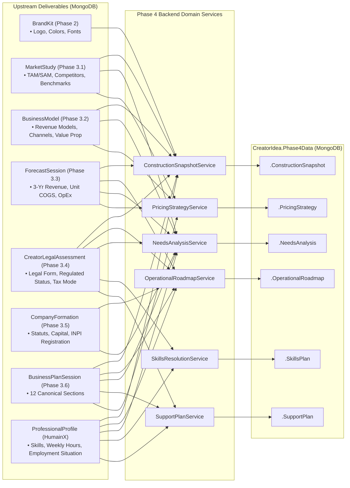

# MONDIAL BUSINESS CREATION (MBC) — CREATOR PHASE 4 DATA MAP
**Data Lineage, Cross-Phase Inputs, Domain Transformers, and MongoDB Storage**

---

## 1. Upstream Data Source Lineage

The following diagram maps how Phase 1, Phase 2, and Phase 3 deliverables feed into Phase 4 services and MongoDB subdocuments:

---

## 2. Detailed Field-by-Field Data Continuity Table

| Upstream Field / Entity | Source Step | Phase 4 Consumer | Consumption Purpose in Phase 4 | MongoDB Destination Field |
| :--- | :---: | :--- | :--- | :--- |
| `CreatorLegalAssessment.Structure` | Phase 3.4 | Step 4.1, 4.2, 4.5 | Determines legal formation tasks (SASU, SARL, EI) and tax exemption eligibility (ACRE) | `Phase4Data.ConstructionSnapshot.ReadyItems`, `Phase4Data.OperationalRoadmap.Tasks` |
| `ForecastSession.UnitEconomics.DirectCostPerUnit` | Phase 3.3 | Step 4.6 | Computes contribution margin floor pricing ($P_{min} = \frac{VC}{1 - m}$) | `Phase4Data.PricingStrategy.Offers[].FloorPrice` |
| `ForecastSession.LaunchBudget` | Phase 3.3 | Step 4.2, 4.3 | Sets initial capital expenditure bounds for operational requirements | `Phase4Data.NeedsAnalysis.Needs[].EstimatedCost` |
| `ProfessionalProfile.VentureContext.WeeklyAvailability` | HumainX | Step 4.2 | Paces Roadmap scheduling; limits `MaxNowTasks` per sprint | `Phase4Data.OperationalRoadmap.WeeklyAvailabilityHours` |
| `ProfessionalProfile.Competencies` | HumainX | Step 4.4 | Detects capability gaps between project needs and founder skills | `Phase4Data.SkillsPlan.Resolutions[].SkillName` |
| `ProfessionalProfile.CurrentSituation` (e.g. ARE) | HumainX | Step 4.5 | Triggers France Travail aid matching (ARCE capital disbursement vs ARE continuation) | `Phase4Data.SupportPlan.Matches[].EligibilityStatus` |
| `MarketStudy.CompetitorBenchmarks` | Phase 3.1 | Step 4.6 | Provides benchmark reference price and market upper bounds | `Phase4Data.PricingStrategy.Offers[].MarketReferencePrice` |
| `BusinessPlanSession.ExecutiveSummary` | Phase 3.6 | Step 4.1, 4.5 | Provides context for public grant applications and MBC artifact reuse links | `Phase4Data.SupportPlan.Matches[].AuditDetails.RequiredDocuments` |

---

## 3. Data Transformation & Deduplication Rules

1. **Snapshot Item Deduplication:** `ConstructionSnapshotService` groups inputs into 15 normalized categories and assigns stable item IDs (`itemKey`). Re-evaluating upstream sources updates status in-place without generating duplicate snapshot items.
2. **Roadmap Task Personalization:** Generic checklist templates are prohibited. Tasks dynamically inject the founder's specific legal structure (e.g. *"File SASU Statuts on Guichet Unique"* rather than *"Register your company"*).
3. **Needs Decision vs Fulfillment:** Submitting founder context (`FounderInformation`) updates `FounderState` to `Confirmed` but preserves `SystemStatus = Identified` until verifiable technical/legal completion occurs.
4. **Skills Statutory Verification Guard:** Legal/tax compliance capabilities (e.g. Certified Accountant sign-off for statutory audits) cannot be resolved via `Learn`; they are locked to `Verify` with licensed third-party credentials.
5. **Support Unawarded Grant Rule:** Grant award amounts are stored under `EstimatedAwardAmount` but are strictly excluded from spendable cash balances until formal award status is confirmed.

---
*End of Phase 4 Data Map.*
