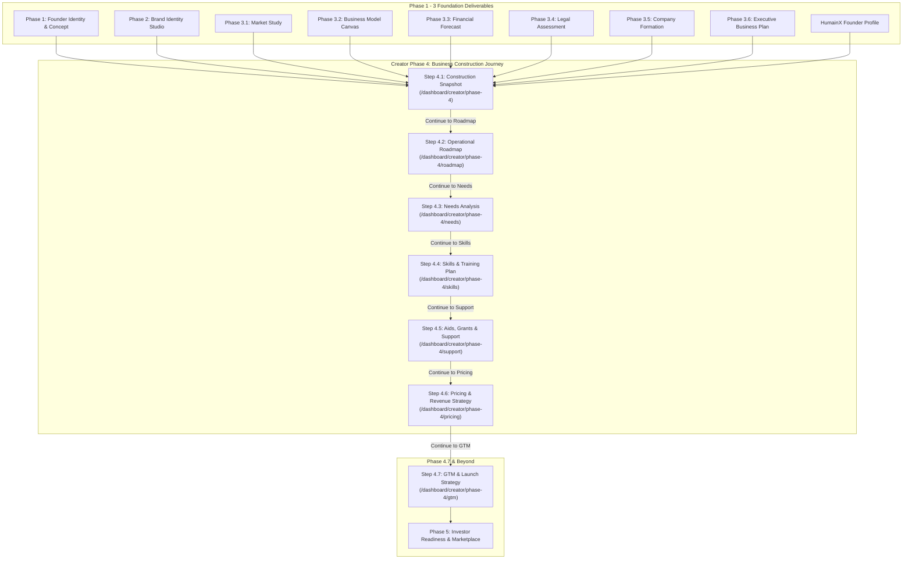

# MONDIAL BUSINESS CREATION (MBC) — CREATOR PHASE 4 FLOW MAP
**End-to-End Journey, Step Inputs, Outputs, Storage, and Transitions**

---

## 1. Global Flow Diagram

---

## 2. Step-by-Step Flow Specifications

### Step 4.1: Construction Snapshot
- **Route:** `/dashboard/creator/phase-4?ideaId={ideaId}`
- **Primary Goal:** Transform existing Phase 1–3 deliverables into an inventory of 15 operational categories across 5 diagnostic tiers.
- **Inputs Received:**
  - `CreatorLegalAssessment` (Phase 3.4)
  - `MarketStudy` (Phase 3.1)
  - `BusinessModel` (Phase 3.2)
  - `ForecastSession` (Phase 3.3)
  - `BusinessPlanSession` (Phase 3.6)
  - `BrandKit` (Phase 2)
  - `ProfessionalProfile` (HumainX)
- **Outputs Produced:**
  - Categorized items: `ReadyItems[]`, `PartialItems[]`, `MissingItems[]`, `CriticalItems[]`, `OptionalItems[]`.
  - Diagnostics: `TotalItemsCount`, `ReadyCount`, `CriticalCount`, `MissingCount`.
- **Backend API:** `GET /api/creator/phase4/construction-snapshot`, `POST /generate`, `POST /refresh`.
- **Database Storage:** `CreatorIdea.Phase4Data.ConstructionSnapshot`.
- **Exit / Completion Criteria:** Snapshot generated and viewed by founder; primary CTA `"View Operational Roadmap →"` unlocks Step 4.2.

---

### Step 4.2: Operational Roadmap
- **Route:** `/dashboard/creator/phase-4/roadmap?ideaId={ideaId}`
- **Primary Goal:** Convert snapshot requirements into a chronological action plan scheduled across 6 realistic horizons.
- **Inputs Received:**
  - `ConstructionSnapshot` (Step 4.1)
  - `CreatorLegalAssessment` (Phase 3.4)
  - `ProfessionalProfile.VentureContext.WeeklyAvailability` (Founder capacity)
- **Outputs Produced:**
  - Chronological Task List across horizons: `Now`, `Next 30 Days`, `Days 30–60`, `Days 60–90`, `Before Launch`, `After Launch`.
  - Capacity constraints: `MaxNowTasks`, `WeeklyAvailabilityHours`.
  - Task state mutations: `Status` (Pending, InProgress, Completed, Deferred), `Notes`, `AssignedTo`.
- **Backend API:** `GET /api/creator/phase4/roadmap`, `POST /generate`, `POST /refresh`, `PATCH /task`, `POST /activate`, `POST /availability`, `POST /keep-current`.
- **Database Storage:** `CreatorIdea.Phase4Data.OperationalRoadmap`.
- **Exit / Completion Criteria:** Founder reviews the "Now" horizon and customizes task assignments; primary CTA `"Continue to Needs Analysis →"` advances to Step 4.3.

---

### Step 4.3: Needs Analysis
- **Route:** `/dashboard/creator/phase-4/needs?ideaId={ideaId}`
- **Primary Goal:** Clarify specific operational, legal, software, and physical resource requirements.
- **Inputs Received:**
  - `OperationalRoadmap` (Step 4.2)
  - `ConstructionSnapshot` (Step 4.1)
  - `BusinessModel` & `ForecastSession`
- **Outputs Produced:**
  - Structured Need items with explicit separation:
    - Founder Decision: `Confirmed`, `Deferred`, `Identified`.
    - System Fulfillment: `Satisfied`, `Identified`.
  - Founder-submitted evidence / context notes (`FounderInformation`).
- **Backend API:** `GET /api/creator/phase4/needs`, `POST /generate`, `POST /refresh`, `PATCH /{needKey}`, `PUT /{needKey}/state`, `POST /keep-current`.
- **Database Storage:** `CreatorIdea.Phase4Data.NeedsAnalysis`.
- **Exit / Completion Criteria:** All critical requirements confirmed or deferred; primary CTA `"Continue to Skills & Training →"` advances to Step 4.4.

---

### Step 4.4: Skills & Training Plan
- **Route:** `/dashboard/creator/phase-4/skills?ideaId={ideaId}`
- **Primary Goal:** Resolve founder capability gaps across three distinct resolution pathways (`Learn`, `Delegate`, `Verify`).
- **Inputs Received:**
  - `NeedsAnalysis` (Step 4.3)
  - `OperationalRoadmap` (Step 4.2)
  - `ProfessionalProfile` (HumainX skill competencies and preferences)
- **Outputs Produced:**
  - Resolution entries for each identified skill gap:
    - `Learn`: Dynamic micro-learning curriculum with estimated duration and milestones.
    - `Delegate`: Service Provider job brief with scope, deliverables, and estimated budget.
    - `Verify`: Statutory checklist with mandatory verification guard for regulated activities.
- **Backend API:** `GET /api/creator/phase4/skills-plan`, `POST /generate`, `POST /refresh`, `POST /keep-current`, `PATCH /{resolutionKey}`.
- **Database Storage:** `CreatorIdea.Phase4Data.SkillsPlan`.
- **Exit / Completion Criteria:** Resolutions assigned for all open capability requirements; primary CTA `"Continue to Aids & Grants →"` advances to Step 4.5.

---

### Step 4.5: Aids, Grants & Public Support
- **Route:** `/dashboard/creator/phase-4/support?ideaId={ideaId}`
- **Primary Goal:** Match the venture against official French and European public funding, tax exemptions, and training grants.
- **Inputs Received:**
  - Prerequisite Gate: Phase 3 finalized, HumainX ready, Snapshot & Roadmap exist, Needs & Skills current.
  - Founder context: Country (`France`), Current Situation (e.g. `ARE`), Legal form, Recorded project location.
- **Outputs Produced:**
  - Matched scheme opportunities categorized into Grants, Tax Exemptions, Mentoring, and Training allowances.
  - Explicit distinction: Potential/Statutory eligibility tracked without falsely treating unawarded grants as spendable launch cash.
  - Founder saved options and application tracking state.
- **Backend API:** `GET /api/creator/phase4/support`, `POST /generate`, `POST /refresh`, `PATCH /{supportKey}`, `POST /facts`.
- **Database Storage:** `CreatorIdea.Phase4Data.SupportPlan`.
- **Exit / Completion Criteria:** Public schemes evaluated and relevant options bookmarked; primary CTA `"Continue to Pricing & Revenue →"` advances to Step 4.6.

---

### Step 4.6: Pricing & Revenue Model Strategy
- **Route:** `/dashboard/creator/phase-4/pricing?ideaId={ideaId}`
- **Primary Goal:** Establish commercially sound launch pricing grounded in contribution margin floor formulas, benchmark references, and empirical testing.
- **Inputs Received:**
  - `BusinessModel` (revenue models, customer segments)
  - `ForecastSession` (unit COGS, delivery expenses)
  - `MarketStudy` (competitor pricing benchmarks)
- **Outputs Produced:**
  - Commercial launch offers with 4-price independence (`RecommendedPrice`, `FounderSelectedPrice`, `MarketReferencePrice`, `ValidatedMarketPrice`).
  - Contribution margin floor validation ($P_{min} = \frac{VC}{1 - m}$).
  - Scenario Simulator projection ($€\text{Price} \times \text{Paying Customers} = €\text{Estimated Monthly Revenue}$).
  - Empirical validation logs (customer feedback, paid preorders).
- **Backend API:** `GET /api/creator/phase4/pricing`, `POST /generate`, `POST /refresh`, `PATCH /{offerKey}`.
- **Database Storage:** `CreatorIdea.Phase4Data.PricingStrategy`.
- **Exit / Completion Criteria:** Founder price confirmed, scenario simulator evaluated; primary CTA `"Save & Continue →"` advances to Step 4.7 GTM Strategy.

---
*End of Phase 4 Flow Map.*
