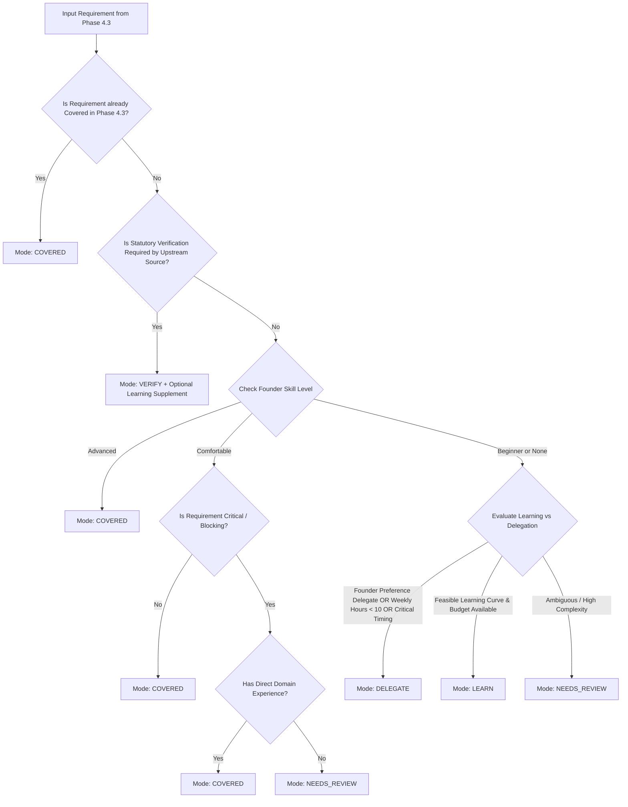

# PHASE 4.4 — CAPABILITY RESOLUTION POLICY & INVARIANTS

## Domain Objective
The `ICapabilityResolutionPolicy` provides a deterministic evaluation engine that maps capability gaps to action resolutions (`LEARN`, `DELEGATE`, `VERIFY`, `COVERED`, `NEEDS_REVIEW`). It completely eliminates arbitrary heuristic guesswork through rigorous rule precedence and invariant constraints.

---

## The 6 Canonical Evaluation Rules

### Rule 1: Complexity-Aware Skill Coverage
- **Advanced Level**: The founder possesses deep subject matter expertise. Requirement is resolved as `COVERED`.
- **Comfortable Level**:
  - For normal/low/medium priority requirements: resolved as `COVERED`.
  - For critical or launch-blocking requirements: resolved as `NEEDS_REVIEW` unless the founder's job title or direct role history explicitly supports it.
- **Beginner Level**: Never automatically `COVERED`. Must be directed to `LEARN`, `DELEGATE`, or `NEEDS_REVIEW`.
- **Unassessed / Null Level**: Resolved as `NEEDS_REVIEW`.

### Rule 2: Authoritative Statutory Verification
- Applied when Phase 3 Legal Assessment or authoritative legal evidence mandates professional certification, statutory filing, or regulated audit.
- Examples:
  - Corporate share capital escrow deposit (`Attestation de dépôt`).
  - Regulated profession compliance filings.
  - Certified annual financial audit requirements.
- Primary resolution mode is strictly `VERIFY`.
- `isMandatoryVerification` is set to `true`.
- **Safety Lock**: Cannot be overridden by founder with `ChooseLearn` or `ChooseDelegate`.

### Rule 3: Non-Exclusive Verify with Supporting Learning
- When `VERIFY` is selected, an `OptionalLearningSupplement` is attached.
- Enables the creator to understand core concepts, terminology, and governance criteria when reviewing deliverables with attorneys or certified accountants.

### Rule 4: Phase 4.3 Covered Requirements Pass-Through
- If a requirement was already categorized under `CoveredRequirements` in Phase 4.3 Needs Analysis, it is directly ingested as `COVERED` with reason `PHASE_4_3_COVERED_PASS_THROUGH`.
- Eliminates redundant processing and preserves upstream consistency.

### Rule 5: Deterministic & Curated Learning Topics
- Curated taxonomies provide standard learning curricula:
  - **SEO & Inbound**: Keyword research, search intent mapping, on-page optimization, technical crawl health.
  - **B2B Sales**: Prospecting cadence, qualification framework (BANT), demo structuring, negotiation.
  - **Product Strategy**: User story mapping, sprint prioritization, unit economics modeling.
  - **Software Engineering**: RESTful API design, database schema modeling, automated testing.

### Rule 6: Decoupled Founder Decision & Safety Guard
- System recommendation (`ResolutionMode`) remains preserved as audit truth.
- Founder choice is stored in `FounderDecision` (`ChooseLearn`, `ChooseDelegate`, `ConfirmCovered`, `Defer`).
- Refresh re-evaluates system recommendations while preserving `FounderDecision` and `FounderNotes`.
- If `isMandatoryVerification` is true, the API rejects `ChooseLearn` and `ChooseDelegate` with HTTP 400 Bad Request.
