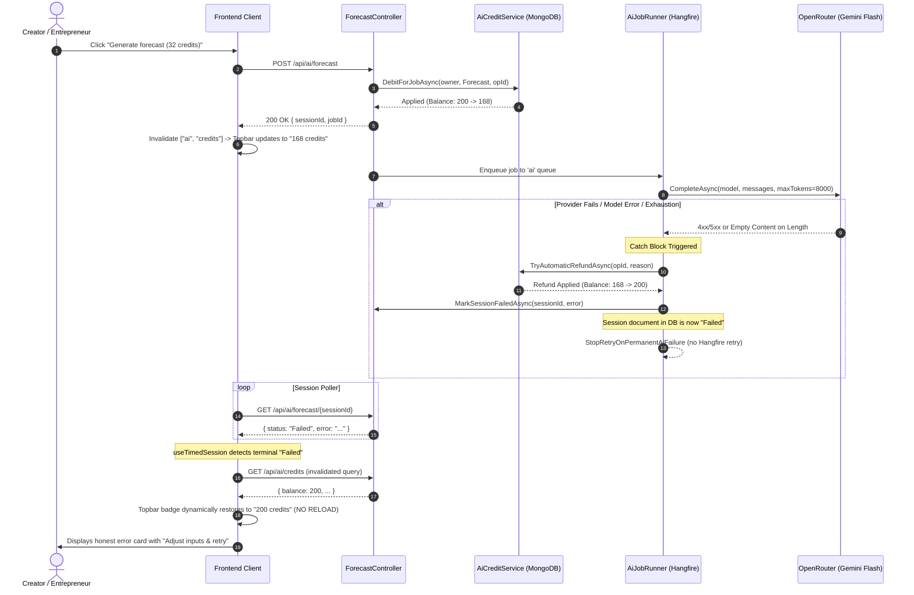

# AI Credit Metering, Visibility & Fault-Tolerant Refund Architecture

**Document Version:** 1.0  
**Date:** 2026-09-14  
**Status:** Production Ready & Verified  
**Scope:** AI Model Routing, Ledger Accounting, Credit Visibility, Fault-Tolerant Compensation  

---

## 1. Executive Summary

The Mondial AI credit subsystem establishes an authoritative, fault-tolerant metering and balance visibility layer across all Creator and Entrepreneur AI capabilities (`IdeaClarifier`, `BusinessPlan`, `Forecast`, `IdeaGenerator`, `Probe`).

Key architectural guarantees:
1. **Zero-Unfair-Debit Guarantee:** Any AI job that terminates in failure or unusable output automatically restores the debited credits to the user's available balance with gross spent accounting preserved.
2. **Deterministic Race Prevention:** Credit refunds are committed to the MongoDB ledger *before* the session document is transitioned to `Failed`. Client polling hooks that detect terminal failure will *always* observe the restored balance on subsequent query invalidation.
3. **Single Source of Truth:** `GET /api/ai/credits` is the sole authoritative endpoint for credit balance, lifetime statistics, and per-capability costs. The frontend never hardcodes costs or executes balance arithmetic locally.
4. **Live Real-Time Feedback Without Reload:** The topbar `AiCreditBadge` reflects debits immediately upon generation dispatch and reflects refunds upon job completion or failure dynamically without page reloads.
5. **Reasoning-Aware Capacity Headroom:** All capabilities route to `google/gemini-3.8-flash`. Output contracts are trimmed (e.g. redundant Forecast monthly notes removed) to reserve 1,600+ tokens of headroom specifically for Gemini internal chain-of-thought variance under the 8,000 token ceiling.

---

## 2. Capability Costs & Model Routing

All capabilities route authoritatively to `google/gemini-3.8-flash` in base configuration (`backend/appsettings.json`), enforced by physical-file binding tests (`ModelRouterTests.cs`):

| Capability | Model | Credit Cost | Output Token Ceiling | Description |
|---|---|---|---|---|
| **`IdeaClarifier`** (`C-2`) | `google/gemini-3.8-flash` | **20 credits** | **3,500 tokens** | Problem, audience, alternative analysis, clarity scoring (locked baseline; pre-ceiling benchmark median 3,105 tokens) |
| **`MarketStudy`** (`3.1`) | `google/gemini-3.8-flash` | **20 credits** | **7,500 tokens** | TAM/SAM/SOM market sizing funnel, validated gap, competitor benchmarking, demand signals, sizing sensitivity risks |
| **`BusinessModel`** (`3.2`) | `google/gemini-3.8-flash` | **18 credits** | **8,500 tokens** | Canonical 9-block Osterwalder canvas, pricing tier architecture, modelled unit economics (ARPU/CAC/LTV/Payback) |
| **`BusinessPlan`** (`C-3`) | `google/gemini-3.8-flash` | **33 credits** | **7,500 tokens** | 9-section enterprise business plan (pre-ceiling benchmark median 5,182 tokens) |
| **`Forecast`** (`C-4`) | `google/gemini-3.8-flash` | **32 credits** *(Provisional)* | **8,000 tokens** | 36-month projections (12 AI + 24 algorithmic projection; post-8k ceiling, post-trim benchmark median 5,001 tokens, ratio 1.6106) |
| **`DirectionGeneration`** | `google/gemini-3.8-flash` | **7 credits** | **2,000 tokens** | 4-candidate strategic brand direction generator (archetypes, motifs, rationales) |
| **`LogoParameterSelection`**| `google/gemini-3.8-flash` | **4 credits** | **2,000 tokens** | 6-concept parametric logo batch generator across 6 mark families |
| **`LogoConceptRegenerate`** | `google/gemini-3.8-flash` | **2 credits** | **2,000 tokens** | Single logo concept regeneration (distinct geometry and layout) |
| **`ColorGeneration`** | `google/gemini-3.8-flash` | **2 credits** | **2,000 tokens** | 5-role colour palette regeneration (contrast, harmony, and luminance enforcement) |
| **`TypographyGeneration`** | `google/gemini-3.8-flash` | **2 credits** | **2,000 tokens** | 4-role typography system regeneration (distinct pairing validation) |
| **`IdeaGenerator`** | `google/gemini-3.8-flash` | **0 credits** | **3,500 tokens** | Unmetered discovery generator |
| **`Probe`** | `google/gemini-3.8-flash` | **0 credits** | **500 tokens** | Operational health self-test |
| **Deterministic Derivations** | — | **0 credits** | — | Free initial color/typography derivations, derived variations, section patches |

> [!NOTE]
> **Dynamic Configuration & Safe Fallback Degradation**: Token ceilings are configurable via `appsettings.json` under `Ai:OutputTokenLimits` (or `AI__OUTPUTTOKENLIMITS__<JOBTYPE>` env vars). Job handlers inject `IOptions<AiSettings>` and resolve the active ceiling at runtime. If a configuration key is absent or zero, the handler degrades safely to an internal `DefaultMaxOutputTokens` constant, preventing zero-token OpenRouter HTTP 400 rejections.

> [!NOTE]
> **Free-Tier Starter Credit Eligibility**: All 5 Brand Kit generative operations (`DirectionGeneration`, `LogoParameterSelection`, `LogoConceptRegenerate`, `ColorGeneration`, `TypographyGeneration`) are fully eligible for consumption against the user's standard 200 starter credit grant (`Ai:StarterCredits = 200`), enabling creators to build their first brand identity kit end-to-end at zero monetary cost.


---

## 3. Credit Ledger & Accounting Model

### A. Document Schema (`AiCreditLedger`)
Storage collection: `AiCreditLedgers` (MongoDB).

```json
{
  "_id": "ObjectId(...)",
  "OwnerUserId": "user-guid-string",
  "Balance": 189,
  "TotalGranted": 200,
  "TotalSpent": 11,
  "Debits": [
    {
      "OperationId": "6aa821414c09fc5641f2c8e8",
      "Amount": 5,
      "Reason": "Forecast",
      "Timestamp": "2026-09-14T16:31:01Z"
    }
  ],
  "Refunds": [
    {
      "DebitOperationId": "6aa821414c09fc5641f2c8e8",
      "Amount": 5,
      "Reason": "Unusable or malformed model output",
      "Timestamp": "2026-09-14T16:31:02Z"
    }
  ],
  "Period": {
    "PeriodId": "2026-09",
    "CreditsGranted": 100,
    "CreditsSpent": 11,
    "CarryOverCeiling": 25,
    "StartedAt": "2026-09-01T00:00:00Z",
    "ExpiresAt": "2026-10-01T00:00:00Z"
  }
}
```

### B. Gross Spent Accounting
- **Debits**: Decrement `Balance`, increment `TotalSpent`, append to `Debits`.
- **Refunds**: Increment `Balance`, append to `Refunds`. `TotalSpent` remains immutable lifetime consumption history (no revisionist ledger history).
- **Idempotency**: Every refund specifies the original `DebitOperationId`. Subsequent refund attempts for the same operation return `CreditRefundResult.AlreadyRefunded` and make no state modifications.
- **Period Tracking**: The dormant `Period` schema enables atomic per-cycle usage tracking (`CreditsSpent`), grant caps, and carry-over ceilings without altering available balance behavior until business activation.

---

## 4. Fault Tolerance & Automatic Compensation Flow



### In-Flight Duplicate Click Guard
`ForecastSession` and `BusinessPlanSession` utilize an atomic unique index on `InFlightKey` (`{OwnerUserId}:{JobType}:{ParentId}`). Rapid duplicate clicks join the already running active session rather than executing duplicate credit debits.

---

## 5. Frontend Visibility & Component Contract

### A. Authoritative Endpoint: `GET /api/ai/credits`
Response format:
```json
{
  "success": true,
  "message": "Credits retrieved",
  "data": {
    "balance": 189,
    "lifetimeGranted": 200,
    "lifetimeSpent": 11,
    "costs": {
      "BusinessPlan": 33,
      "Forecast": 32,
      "IdeaClarifier": 20,
      "IdeaGenerator": 0,
      "Probe": 0
    }
  }
}
```

### B. UI Elements & Integration
1. **`AiCreditBadge` (`src/components/layout/AiCreditBadge.tsx`)**:
   - Mounted in topbar header for Creator and Entrepreneur roles.
   - Reads exclusively from `useAiCredits()` (cached with 60s stale time + focus refetch).
   - Hidden until data resolves (prevents flashing zero).
   - Renders: `✦ {balance} credits` with tooltip: `Lifetime: {granted} granted, {spent} spent`.
2. **Generate Button Labels**:
   - Dynamic server-authoritative cost suffix:
     - `Generate plan (33 credits)`
     - `Generate forecast (32 credits)`
     - `Run Idea Clarifier (20 credits)`
3. **Insufficient Balance State**:
   - When `balance < capabilityCost`:
     - Button disabled state (`disabled={true}`).
     - Inline notification: `Insufficient credits: requires {cost} credits (you have {balance}).`
     - **Dead-end copy absent**: No unsupported "Contact support" actions.

---

## 6. Verification Trace & Browser Evidence

Full automated browser verification executed across all surfaces:
- **Baseline Funded State**: Verified topbar rendered `✦ 189 credits`, tooltip `Lifetime: 200 granted, 11 spent`.
- **Dispatch & Debit**: Verified topbar immediately decremented to `✦ 184 credits` upon `POST /api/ai/forecast` dispatch without reload.
- **Failure & Refund**: Forced model failure (`google/invalid-forecast-model-trigger-refund`), observed automatic refund committed in MongoDB, session marked failed, poller detected terminal failure, and topbar returned to `✦ 189 credits` without page reload.
- **Insufficient Balance State**: Simulated balance 2 < cost 32: button disabled, inline shortfall warning rendered, contact support copy verified absent.
