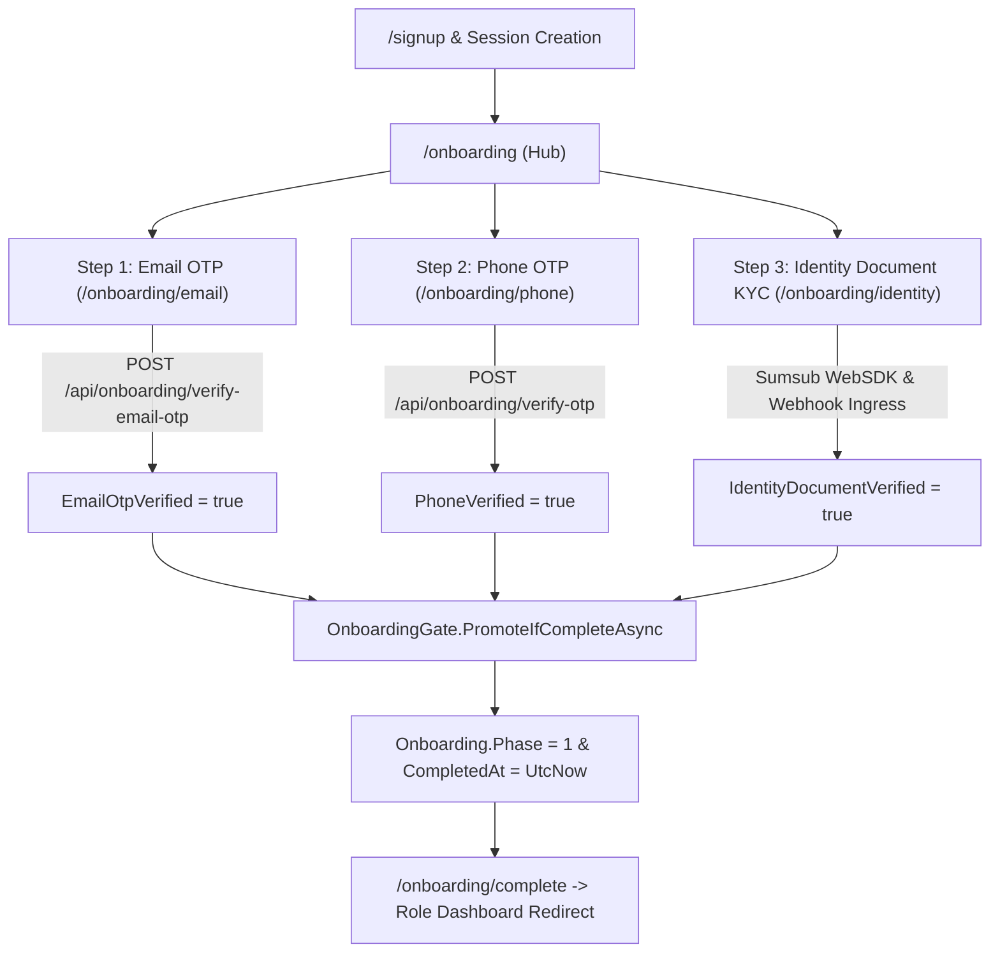
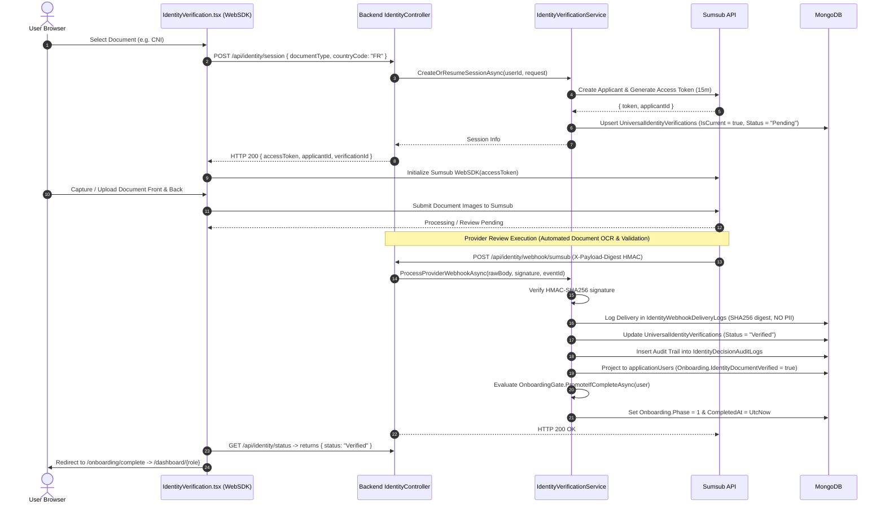
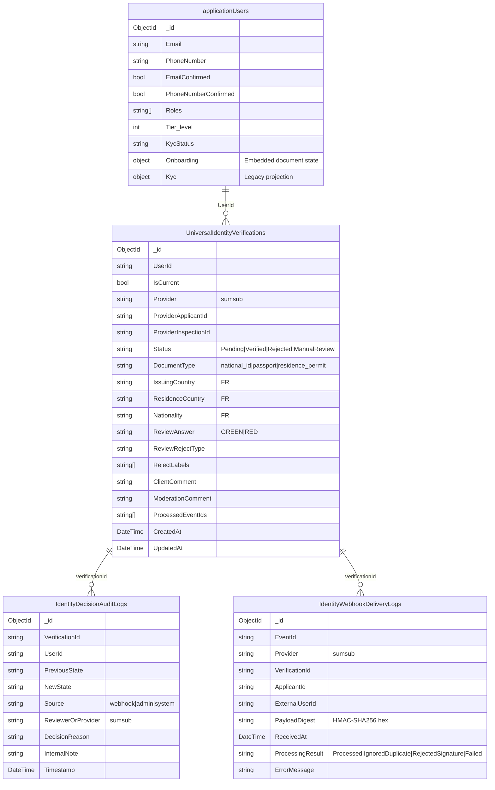

# Mondial ECO — Universal Identity & Onboarding Architecture (Phase 0 → Phase 1)

This document establishes the canonical single source of truth for the **Universal Onboarding and Identity Verification Phase** across all platform roles (Creator, Entrepreneur, Investor, and Service Provider) in Mondial ECO.

---

## 1. Purpose & Domain Scope

Mondial ECO enforces a **Universal Phase 0 Onboarding Gate** across all user archetypes before unlocking domain-specific dashboards and capabilities:
* **Creator**: Locked out of `/dashboard/creator` and Idea Workbenches until Phase 1.
* **Entrepreneur**: Locked out of `/dashboard/entrepreneur` and Company Workspaces until Phase 1.
* **Investor**: Locked out of `/dashboard/investor` and Deal Flow Pipelines until Phase 1.
* **Service Provider**: Locked out of `/dashboard/serviceprovider` and Marketplace Listings until Phase 1.

Every user undergoes an identical, standardized, 3-step verification sequence:
1. **Email Verification** (HMAC-SHA256 6-digit OTP via SMTP)
2. **Phone Verification** (HMAC-SHA256 6-digit OTP via Twilio SMS)
3. **Identity Document Verification** (Automated document KYC via Sumsub WebSDK)

> [!IMPORTANT]
> **Facial verification, selfie photos, liveness detection, and video identification are strictly and permanently removed** from active runtime business logic. The universal gate requires ONLY Email + Phone + Government Identity Document.

---

## 2. Canonical Signup & Entry Flow

Users enter the Universal Onboarding flow via canonical session-based authentication:

```
[ Browser: /signup/role ]
        │
        ▼ (Selects Role: Creator | Entrepreneur | Investor | ServiceProvider)
[ Browser: /signup ]
        │
        ▼ POST /api/auth/register (name, email, password, role)
[ Backend: AuthController.Register ]
        │
        ├─ 1. Validates inputs & uniqueness
        ├─ 2. Creates ApplicationUser (EmailConfirmed = true, Onboarding.Phase = 0)
        ├─ 3. Generates 8-Hour Auth JWT (`token`) & 7-Day Refresh Token
        └─ 4. Returns HTTP 201 Created with `{ token, user }`
        │
        ▼ Frontend: src/lib/api-auth.ts
[ establishSession({ token, user }) ]
        │
        ├─ 1. Writes token to localStorage ("token")
        ├─ 2. AuthProvider updates state (isAuthenticated = true, isBackendVerified = true)
        └─ 3. router.replace("/onboarding")
        │
        ▼
[ Browser: /onboarding ]
        │
        └─ Protected by <AuthGuard>; renders Universal Onboarding Hub
```

* Zero onboarding JWTs or tokens are passed via URL query strings.
* Session authorization header (`Authorization: Bearer <token>`) is automatically injected for all subsequent API requests.

---

## 3. Universal Phase Steps



### Step 1: Email Verification
* **Frontend Route**: `/onboarding/email` (`src/app/onboarding/email/page.tsx`)
* **Send Endpoint**: `POST /api/onboarding/send-email-otp`
* **Verify Endpoint**: `POST /api/onboarding/verify-email-otp` (`{ "code": "123456" }`)
* **Security**: 6-digit random code hashed using HMAC-SHA256 with JWT secret key salt (`${userId}:${code}`).
* **Expiry**: 10 minutes (`EmailOtpExpiresAt`).
* **Authoritative State**: `applicationUsers.Onboarding.EmailOtpVerified = true`.

### Step 2: Phone Verification
* **Frontend Route**: `/onboarding/phone` (`src/app/onboarding/phone/page.tsx`)
* **Send Endpoint**: `POST /api/onboarding/send-otp` (`{ "phone": "+33612345678" }`)
* **Verify Endpoint**: `POST /api/onboarding/verify-otp` (`{ "code": "123456" }`)
* **Security**: 6-digit random code hashed using HMAC-SHA256 (`${userId}:${code}`).
* **Expiry**: 60 seconds (`PhoneVerifyExpiresAt`).
* **Normalization**: E.164 format requirement (`+` prefix, minimum 8 characters).
* **Provider**: Twilio SMS (`TwilioService`); logs warning in development when unconfigured.
* **Authoritative State**: `applicationUsers.Onboarding.PhoneVerified = true`.

### Step 3: Identity Document Verification
* **Frontend Route**: `/onboarding/identity` (`src/app/onboarding/identity/page.tsx` & `src/components/onboarding/IdentityVerification.tsx`)
* **Config Endpoint**: `GET /api/identity/config?country=FR`
* **Session Endpoint**: `POST /api/identity/session` (`{ "documentType": "national_id", "countryCode": "FR" }`)
* **Status Endpoint**: `GET /api/identity/status`
* **Retry Endpoint**: `POST /api/identity/retry`
* **Webhook Ingress**: `POST /api/identity/webhook/sumsub` (Canonical HMAC-SHA256 signed endpoint)
* **Authoritative State**: `UniversalIdentityVerifications` (`Status = "Verified"`) projected into `applicationUsers.Onboarding.IdentityDocumentVerified = true`.
*(Note: Legacy forwarder `POST /api/onboarding/sumsub/webhook` has been removed).*

---

## 4. France MVP Document Policy

For users under French jurisdiction (`FR`), accepted document types are strictly constrained:

| Document Type | Code | Front Photo | Back Photo | Notes |
| :--- | :--- | :---: | :---: | :--- |
| **Carte Nationale d'Identité (CNI)** | `national_id` | **Required** | **Required** | French National Identity Card |
| **Passeport** | `passport` | **Required** | **No** | French / International Passport |
| **Titre de Séjour** | `residence_permit` | **Required** | **Required** | French Residence Permit |

> [!CAUTION]
> **Driver's License (`drivers_license` / `driver_license`) is strictly prohibited** for French identity verification and is rejected by both frontend validation and backend model guards.

---

## 5. Sumsub Integration & WebSDK Workflow



---

## 6. Universal Phase 1 Promotion Gate

The promotion gate is centralized in `backend/Services/OnboardingGate.cs`.

### Gate Condition
```csharp
var complete = user.Onboarding.EmailOtpVerified &&
               user.Onboarding.PhoneVerified &&
               user.Onboarding.IdentityDocumentVerified;
```

### Side Effects upon Promotion
When `complete == true` and `user.Onboarding.Phase < 1`:
1. `user.Onboarding.Phase = 1`
2. `user.Onboarding.CompletedAt = DateTime.UtcNow`
3. `user.KycStatus = "VERIFIED"` (backward compatibility projection)
4. `user.Kyc.Status = VerificationStatus.Verified`
5. `user.Kyc.VerifiedAt = DateTime.UtcNow`
6. `user.Tier_level = Math.Max(user.Tier_level, 1)`
7. Persisted via `UserManager.UpdateAsync(user)`
8. Emits structured audit log event `"onboarding_complete"`.

### Role Redirection
After `Onboarding.Phase >= 1`, the frontend router resolver (`resolvePostLoginRedirect` / `getRoleDashboardRoute` in `src/lib/roles.ts`) automatically routes the user to their respective primary dashboard:

| User Role | Canonical Destination Route |
| :--- | :--- |
| **Creator** | `/dashboard/creator` |
| **Entrepreneur** | `/dashboard/entrepreneur` |
| **Investor** | `/dashboard/investor` |
| **Service Provider** | `/dashboard/serviceprovider` |
| **Admin / SuperAdmin** | `/dashboard/admin` |

---

## 7. Data Persistence & Collection Schema Map



### Detailed Persistence Responsibilities

1. **`applicationUsers` Collection**:
   - **`Onboarding.EmailOtpHash`** / **`EmailOtpExpiresAt`**: Temporary salted HMAC-SHA256 hash for email verification (cleared on verification).
   - **`Onboarding.EmailOtpVerified`**: Authoritative boolean flag for email verification.
   - **`Onboarding.PhoneVerifyHash`** / **`PhoneVerifyExpiresAt`**: Temporary salted HMAC-SHA256 hash for phone verification (cleared on verification).
   - **`Onboarding.PhoneVerified`**: Authoritative boolean flag for phone verification.
   - **`Onboarding.IdentityDocumentVerified`**: Projected boolean flag for identity document verification.
   - **`Onboarding.Phase`**: Authoritative integer onboarding state (`0` = In Progress, `1` = Universal Complete).
   - **`Onboarding.CompletedAt`**: Authoritative UTC timestamp of Phase 1 gate completion.
   - **Legacy Compatibility Fields**: `FaceVerified`, `Kyc.Face`, `Kyc.FacialVerification`, `SelfieImage` (preserved for BSON deserialization compatibility only; zero active runtime read/write).

2. **`UniversalIdentityVerifications` Collection**:
   - Primary domain collection for identity attempts.
   - Maintains exact provider identifiers (`ProviderApplicantId`, `ProviderInspectionId`).
   - Tracks document types, issuing country, moderation comments, and deduplication event arrays (`ProcessedEventIds`).

3. **`IdentityWebhookDeliveryLogs` Collection**:
   - Durable operational webhook ingress ledger.
   - Stores raw payload digest (`PayloadDigest` = SHA256 hex string) and event IDs.
   - **Zero raw JSON payloads and zero raw PII are stored in delivery logs**.

4. **`IdentityDecisionAuditLogs` Collection**:
   - Append-only audit trail capturing every state machine transition (`PreviousState` $\to$ `NewState`).

5. **Document File Storage Classification**:
   - **Canonical Identity KYC Documents**: **PROVIDER-ONLY** (hosted and evaluated entirely inside Sumsub infrastructure).
   - **Supplementary Documents (Residence, Income, Tax, License)**: Stored locally in web root (`/wwwroot/uploads/documents/...`) via `SaveFile`. Supplementary uploads do not block Phase 1 promotion.
   - **Legacy Manual Upload Fallback**: `POST /api/onboarding/identity/upload` saves files locally to `/wwwroot/uploads/identity/documents/...` only when feature flag `FeatureFlags:AllowLegacyIdentityUpload == true` (default: `false`). Uploading does not verify identity.

---

## 8. Authoritative Source Matrix

| Domain Information | Authoritative Collection & Field | Projection / Cache Location | Mutating Authority |
| :--- | :--- | :--- | :--- |
| **Email Verified** | `applicationUsers.Onboarding.EmailOtpVerified` | `applicationUsers.EmailConfirmed` | `OnboardingController.VerifyEmailOtp` |
| **Phone Verified** | `applicationUsers.Onboarding.PhoneVerified` | `applicationUsers.PhoneNumberConfirmed` | `OnboardingController.VerifyPhoneOtp` |
| **Identity Document Verified** | `UniversalIdentityVerifications.Status == "Verified"` | `applicationUsers.Onboarding.IdentityDocumentVerified`, `applicationUsers.KycStatus` | `IdentityVerificationService.ProcessProviderWebhookAsync` |
| **Current Identity Attempt** | `UniversalIdentityVerifications (IsCurrent = true)` | None | `IdentityVerificationService` |
| **Provider Applicant ID** | `UniversalIdentityVerifications.ProviderApplicantId` | None | `IdentityVerificationService` / `SumsubService` |
| **Document Type Selected** | `UniversalIdentityVerifications.DocumentType` | `applicationUsers.Onboarding.IdentityDocumentType` | `IdentityVerificationService.CreateOrResumeSessionAsync` |
| **Rejection / Review Reason** | `UniversalIdentityVerifications.ClientComment` | `applicationUsers.Kyc.Identity.RejectionReason` | `IdentityVerificationService.ProcessProviderWebhookAsync` |
| **Webhook Delivery Ledger** | `IdentityWebhookDeliveryLogs` | None | `IdentityVerificationService.RecordDeliveryLogAsync` |
| **Decision History Trail** | `IdentityDecisionAuditLogs` | None | `IdentityVerificationService.RecordDecisionAuditAsync` |
| **Universal Onboarding Phase** | `applicationUsers.Onboarding.Phase` | None | `OnboardingGate.PromoteIfCompleteAsync` |
| **Platform Roles** | `applicationUsers.Roles` | User JWT Claim `role` | `AuthController` / `UserManager` |
| **Supplementary Documents** | `applicationUsers.Onboarding.{Residence,Income,Tax,License}` | File path on disk (`/wwwroot/uploads/documents/...`) | `OnboardingController.UploadDocument` |

---

## 9. Security, Privacy & BSON Compatibility

1. **Secret & Key Isolation**:
   - Sumsub `AppToken`, `SecretKey`, and `WebhookSecret` are loaded strictly via environment variables (`Sumsub__*`).
   - OTP secrets are derived from `JwtSettings:Key` via HMAC-SHA256.
2. **PII Protection**:
   - Raw identity document images are never persisted to the local file system during standard Sumsub WebSDK KYC.
   - Webhook logs retain cryptographic digests (`PayloadDigest`) rather than raw webhook payloads.
3. **Historical BSON Compatibility**:
   - Database models retain BSON mappings for legacy face properties to prevent deserialization faults when querying historical database documents:
     - `ApplicationUser.FaceVerified`
     - `ApplicationUser.Kyc.Face`
     - `ApplicationUser.Kyc.FacialVerification`
     - `ApplicationUser.SelfieImage`
   - These properties are dead/non-functional in business logic and carry zero gate authority.

---

## 10. Operational Status & Explicit Level Binding

1. **Explicit Verification Level Binding**:
   - Runtime configuration: `Sumsub:LevelName = "id-document-only"`.
   - WebSDK Access Token endpoint: `POST /resources/accessTokens/sdk` with JSON body `{ "userId": "<userId>", "levelName": "id-document-only", "ttlInSecs": 900 }`.
   - Applicant Creation endpoint: `POST /resources/applicants?levelName=id-document-only` with JSON body `{ "externalUserId": "<userId>" }`.
   - **Outbound Request Signing**: `HMAC-SHA256(SecretKey, timestamp + HTTP_METHOD + URI_WITH_QUERY + EXACT_SERIALIZED_BODY)`. Exact body bytes are signed and transmitted.
   - **Fail-Closed Semantics**: If `Sumsub:LevelName` is missing or unconfigured, token generation immediately throws an exception and halts session creation. Zero fallback to Account Default is permitted.
2. **Sumsub Dashboard Configuration Requirements**:
   - Verified level name: `id-document-only`.
   - Verification steps: Strictly **Identity Document** (CNI, Passport, Residence Permit; Driver's License disabled).
   - Biometric steps (Selfie, Liveness, Face Match, Video Identification): Strictly **Disabled / Absent**.
   - Capture Mode: **Live Capture** with **Fallback to file upload = Not available**.
3. **Webhook Verification Status Distinction**:
   - **WEBHOOK CODE-PATH TEST RESULT**: **PASS** (20 automated unit & integration tests validate HMAC-SHA256 signature verification, idempotency, out-of-order protection, deterministic signing, route regressions, and Phase 1 gate promotion).
   - **REAL CANONICAL WEBHOOK DELIVERY**: **VERIFIED** (Confirmed delivery of provider-generated `applicantReviewed` event to `https://mondialbusiness.eu/api/identity/webhook/sumsub` with `200 OK`).
   - **LEGACY SUMSUB WEBHOOK**: **REMOVED**
   - **UNIVERSAL IDENTITY PRODUCTION STATUS**: **PRODUCTION READY** / **FROZEN**
4. **Webhook Endpoint Routing**:
   - Canonical webhook URL: `https://mondialbusiness.eu/api/identity/webhook/sumsub` (Sole authoritative provider destination).
   - Legacy webhook URL: Removed.
5. **Architectural Limitation (Document-Only KYC)**:
   - MBC uses **document-only** identity verification.
   - It validates provider-approved document authenticity and identity-document validity state.
   - It does **NOT** perform biometric owner matching because:
     - **Selfie** is disabled
     - **Liveness** is disabled
     - **Face Match** is disabled
   - The platform does not purport to prove physical document ownership beyond provider-side document inspection and live capture enforcement.

---

## 11. Sumsub WebSDK 2.0 Hardening & Client Architecture

1. **Canonical WebSDK 2.0 Frontend Pipeline**:
   - Route: `/onboarding/identity`
   - Document selection (CNI / Passport / Residence Permit) initiates session via `POST /api/identity/session`.
   - Backend mints short-lived SDK token (TTL = 900s) bound explicitly to `id-document-only`.
   - WebSDK 2.0 initializes via `https://static.sumsub.com/idensic/static/sns-websdk-builder.js` and launches Live Capture.
   - Zero direct file inputs (`<input type="file">` absent) and zero direct image upload endpoints called.

2. **UX-Only Client Events**:
   - `onApplicantSubmitted` updates client state to `"Verification submitted. We're checking your document."` and starts safe 5-second polling of `GET /api/identity/status`.
   - Client events never mutate or assume `IdentityDocumentVerified = true`.
   - Authoritative verification state transitions are strictly governed by provider webhook delivery (`applicantReviewed`) $\to$ `UniversalIdentityVerifications` $\to$ `applicationUsers.Onboarding.IdentityDocumentVerified`.

3. **Safe Access-Token Refresh**:
   - WebSDK token expiration callback invokes `POST /api/identity/session` returning a fresh SDK token string (`Promise<string>`).
   - Session resumption safely reuses the active `UniversalIdentityVerification` record without creating duplicate applicants or resetting verification state.

4. **WebSDK Domain Authorization**:
   - Production origin: `https://mondialbusiness.eu`
   - Development origin: `http://localhost:3000`
   - Wildcard origin access: **Disabled**.

