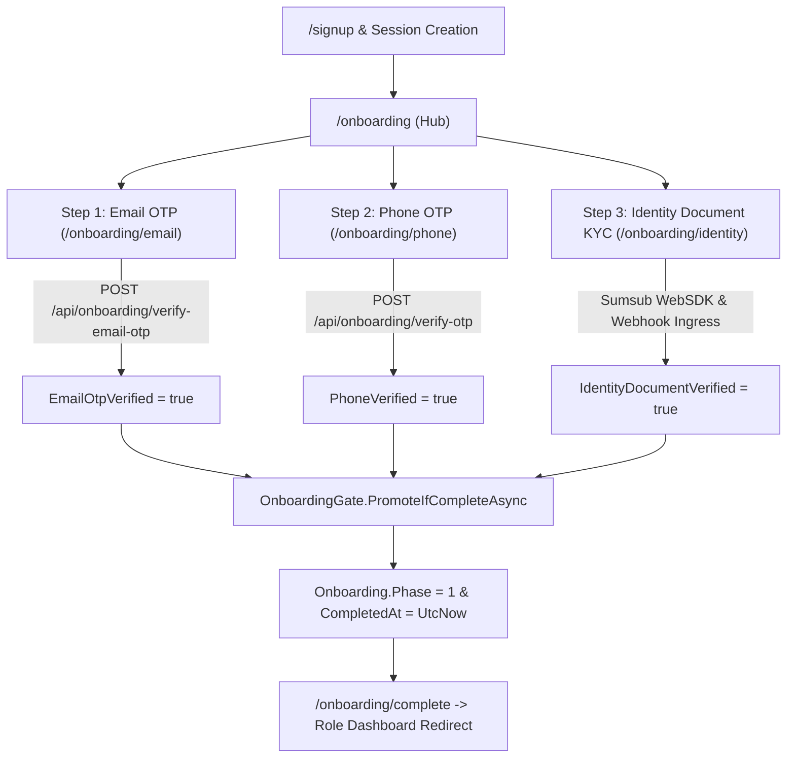
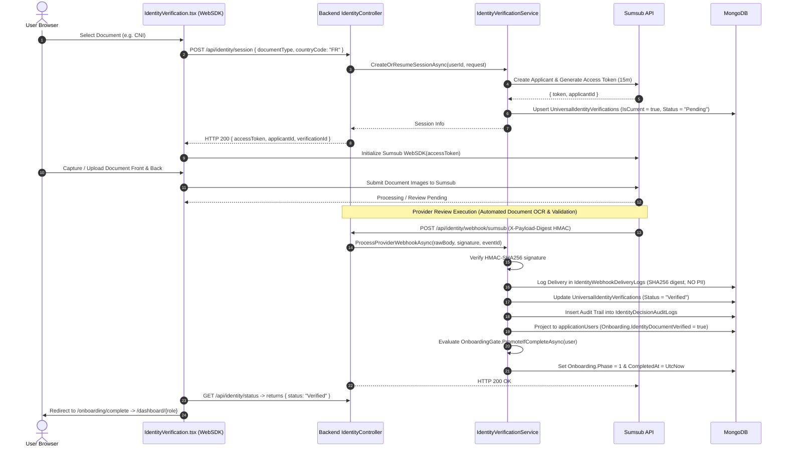
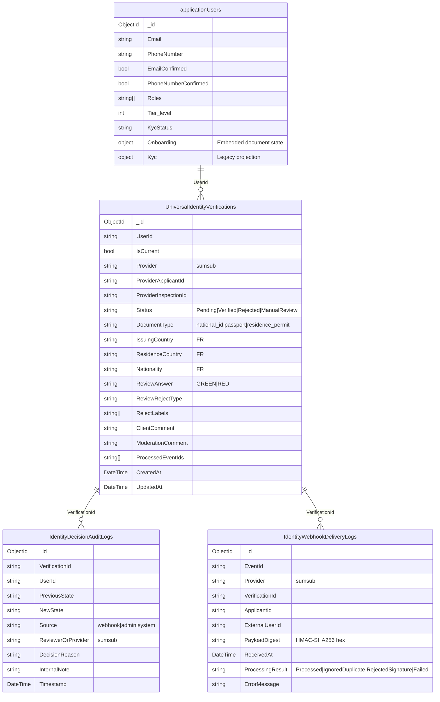

# Mondial ECO — Universal Identity & Onboarding Architecture (Phase 0 → Phase 1)

This document establishes the canonical single source of truth for the **Universal Onboarding and Identity Verification Phase** across all platform roles (Creator, Entrepreneur, Investor, and Service Provider) in Mondial ECO.

---

## 1. Purpose & Domain Scope

Mondial ECO enforces a **Universal Phase 0 Onboarding Gate** across all user archetypes before unlocking domain-specific dashboards and capabilities:
* **Creator**: Locked out of `/dashboard/creator` and Idea Workbenches until Phase 1.
* **Entrepreneur**: Locked out of `/dashboard/entrepreneur` and Company Workspaces until Phase 1.
* **Investor**: Locked out of `/dashboard/investor` and Deal Flow Pipelines until Phase 1.
* **Service Provider**: Locked out of `/dashboard/serviceprovider` and Marketplace Listings until Phase 1.

Every user undergoes the standardized verification sequence:
1. **Email Verification** (HMAC-SHA256 6-digit OTP via SMTP) — **Required**
2. **Phone Verification** (HMAC-SHA256 6-digit OTP via Twilio SMS) — **Required**
3. **Identity Document Verification** (Automated document KYC via Sumsub WebSDK) — **Fully Implemented & Deferred for MVP Launch**

> [!IMPORTANT]
> **MVP Launch Gate Policy & Reversible Feature Flag**:
> - Required Universal Onboarding Steps: **Email Verification** + **Phone Verification**.
> - Identity Document Verification is fully implemented and preserved in place, but temporarily deferred from blocking Universal Phase 1 onboarding.
> - Policy is governed by `FeatureFlags:RequireIdentityVerificationInUniversalOnboarding` (defaults to `false`).
> - **Facial verification, selfie photos, liveness detection, and video identification are permanently removed** from active runtime business logic.

---

## 2. Canonical Signup & Entry Flow

Users enter the Universal Onboarding flow via canonical session-based authentication:

```
[ Browser: /signup/role ]
        │
        ▼ (Selects Role: Creator | Entrepreneur | Investor | ServiceProvider)
[ Browser: /signup ]
        │
        ▼ POST /api/auth/register (name, email, password, role)
[ Backend: AuthController.Register ]
        │
        ├─ 1. Validates inputs & uniqueness
        ├─ 2. Creates ApplicationUser (EmailConfirmed = true, Onboarding.Phase = 0)
        ├─ 3. Generates 8-Hour Auth JWT (`token`) & 7-Day Refresh Token
        └─ 4. Returns HTTP 201 Created with `{ token, user }`
        │
        ▼ Frontend: src/lib/api-auth.ts
[ establishSession({ token, user }) ]
        │
        ├─ 1. Writes token to localStorage ("token")
        ├─ 2. AuthProvider updates state (isAuthenticated = true, isBackendVerified = true)
        └─ 3. router.replace("/onboarding")
        │
        ▼
[ Browser: /onboarding ]
        │
        └─ Protected by <AuthGuard>; renders Universal Onboarding Hub
```

* Zero onboarding JWTs or tokens are passed via URL query strings.
* Session authorization header (`Authorization: Bearer <token>`) is automatically injected for all subsequent API requests.

---

## 3. Universal Phase Steps



### Step 1: Email Verification
* **Frontend Route**: `/onboarding/email` (`src/app/onboarding/email/page.tsx`)
* **Send Endpoint**: `POST /api/onboarding/send-email-otp`
* **Verify Endpoint**: `POST /api/onboarding/verify-email-otp` (`{ "code": "123456" }`)
* **Security**: 6-digit random code hashed using HMAC-SHA256 with JWT secret key salt (`${userId}:${code}`).
* **Expiry**: 10 minutes (`EmailOtpExpiresAt`).
* **Authoritative State**: `applicationUsers.Onboarding.EmailOtpVerified = true`.

### Step 2: Phone Verification
* **Frontend Route**: `/onboarding/phone` (`src/app/onboarding/phone/page.tsx`)
* **Send Endpoint**: `POST /api/onboarding/send-otp` (`{ "phone": "+33612345678" }`)
* **Verify Endpoint**: `POST /api/onboarding/verify-otp` (`{ "code": "123456" }`)
* **Security**: 6-digit random code hashed using HMAC-SHA256 (`${userId}:${code}`).
* **Expiry**: 60 seconds (`PhoneVerifyExpiresAt`).
* **Normalization**: E.164 format requirement (`+` prefix, minimum 8 characters).
* **Provider**: Twilio SMS (`TwilioService`); logs warning in development when unconfigured.
* **Authoritative State**: `applicationUsers.Onboarding.PhoneVerified = true`.

### Step 3: Identity Document Verification
* **Frontend Route**: `/onboarding/identity` (`src/app/onboarding/identity/page.tsx` & `src/components/onboarding/IdentityVerification.tsx`)
* **Config Endpoint**: `GET /api/identity/config?country=FR`
* **Session Endpoint**: `POST /api/identity/session` (`{ "documentType": "national_id", "countryCode": "FR" }`)
* **Status Endpoint**: `GET /api/identity/status`
* **Retry Endpoint**: `POST /api/identity/retry`
* **Webhook Ingress**: `POST /api/identity/webhook/sumsub` (Canonical HMAC-SHA256 signed endpoint)
* **Authoritative State**: `UniversalIdentityVerifications` (`Status = "Verified"`) projected into `applicationUsers.Onboarding.IdentityDocumentVerified = true`.
*(Note: Legacy forwarder `POST /api/onboarding/sumsub/webhook` has been removed).*

---

## 4. France MVP Document Policy

For users under French jurisdiction (`FR`), accepted document types are strictly constrained:

| Document Type | Code | Front Photo | Back Photo | Notes |
| :--- | :--- | :---: | :---: | :--- |
| **Carte Nationale d'Identité (CNI)** | `national_id` | **Required** | **Required** | French National Identity Card |
| **Passeport** | `passport` | **Required** | **No** | French / International Passport |
| **Titre de Séjour** | `residence_permit` | **Required** | **Required** | French Residence Permit |

> [!CAUTION]
> **Driver's License (`drivers_license` / `driver_license`) is strictly prohibited** for French identity verification and is rejected by both frontend validation and backend model guards.

---

## 5. Sumsub Integration & WebSDK Workflow



---

## 6. Universal Phase 1 Promotion Gate

The promotion gate is centralized in `backend/Services/OnboardingGate.cs`.

### Gate Condition
```csharp
var requireIdentity = config.GetValue<bool>(
    "FeatureFlags:RequireIdentityVerificationInUniversalOnboarding", false);

var complete = user.Onboarding.EmailOtpVerified &&
               user.Onboarding.PhoneVerified &&
               (!requireIdentity || user.Onboarding.IdentityDocumentVerified);
```

### Side Effects upon Promotion
When `complete == true` and `user.Onboarding.Phase < 1`:
1. `user.Onboarding.Phase = 1`
2. `user.Onboarding.CompletedAt = DateTime.UtcNow`
3. `user.Tier_level = Math.Max(user.Tier_level, 1)`
4. If `user.Onboarding.IdentityDocumentVerified == true`:
   - `user.KycStatus = "VERIFIED"`
   - `user.Kyc.Status = VerificationStatus.Verified`
   - `user.Kyc.VerifiedAt = DateTime.UtcNow`
   *(When identity is deferred and unverified, `KycStatus` remains unverified / pending, preventing misleading claims).*
5. Persisted via `UserManager.UpdateAsync(user)`
6. Emits structured audit log event `"onboarding_complete"`.

### Role Redirection
After `Onboarding.Phase >= 1`, the frontend router resolver (`resolvePostLoginRedirect` / `getRoleDashboardRoute` in `src/lib/roles.ts`) automatically routes the user to their respective primary dashboard:

| User Role | Canonical Destination Route |
| :--- | :--- |
| **Creator** | `/dashboard/creator` |
| **Entrepreneur** | `/dashboard/entrepreneur` |
| **Investor** | `/dashboard/investor` |
| **Service Provider** | `/dashboard/serviceprovider` |
| **Admin / SuperAdmin** | `/dashboard/admin` |

---

## 7. Data Persistence & Collection Schema Map



### Detailed Persistence Responsibilities

1. **`applicationUsers` Collection**:
   - **`Onboarding.EmailOtpHash`** / **`EmailOtpExpiresAt`**: Temporary salted HMAC-SHA256 hash for email verification (cleared on verification).
   - **`Onboarding.EmailOtpVerified`**: Authoritative boolean flag for email verification.
   - **`Onboarding.PhoneVerifyHash`** / **`PhoneVerifyExpiresAt`**: Temporary salted HMAC-SHA256 hash for phone verification (cleared on verification).
   - **`Onboarding.PhoneVerified`**: Authoritative boolean flag for phone verification.
   - **`Onboarding.IdentityDocumentVerified`**: Projected boolean flag for identity document verification.
   - **`Onboarding.Phase`**: Authoritative integer onboarding state (`0` = In Progress, `1` = Universal Complete).
   - **`Onboarding.CompletedAt`**: Authoritative UTC timestamp of Phase 1 gate completion.
   - **Legacy Compatibility Fields**: `FaceVerified`, `Kyc.Face`, `Kyc.FacialVerification`, `SelfieImage` (preserved for BSON deserialization compatibility only; zero active runtime read/write).

2. **`UniversalIdentityVerifications` Collection**:
   - Primary domain collection for identity attempts.
   - Maintains exact provider identifiers (`ProviderApplicantId`, `ProviderInspectionId`).
   - Tracks document types, issuing country, moderation comments, and deduplication event arrays (`ProcessedEventIds`).

3. **`IdentityWebhookDeliveryLogs` Collection**:
   - Durable operational webhook ingress ledger.
   - Stores raw payload digest (`PayloadDigest` = SHA256 hex string) and event IDs.
   - **Zero raw JSON payloads and zero raw PII are stored in delivery logs**.

4. **`IdentityDecisionAuditLogs` Collection**:
   - Append-only audit trail capturing every state machine transition (`PreviousState` $\to$ `NewState`).

5. **Document File Storage Classification**:
   - **Canonical Identity KYC Documents**: **PROVIDER-ONLY** (hosted and evaluated entirely inside Sumsub infrastructure).
   - **Supplementary Documents (Residence, Income, Tax, License)**: Stored locally in web root (`/wwwroot/uploads/documents/...`) via `SaveFile`. Supplementary uploads do not block Phase 1 promotion.
   - **Legacy Manual Upload Fallback**: `POST /api/onboarding/identity/upload` saves files locally to `/wwwroot/uploads/identity/documents/...` only when feature flag `FeatureFlags:AllowLegacyIdentityUpload == true` (default: `false`). Uploading does not verify identity.

---

## 8. Authoritative Source Matrix

| Domain Information | Authoritative Collection & Field | Projection / Cache Location | Mutating Authority |
| :--- | :--- | :--- | :--- |
| **Email Verified** | `applicationUsers.Onboarding.EmailOtpVerified` | `applicationUsers.EmailConfirmed` | `OnboardingController.VerifyEmailOtp` |
| **Phone Verified** | `applicationUsers.Onboarding.PhoneVerified` | `applicationUsers.PhoneNumberConfirmed` | `OnboardingController.VerifyPhoneOtp` |
| **Identity Document Verified** | `UniversalIdentityVerifications.Status == "Verified"` | `applicationUsers.Onboarding.IdentityDocumentVerified`, `applicationUsers.KycStatus` | `IdentityVerificationService.ProcessProviderWebhookAsync` |
| **Current Identity Attempt** | `UniversalIdentityVerifications (IsCurrent = true)` | None | `IdentityVerificationService` |
| **Provider Applicant ID** | `UniversalIdentityVerifications.ProviderApplicantId` | None | `IdentityVerificationService` / `SumsubService` |
| **Document Type Selected** | `UniversalIdentityVerifications.DocumentType` | `applicationUsers.Onboarding.IdentityDocumentType` | `IdentityVerificationService.CreateOrResumeSessionAsync` |
| **Rejection / Review Reason** | `UniversalIdentityVerifications.ClientComment` | `applicationUsers.Kyc.Identity.RejectionReason` | `IdentityVerificationService.ProcessProviderWebhookAsync` |
| **Webhook Delivery Ledger** | `IdentityWebhookDeliveryLogs` | None | `IdentityVerificationService.RecordDeliveryLogAsync` |
| **Decision History Trail** | `IdentityDecisionAuditLogs` | None | `IdentityVerificationService.RecordDecisionAuditAsync` |
| **Universal Onboarding Phase** | `applicationUsers.Onboarding.Phase` | None | `OnboardingGate.PromoteIfCompleteAsync` |
| **Platform Roles** | `applicationUsers.Roles` | User JWT Claim `role` | `AuthController` / `UserManager` |
| **Supplementary Documents** | `applicationUsers.Onboarding.{Residence,Income,Tax,License}` | File path on disk (`/wwwroot/uploads/documents/...`) | `OnboardingController.UploadDocument` |

---

## 9. Security, Privacy & BSON Compatibility

1. **Secret & Key Isolation**:
   - Sumsub `AppToken`, `SecretKey`, and `WebhookSecret` are loaded strictly via environment variables (`Sumsub__*`).
   - OTP secrets are derived from `JwtSettings:Key` via HMAC-SHA256.
2. **PII Protection**:
   - Raw identity document images are never persisted to the local file system during standard Sumsub WebSDK KYC.
   - Webhook logs retain cryptographic digests (`PayloadDigest`) rather than raw webhook payloads.
3. **Historical BSON Compatibility**:
   - Database models retain BSON mappings for legacy face properties to prevent deserialization faults when querying historical database documents:
     - `ApplicationUser.FaceVerified`
     - `ApplicationUser.Kyc.Face`
     - `ApplicationUser.Kyc.FacialVerification`
     - `ApplicationUser.SelfieImage`
   - These properties are dead/non-functional in business logic and carry zero gate authority.

---

## 10. Operational Status & Explicit Level Binding

1. **Explicit Verification Level Binding**:
   - Runtime configuration: `Sumsub:LevelName = "id-document-only"`.
   - WebSDK Access Token endpoint: `POST /resources/accessTokens/sdk` with JSON body `{ "userId": "<userId>", "levelName": "id-document-only", "ttlInSecs": 900 }`.
   - Applicant Creation endpoint: `POST /resources/applicants?levelName=id-document-only` with JSON body `{ "externalUserId": "<userId>" }`.
   - **Outbound Request Signing**: `HMAC-SHA256(SecretKey, timestamp + HTTP_METHOD + URI_WITH_QUERY + EXACT_SERIALIZED_BODY)`. Exact body bytes are signed and transmitted.
   - **Fail-Closed Semantics**: If `Sumsub:LevelName` is missing or unconfigured, token generation immediately throws an exception and halts session creation. Zero fallback to Account Default is permitted.
2. **Sumsub Dashboard Configuration Requirements**:
   - Verified level name: `id-document-only`.
   - Verification steps: Strictly **Identity Document** (CNI, Passport, Residence Permit; Driver's License disabled).
   - Biometric steps (Selfie, Liveness, Face Match, Video Identification): Strictly **Disabled / Absent**.
   - Capture Mode: **Live Capture** with **Fallback to file upload = Not available**.
3. **Webhook Verification Status Distinction**:
   - **WEBHOOK CODE-PATH TEST RESULT**: **PASS** (20 automated unit & integration tests validate HMAC-SHA256 signature verification, idempotency, out-of-order protection, deterministic signing, route regressions, and Phase 1 gate promotion).
   - **REAL CANONICAL WEBHOOK DELIVERY**: **VERIFIED** (Confirmed delivery of provider-generated `applicantReviewed` event to `https://mondialbusiness.eu/api/identity/webhook/sumsub` with `200 OK`).
   - **LEGACY SUMSUB WEBHOOK**: **REMOVED**
   - **UNIVERSAL IDENTITY PRODUCTION STATUS**: **PRODUCTION READY** / **FROZEN**
4. **Webhook Endpoint Routing**:
   - Canonical webhook URL: `https://mondialbusiness.eu/api/identity/webhook/sumsub` (Sole authoritative provider destination).
   - Legacy webhook URL: Removed.
5. **Architectural Limitation (Document-Only KYC)**:
   - MBC uses **document-only** identity verification.
   - It validates provider-approved document authenticity and identity-document validity state.
   - It does **NOT** perform biometric owner matching because:
     - **Selfie** is disabled
     - **Liveness** is disabled
     - **Face Match** is disabled
   - The platform does not purport to prove physical document ownership beyond provider-side document inspection and live capture enforcement.

---

## 11. Sumsub WebSDK 2.0 Hardening & Client Architecture

1. **Canonical WebSDK 2.0 Frontend Pipeline**:
   - Route: `/onboarding/identity`
   - Document selection (CNI / Passport / Residence Permit) initiates session via `POST /api/identity/session`.
   - Backend mints short-lived SDK token (TTL = 900s) bound explicitly to `id-document-only`.
   - WebSDK 2.0 initializes via `https://static.sumsub.com/idensic/static/sns-websdk-builder.js` and launches Live Capture.
   - Zero direct file inputs (`<input type="file">` absent) and zero direct image upload endpoints called.

2. **UX-Only Client Events**:
   - `onApplicantSubmitted` updates client state to `"Verification submitted. We're checking your document."` and starts safe 5-second polling of `GET /api/identity/status`.
   - Client events never mutate or assume `IdentityDocumentVerified = true`.
   - Authoritative verification state transitions are strictly governed by provider webhook delivery (`applicantReviewed`) $\to$ `UniversalIdentityVerifications` $\to$ `applicationUsers.Onboarding.IdentityDocumentVerified`.

3. **Safe Access-Token Refresh**:
   - WebSDK token expiration callback invokes `POST /api/identity/session` returning a fresh SDK token string (`Promise<string>`).
   - Session resumption safely reuses the active `UniversalIdentityVerification` record without creating duplicate applicants or resetting verification state.

4. **WebSDK Domain Authorization**:
   - Production origin: `https://mondialbusiness.eu`
   - Development origin: `http://localhost:3000`
   - Wildcard origin access: **Disabled**.

---

## 12. Semantic Separation: Universal Onboarding Complete vs Identity/KYC Verified

A critical platform invariant is the strict semantic decoupling between **Universal Onboarding Completion** and **Identity / KYC Verification**:

### A. Universal Onboarding Complete
- **Definition**: The user has successfully completed all baseline platform access gates.
- **Current MVP Requirement**: `EmailOtpVerified == true` && `PhoneVerified == true` (with `FeatureFlags:RequireIdentityVerificationInUniversalOnboarding = false`).
- **State Impact**:
  - `Onboarding.Phase = 1`
  - `Onboarding.CompletedAt = UtcNow`
  - Domain dashboards are unlocked across all roles (`/dashboard/creator`, `/dashboard/entrepreneur`, `/dashboard/investor`, `/dashboard/serviceprovider`).

### B. Identity / KYC Verified
- **Definition**: Automated provider document KYC has been verified and confirmed.
- **Requirement**: `Onboarding.IdentityDocumentVerified == true` via Sumsub webhook approval (`GREEN`).
- **State Impact**:
  - `KycStatus = "VERIFIED"`
  - `Kyc.Status = VerificationStatus.Verified`
  - `Kyc.VerifiedAt = UtcNow`

### C. Critical Rule: Never Equate Phase 1 with KYC Verified
Under the active MVP policy (where identity verification is deferred):
```text
Onboarding.Phase = 1
KycStatus = NotStarted / null
Kyc.Status = null
Kyc.VerifiedAt = null
```
`Phase 1` unlocks dashboard workrooms and primary platform navigation; it does **not** grant or assert `KYC Verified` standing until identity document review has actually completed.

---

## 13. Auth Context Synchronization & Single Routing Authority

### A. Root Cause of Previous Redirect Ping-Pong
Prior to this remediation, an infinite redirect loop occurred between `/onboarding` and `/dashboard/*`:
1. User registered with initial state `onboardingPhase: 0`.
2. Frontend `AuthContext` and browser `localStorage` cached the user object with `onboardingPhase: 0`.
3. After completing Email and Phone OTP verification, backend promoted the database user to `Onboarding.Phase = 1`.
4. However, the frontend verification pages failed to refresh the authenticated user session, leaving `AuthContext` stale (`onboardingPhase: 0`).
5. When the user landed on `/dashboard/*`, `<AuthGuard>` detected `onboardingPhase === 0` and pushed the user back to `/onboarding`.
6. At `/onboarding`, the page queried `GET /api/onboarding/status`, observed `phase === 1`, and redirected back to `/dashboard/*`.
7. This produced an infinite redirect ping-pong loop.

### B. Single Source of Truth & Synchronized Architecture
The architecture is now frozen to a single authoritative chain:
```text
Backend persisted onboarding state
       │
       ▼ GET /api/auth/me
refreshAuthMe() / refreshCurrentUser()
       │
       ├─ Synchronizes AuthContext state
       └─ Synchronizes localStorage cached user
       │
       ▼
AuthGuard final routing decision
```

1. **Immediate Post-Verification Sync**: Both `src/app/onboarding/email/page.tsx` and `src/app/onboarding/phone/page.tsx` invoke `await refreshAuthMe()` immediately after OTP verification. If backend returns `onboardingPhase >= 1`, the page initiates a single `router.replace(roleDashboard)` directly.
2. **AuthGuard Authoritative Refresh**: When mounted on any `/dashboard/*` route, if cached user indicates `onboardingPhase === 0`, `<AuthGuard>` renders a brief loading spinner while calling `await refreshAuthMe()`. If the backend reports `onboardingPhase >= 1`, the user remains on the dashboard (`0` redirects). If genuinely `0`, `<AuthGuard>` executes exactly one `router.replace("/onboarding")`.
3. **Direct `/onboarding` Access for Phase 1 Users**: If a Phase 1 user manually navigates to `/onboarding`, `src/app/onboarding/page.tsx` synchronizes `refreshAuthMe()` and executes exactly one `router.replace(roleDashboard)` (0 ping-pong redirects).

---

## 14. Role-Based Dashboard Routing Parity

Upon reaching `Onboarding.Phase = 1` via Email + Phone verification, all four platform user archetypes seamlessly unlock their designated dashboards without requiring identity verification:

- **Creator**: `/onboarding` $\to$ `/dashboard/creator`
- **Entrepreneur**: `/onboarding` $\to$ `/dashboard/entrepreneur`
- **Investor**: `/onboarding` $\to$ `/dashboard/investor`
- **Service Provider**: `/onboarding` $\to$ `/dashboard/serviceprovider`

Identity document verification remains deferred across all four universal entry journeys.

---

## 15. SignalR Token Redaction & Secure WebSocket Pipeline

To prevent sensitive JWT access tokens from leaking into development or production logs while preserving full authenticated SignalR capabilities, the ASP.NET Core middleware pipeline implements query-string redaction:

### A. Pipeline Order in `backend/Program.cs`
```text
1.  CorrelationIdMiddleware
2.  ExceptionHandlingMiddleware (non-development)
3.  SecurityHeadersMiddleware
4.  QueryStringRedactionMiddleware   <-- Stashes token, redacts query
5.  UseSerilogRequestLogging()         <-- Sees only redacted query
6.  UseResponseCompression()
7.  UseCors("AllowAll")
8.  UseHttpsRedirection()
9.  UseStaticFiles()
10. UseRequestTimeouts()
11. UseRateLimiter()
12. UseAuthentication()                <-- Ingests stashed token
13. UseAuthorization()                 <-- Authorizes hub connection
14. MapHub<NotificationHub>("/hubs/notifications")
15. MapControllers()
```

### B. Redaction Mechanism (`QueryStringRedactionMiddleware.cs`)
1. Checks for inbound `context.Request.Query["access_token"]`.
2. Stashes raw token into `context.Items["access_token"]`.
3. Rewrites `context.Request.QueryString` so that `access_token=[REDACTED]`.
4. Downstream logging (`UseSerilogRequestLogging`, Kestrel console, exception handlers) never encounters the raw token.

### C. Token Ingestion (`JwtBearerEvents.OnMessageReceived`)
In `backend/Program.cs`:
```csharp
options.Events = new JwtBearerEvents
{
    OnMessageReceived = context =>
    {
        var accessToken = (context.HttpContext.Items[QueryStringRedactionMiddleware.AccessTokenItemKey] as string)
            ?? context.Request.Query["access_token"].ToString();
        var path = context.HttpContext.Request.Path;

        if (!string.IsNullOrEmpty(accessToken) &&
            !accessToken.Equals(QueryStringRedactionMiddleware.RedactedPlaceholder, StringComparison.OrdinalIgnoreCase) &&
            path.StartsWithSegments("/hubs"))
        {
            context.Token = accessToken;
        }

        return Task.CompletedTask;
    },
    OnTokenValidated = context =>
    {
        // Maps JWT "sub" claim to ClaimTypes.NameIdentifier for hub caller resolution
        var subClaim = context.Principal?.FindFirst(JwtRegisteredClaimNames.Sub)
            ?? context.Principal?.FindFirst("sub");
        if (subClaim != null && context.Principal?.Identity is ClaimsIdentity identity)
        {
            if (!identity.HasClaim(c => c.Type == ClaimTypes.NameIdentifier))
            {
                identity.AddClaim(new Claim(ClaimTypes.NameIdentifier, subClaim.Value));
            }
        }
        return Task.CompletedTask;
    }
};
```

### D. Validated SignalR Assertions
- `POST /hubs/notifications/negotiate?negotiateVersion=1` $\to$ `200 OK`
- `GET /hubs/notifications?id=...&access_token=...` $\to$ `101 Switching Protocols`
- Authenticated user identity resolved via `ClaimTypes.NameIdentifier` (`NotificationHub` is `[Authorize]`).
- WebSocket handshake protocol completed successfully (`"{}\u001e"`).
- Reconnect and re-negotiation verified.
- Logs strictly display `access_token=[REDACTED]`; zero raw JWTs, secret keys, or SDK tokens are logged.

---

## 16. Registration Password Policy Alignment

The frontend signup form (`src/app/(auth)/signup/page.tsx`) matches the authoritative backend ASP.NET Identity password configuration:
- **Minimum Length**: 6 characters (`RequireLength: 6`)
- **Uppercase**: At least one uppercase letter (`RequireUppercase: true`)
- **Lowercase**: At least one lowercase letter (`RequireLowercase: true`)
- **Digit**: At least one numeric digit (`RequireDigit: true`)
- **Special Character**: Not required (`RequireNonAlphanumeric: false`)
- **Unique Characters**: Default (`RequiredUniqueChars: 1`)

The frontend validates all rules client-side prior to submission with explicit UI indicators, while backend validation remains fully authoritative. Any field-level validation errors returned by the backend (`data.Password[]`) are surfaced directly under the password input.

---

## 17. Creator Journey Exception & 404 Status Semantics

In `backend/Controllers/CreatorJourneyController.cs`, domain exceptions raised during journey lookup (`CreatorJourneyException`) preserve their intended HTTP status codes rather than falling into the generic 500 handler:
- When an idea is not found, `CreatorJourneyException(404, "Idea not found.")` returns `HTTP 404 Not Found` with `{ success: false, message: "Idea not found." }`.
- Valid journey requests continue to return `HTTP 200 OK`.
- Failures or non-existent ideas in the Creator Journey do not interfere with Universal Onboarding redirects.

---

## 18. Current MVP Baseline — September 2026

| Component | Architecture & Baseline Status |
| :--- | :--- |
| **Universal Onboarding** | **Email Verification + Phone Verification** (Phase 0 $\to$ Phase 1). |
| **Identity Verification** | **Deferred** (`FeatureFlags:RequireIdentityVerificationInUniversalOnboarding = false`). Code, SDK, Webhooks, and Sumsub config remain intact and production-ready for future activation. |
| **Biometrics / Face** | Permanently excluded from platform runtime (no selfie, liveness, or video). |
| **Routing Authority** | Backend persisted onboarding state $\to$ `refreshAuthMe()` $\to$ `AuthContext` / `localStorage` $\to$ `<AuthGuard>` decision. Zero ping-pong loops. |
| **SignalR Security** | `QueryStringRedactionMiddleware` redacts query tokens before Serilog logging while passing token to `JwtBearerEvents` via `HttpContext.Items`. Hub is `[Authorize]`. |
| **Creator Journey** | Preserves `HTTP 404` status semantics on `CreatorJourneyException`; does not affect onboarding redirects. |
| **Password Policy** | Synchronized frontend client validation with authoritative backend policy (min 6, uppercase, lowercase, digit). |
| **Database** | Zero database modifications, migrations, or schema updates. |


