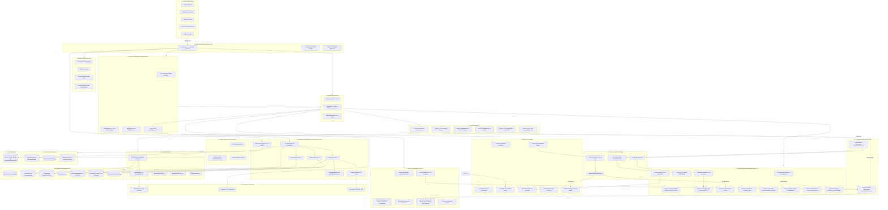

# Mondial ECO — GitDiagram Single-View Master Architecture

This document presents the complete Mondial ECO full-stack architecture as a unified **GitDiagram-style** system map.

```mermaid
graph TD
    %% ==========================================
    %% MONDIAL ECO — GITDIAGRAM MASTER MAP
    %% ==========================================

    subgraph CLIENTS["1. CLIENT PERSONAS"]
        USER_CR["Creator Persona"]
        USER_EN["Entrepreneur Persona"]
        USER_IN["Investor Persona"]
        USER_SP["Service Provider Persona"]
        USER_AD["Admin Persona"]
    end

    subgraph INFRASTRUCTURE["2. EDGE & INGRESS (Traefik v2.11)"]
        EDGE_ROUTER["Traefik Reverse Proxy (:80, :443 TLS)"]
        LE_ACME["Let's Encrypt ACME Storage"]
        IP_ALLOW["Metrics IP Allowlist Middleware"]
    end

    subgraph PUBLIC_WEB["3. PUBLIC WEB (Next.js 16)"]
        PAGE_HOME["Homepage & Marketing (/)"]
        PAGE_PRICING["Pricing (/pricing)"]
        PAGE_PERSONAS["Persona Landing Hubs (/for-*)"]
        PAGE_PROFILE["Universal Public Profile (/profile/[slug])"]
    end

    subgraph AUTH["4. AUTH & UNIVERSAL ONBOARDING"]
        AUTH_PAGES["Login & Register Pages (/(auth)/*)"]
        ONB_GATE["Universal Phase 1 Gate (/onboarding/*)"]
        AUTH_PROVIDER["AuthProvider.tsx & AuthGuard.tsx"]
        AXIOS_CLIENT["Axios Client (src/lib/axios.ts)"]
    end

    subgraph DASHBOARDS["5. DASHBOARDS SHELL"]
        DASH_SHELL["Dashboard Layout Shell"]
        APP_SIDEBAR["AppSidebar (Dynamic Roles via menu.ts)"]
        APP_TOPBAR["Topbar (Role Switcher & Alerts)"]
    end

    subgraph CREATOR_DOMAIN["6. CREATOR DOMAIN"]
        CR_STUDIO["Creator Dashboard & Studio (/creator)"]
        CR_P2["Phase 2: Discovery, Brand & Logo Tool"]
        CR_P3["Phase 3: AI Business Plan & 5-Yr Forecast"]
        CR_P4["Phase 4: Valuation & Offer Pricing"]
        CR_P5["Phase 5: The Crossroads Decision"]
        CR_P6["Phase 6: Level Up & Project Market Push"]
    end

    subgraph ENTREPRENEUR_DOMAIN["7. ENTREPRENEUR DOMAIN (Phases 1–10)"]
        EN_DASH["Entrepreneur Dashboard (/entrepreneur)"]
        EN_P1["Phase 1: Universal Identity Verification (Sumsub KYC)"]
        EN_P2["Phase 2: Company Legal Setup (Steps 1-4)"]
        EN_P3["Phase 3: Traction & KPI Tracker"]
        EN_P4["Phase 4: Cap Table & ESOP Engine"]
        EN_P5["Phase 5: Valuation & Funding Target"]
        EN_P6["Phase 6: Data Room & Digital NDA"]
        EN_P7["Phase 7: Automated Investor-Readiness Review"]
        EN_P8["Phase 8: Smart Investor Matchmaking"]
        EN_P9["Phase 9: Deal Room & Investment Execution"]
        EN_P10["Phase 10: Journey Complete (Terminal State)"]
        EN_ACQ["Acquisition Handoff (/build-company)"]
    end

    subgraph INVESTOR_DOMAIN["8. INVESTOR DOMAIN"]
        IN_DASH["Investor Dashboard (/investor)"]
        IN_THESIS["Investment Thesis Formulator"]
        IN_MATCH["Incoming Matchmaking Inbox"]
        IN_ROOM["Data Room Diligence Reviewer"]
        IN_TERM["Term Sheet Interactive Builder"]
        IN_PIPE["Active Deals Pipeline Kanban"]
        IN_PORT["Portfolio Holdings & Return Marks"]
    end

    subgraph SERVICE_PROVIDER_DOMAIN["9. SERVICE PROVIDER DOMAIN"]
        SP_DASH["Provider Dashboard (/serviceprovider)"]
        SP_CREDS["Credential Verification & Tiers (1-4, Flat 12% Commission)"]
        SP_CAT["Service Catalog & Tiered Packages"]
        SP_LEADS["Client Briefs & Custom Proposals"]
        SP_WORK["Workroom Milestone & Escrow (State Modeled; Stub Gateway)"]
        SP_EARN["Invoices, Balances & Payouts"]
    end

    subgraph MARKETPLACE["10. PLATFORM MARKETPLACES"]
        MKT_PRJ["Creator Project Marketplace (/marketplace/projects)"]
        MKT_SRV["Service Provider Marketplace (/marketplace/services)"]
    end

    subgraph DEALS["11. DEALS & NEGOTIATIONS"]
        DEAL_BUYOUT["Full Buyout Deal Flow"]
        DEAL_EQUITY["Co-Founder Equity Partnership Flow"]
        DEAL_ROUND["Venture Investment Round Flow"]
        DEAL_SIGN["Bilateral Digital Signatures"]
    end

    subgraph MESSAGING["12. REAL-TIME & NOTIFICATIONS"]
        HUB_CHAT["ChatHub (/hubs/chat)"]
        HUB_NOTIF["NotificationHub (/hubs/notifications)"]
        NOTIF_BELL["NotificationBell UI Badge"]
    end

    subgraph AI["13. AI SUBSYSTEM"]
        AI_RUNNER["AiJobRunner.cs (Hangfire 'ai' queue)"]
        AI_ROUTER["ModelRouter.cs & PromptBuilder.cs"]
        AI_CLAR["Idea Clarifier Handler"]
        AI_PLAN["Business Plan Handler"]
        AI_FCST["Forecast Handler"]
    end

    subgraph BACKEND["14. BACKEND API MONOLITH (ASP.NET Core 8)"]
        API_REPLICAS["API Replicas (api=1..N on :8080)"]
        API_CTRLS["51 Controllers (579 Endpoints)"]
        SVC_COMPANY["CompanyService.cs"]
        SVC_CREATOR["CreatorIdeaService.cs"]
        SVC_WORK["WorkroomService.cs"]
        VAL_ENG["ValuationEngine.cs & CapTableCalculator.cs"]
        HANGFIRE_SRV["Hangfire Background Server"]
    end

    subgraph DATABASE["15. DATABASE (MongoDB Atlas)"]
        DB_USERS[("applicationUsers (Identity)")]
        DB_IDEAS[("CreatorIdeas & CreatorJourneys")]
        DB_COMPANIES[("Companies & Phase4CapTables")]
        DB_DEALS[("DealExecutions")]
        DB_WORK[("WorkroomEngagements & Contracts")]
        DB_SESSIONS[("AI Sessions (Clarifier, Plan, Forecast)")]
        DB_HOLDINGS[("CompanyPortfolioHoldings")]
    end

    subgraph CACHE["16. CACHE & STATE (Redis 7)"]
        REDIS_BACKPLANE[("SignalR Backplane (MondialSignalR)")]
        REDIS_KEYS[("DataProtection Key Ring")]
        REDIS_CACHE[("Distributed Cache & Presence Tracker")]
    end

    subgraph STORAGE["17. FILE STORAGE"]
        VOL_UPLOADS[("Docker Volume: uploads-data (/app/wwwroot/uploads)")]
    end

    subgraph EXTERNAL_SERVICES["18. EXTERNAL SERVICES"]
        EXT_OPENROUTER["OpenRouter Cloud AI Gateway"]
        EXT_SUMSUB["Sumsub KYC & Biometrics"]
        EXT_ZOHO["Zoho SMTP (Port 587 TLS)"]
    end

    %% Client Routing
    CLIENTS -->|HTTPS :443| EDGE_ROUTER
    EDGE_ROUTER --> PUBLIC_WEB
    EDGE_ROUTER --> AUTH
    EDGE_ROUTER --> DASHBOARDS
    EDGE_ROUTER --> API_REPLICAS

    %% Auth & Dashboard Connections
    AUTH --> DASHBOARDS
    DASHBOARDS --> CREATOR_DOMAIN
    DASHBOARDS --> ENTREPRENEUR_DOMAIN
    DASHBOARDS --> INVESTOR_DOMAIN
    DASHBOARDS --> SERVICE_PROVIDER_DOMAIN

    %% Creator to Marketplace & Deals
    CR_P5 -->|Path A & B| MKT_PRJ
    MKT_PRJ --> DEAL_BUYOUT
    MKT_PRJ --> DEAL_EQUITY
    DEAL_BUYOUT --> EN_ACQ
    DEAL_EQUITY --> EN_P4
    EN_ACQ --> EN_P2

    %% Entrepreneur to Investor
    EN_P6 --> IN_ROOM
    EN_P78 --> IN_MATCH
    IN_TERM --> DEAL_ROUND
    DEAL_ROUND --> DEAL_SIGN
    DEAL_SIGN -->|Completed| IN_PORT
    DEAL_SIGN -->|Funds Raised| EN_P3

    %% Service Provider Integration
    SP_CAT --> MKT_SRV
    MKT_SRV --> SP_WORK
    EN_DASH -.->|Hire Provider| MKT_SRV
    CR_P2 -.->|Hire Designer| MKT_SRV

    %% API & Engine Connections
    DASHBOARDS --> AXIOS_CLIENT
    AXIOS_CLIENT --> API_CTRLS
    API_CTRLS --> SVC_COMPANY
    API_CTRLS --> SVC_CREATOR
    API_CTRLS --> SVC_WORK
    SVC_COMPANY --> VAL_ENG
    SVC_COMPANY --> HANGFIRE_SRV

    %% AI Pipeline
    CREATOR_DOMAIN --> AI
    AI --> AI_RUNNER
    AI_RUNNER --> AI_ROUTER
    AI_ROUTER --> EXT_OPENROUTER

    %% Database Operations
    API_CTRLS --> DATABASE
    AI_RUNNER --> DB_SESSIONS
    AI_RUNNER --> DB_IDEAS
    SVC_COMPANY --> DB_COMPANIES
    SVC_COMPANY --> DB_HOLDINGS
    SVC_CREATOR --> DB_IDEAS
    SVC_WORK --> DB_WORK

    %% Redis State
    API_REPLICAS --> CACHE
    MESSAGING --> REDIS_BACKPLANE
    MESSAGING --> NOTIF_BELL

    %% Storage & Externals
    API_CTRLS --> VOL_UPLOADS
    AUTH --> EXT_SUMSUB
    HANGFIRE_SRV --> EXT_ZOHO
```
